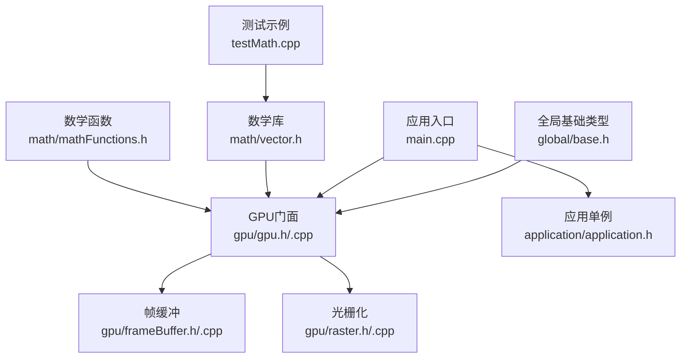
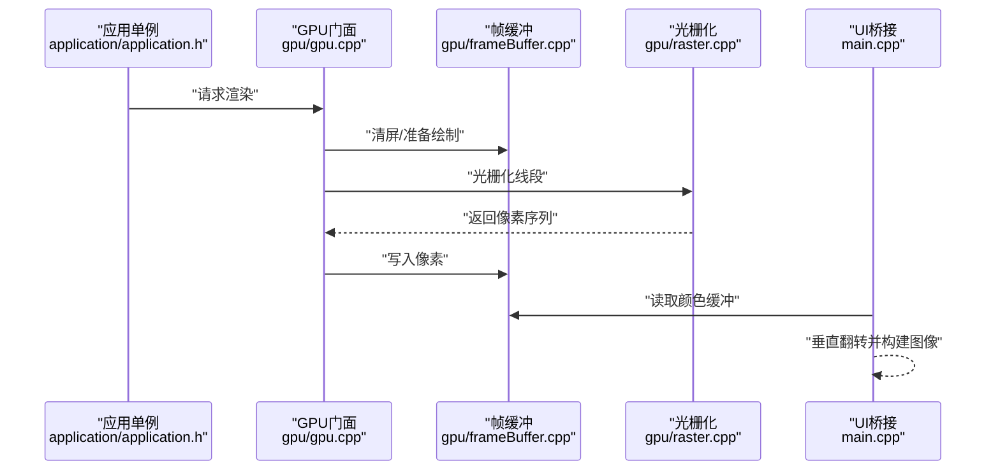
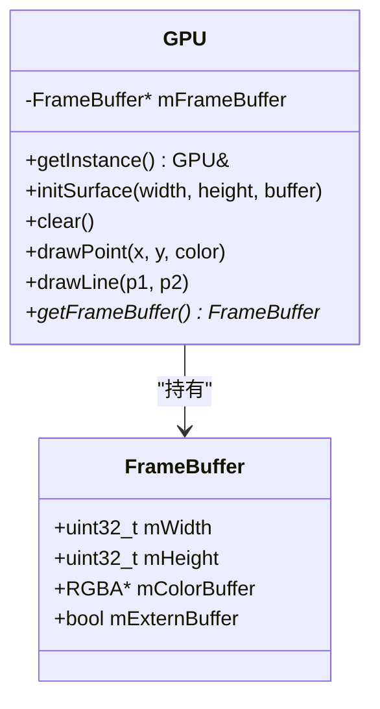
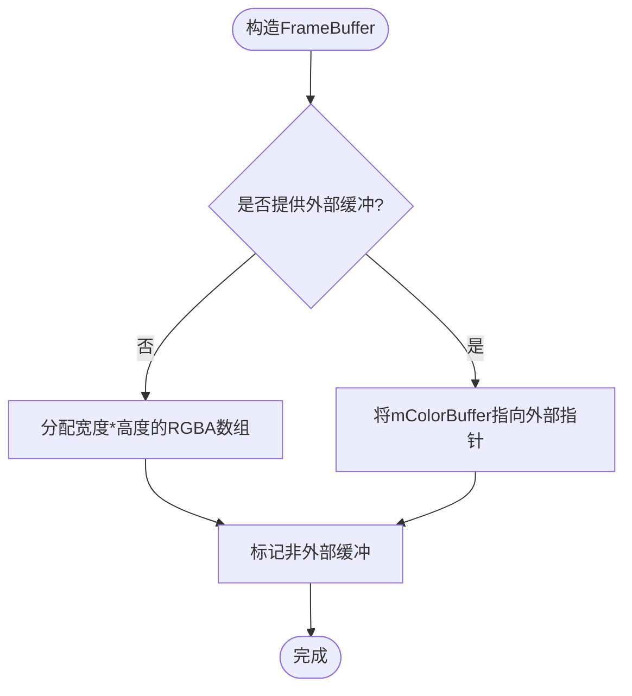
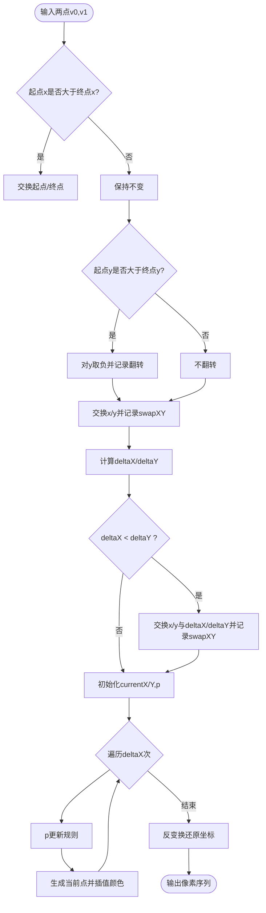
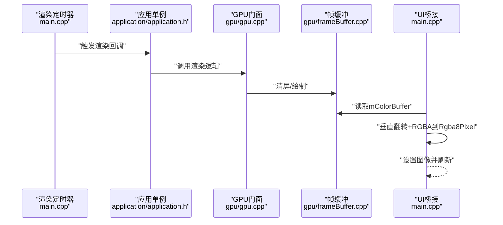
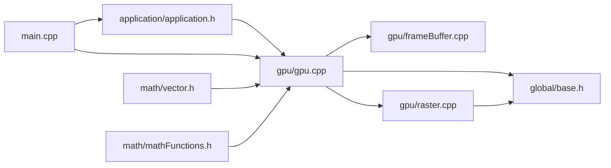

# GPU渲染系统

<cite>
**本文引用的文件**
- [gpu/gpu.h](file://gpu/gpu.h)
- [gpu/gpu.cpp](file://gpu/gpu.cpp)
- [gpu/frameBuffer.h](file://gpu/frameBuffer.h)
- [gpu/frameBuffer.cpp](file://gpu/frameBuffer.cpp)
- [gpu/raster.h](file://gpu/raster.h)
- [gpu/raster.cpp](file://gpu/raster.cpp)
- [global/base.h](file://global/base.h)
- [main.cpp](file://main.cpp)
- [application/application.h](file://application/application.h)
- [math/vector.h](file://math/vector.h)
- [math/mathFunctions.h](file://math/mathFunctions.h)
- [testMath.cpp](file://testMath.cpp)
</cite>

## 目录
1. [引言](#引言)
2. [项目结构](#项目结构)
3. [核心组件](#核心组件)
4. [架构总览](#架构总览)
5. [详细组件分析](#详细组件分析)
6. [依赖关系分析](#依赖关系分析)
7. [性能考虑](#性能考虑)
8. [故障排查指南](#故障排查指南)
9. [结论](#结论)
10. [附录](#附录)

## 引言
本技术文档围绕一个软光栅渲染系统展开，目标是帮助读者全面理解从顶点到像素输出的完整渲染流程，掌握GPU类的单例设计与职责边界、帧缓冲管理机制（内存布局、颜色空间与像素操作）、线段光栅化算法（含中点Bresenham变体）的实现细节，并给出性能优化与渲染质量调优建议。同时，文档解释了渲染系统与数学库、UI系统的集成方式。

## 项目结构
该工程采用按功能域分层的组织方式：
- 全局基础类型与常量定义位于 global/base.h
- GPU子系统位于 gpu/，包含帧缓冲、光栅化与GPU门面
- 数学库位于 math/，提供向量与常用数学函数
- 应用入口与UI桥接位于 main.cpp 与 application/application.h
- 测试示例位于 testMath.cpp

图表来源
- [gpu/gpu.h](file://gpu/gpu.h#L1-L37)
- [gpu/gpu.cpp](file://gpu/gpu.cpp#L1-L48)
- [gpu/frameBuffer.h](file://gpu/frameBuffer.h#L1-L19)
- [gpu/frameBuffer.cpp](file://gpu/frameBuffer.cpp#L1-L21)
- [gpu/raster.h](file://gpu/raster.h#L1-L20)
- [gpu/raster.cpp](file://gpu/raster.cpp#L1-L104)
- [global/base.h](file://global/base.h#L1-L42)
- [main.cpp](file://main.cpp#L1-L59)
- [application/application.h](file://application/application.h#L1-L33)
- [math/vector.h](file://math/vector.h#L1-L323)
- [math/mathFunctions.h](file://math/mathFunctions.h#L1-L155)
- [testMath.cpp](file://testMath.cpp#L1-L30)

章节来源
- [main.cpp](file://main.cpp#L1-L59)
- [application/application.h](file://application/application.h#L1-L33)
- [global/base.h](file://global/base.h#L1-L42)

## 核心组件
- GPU门面（单例）
  - 提供统一的初始化、清屏、点绘制、线段绘制接口
  - 内部持有帧缓冲指针，负责像素写入与调用光栅化模块
- 帧缓冲
  - 封装宽高与颜色缓冲区，支持外部缓冲接管与自动内存管理
- 光栅化
  - 提供线段光栅化与插值函数，生成离散像素序列并计算颜色插值
- 全局基础类型
  - 定义RGBA颜色与Point点结构，提供PI、角度换算等常量与工具宏
- 应用入口与UI桥接
  - 应用单例负责尺寸与渲染调度；主程序通过定时器驱动渲染并将帧缓冲转换为UI可用格式

章节来源
- [gpu/gpu.h](file://gpu/gpu.h#L11-L36)
- [gpu/gpu.cpp](file://gpu/gpu.cpp#L5-L47)
- [gpu/frameBuffer.h](file://gpu/frameBuffer.h#L8-L18)
- [gpu/frameBuffer.cpp](file://gpu/frameBuffer.cpp#L3-L20)
- [gpu/raster.h](file://gpu/raster.h#L8-L19)
- [gpu/raster.cpp](file://gpu/raster.cpp#L7-L103)
- [global/base.h](file://global/base.h#L18-L41)
- [application/application.h](file://application/application.h#L7-L29)
- [main.cpp](file://main.cpp#L10-L53)

## 架构总览
渲染系统以“应用调度—GPU门面—帧缓冲—光栅化”的层次化结构运行。应用单例负责每帧渲染任务，GPU门面负责初始化表面与执行绘制命令，帧缓冲承载像素数据，光栅化模块负责将连续几何映射为离散像素。

图表来源
- [application/application.h](file://application/application.h#L17-L18)
- [gpu/gpu.cpp](file://gpu/gpu.cpp#L25-L47)
- [gpu/frameBuffer.cpp](file://gpu/frameBuffer.cpp#L16-L20)
- [gpu/raster.cpp](file://gpu/raster.cpp#L7-L84)
- [main.cpp](file://main.cpp#L24-L53)

## 详细组件分析

### GPU类（单例门面）
- 设计要点
  - 单例模式：通过静态实例确保全局唯一访问点
  - 职责分离：仅负责绘制命令分发与资源生命周期管理
  - 与帧缓冲解耦：通过指针持有，便于替换或扩展
- 关键接口
  - 初始化表面：根据窗口尺寸与可选外部缓冲创建帧缓冲
  - 清屏：全屏填充默认颜色
  - 点绘制：边界检查后直接写入颜色缓冲
  - 线段绘制：委托光栅化模块生成像素序列并逐点绘制
- 错误处理
  - 点绘制进行越界保护
  - 清屏使用像素总数进行批量填充

图表来源
- [gpu/gpu.h](file://gpu/gpu.h#L11-L36)
- [gpu/gpu.cpp](file://gpu/gpu.cpp#L10-L47)
- [gpu/frameBuffer.h](file://gpu/frameBuffer.h#L8-L18)

章节来源
- [gpu/gpu.h](file://gpu/gpu.h#L11-L36)
- [gpu/gpu.cpp](file://gpu/gpu.cpp#L5-L47)

### 帧缓冲管理机制
- 内存布局
  - 连续RGBA数组，按行优先存储
  - 像素索引公式：行 * 宽 + 列
- 颜色空间与像素操作
  - RGBA通道顺序为R-G-B-A，字节序未做特殊处理
  - 支持外部缓冲接管，避免重复分配
- 生命周期
  - 自动缓冲在析构时释放
  - 外部缓冲由使用者负责释放

图表来源
- [gpu/frameBuffer.cpp](file://gpu/frameBuffer.cpp#L3-L14)

章节来源
- [gpu/frameBuffer.h](file://gpu/frameBuffer.h#L8-L18)
- [gpu/frameBuffer.cpp](file://gpu/frameBuffer.cpp#L3-L20)
- [global/base.h](file://global/base.h#L18-L35)

### 光栅化算法（线段绘制与中点Bresenham）
- 总体流程
  - 规范化：保证起点x坐标小于终点；必要时翻转y方向；必要时交换x/y以控制斜率范围
  - 使用中点Bresenham增量决策变量生成离散像素
  - 反变换：将规范化坐标还原到原始坐标系
  - 插值：沿x或y方向计算权重，对颜色进行线性插值
- 关键实现点
  - 斜率归一化与坐标轴交换，将通用问题转化为第一象限且斜率<=1的标准情形
  - 决策参数p的更新规则与步进逻辑
  - 插值函数根据x或y的投影比例计算颜色

图表来源
- [gpu/raster.cpp](file://gpu/raster.cpp#L7-L84)
- [gpu/raster.cpp](file://gpu/raster.cpp#L86-L103)

章节来源
- [gpu/raster.h](file://gpu/raster.h#L8-L19)
- [gpu/raster.cpp](file://gpu/raster.cpp#L7-L103)
- [global/base.h](file://global/base.h#L37-L41)

### 渲染管道（从顶点到像素输出）
- 控制流
  - 应用单例每帧触发渲染回调
  - GPU清屏并执行绘制命令（如点/线）
  - 主程序从GPU帧缓冲读取像素，进行垂直翻转与格式转换，提交给UI显示
- 数据流
  - GPU内部以RGBA数组存储像素
  - UI侧以Rgba8Pixel格式呈现，需注意GPU原点在左下角，UI原点在左上角，需垂直翻转

图表来源
- [main.cpp](file://main.cpp#L24-L53)
- [application/application.h](file://application/application.h#L17-L18)
- [gpu/gpu.cpp](file://gpu/gpu.cpp#L25-L28)
- [gpu/frameBuffer.cpp](file://gpu/frameBuffer.cpp#L16-L20)

章节来源
- [main.cpp](file://main.cpp#L24-L53)
- [application/application.h](file://application/application.h#L17-L18)
- [gpu/gpu.cpp](file://gpu/gpu.cpp#L25-L47)

### 渲染系统与数学库、UI系统的集成
- 与数学库的集成
  - 数学库提供向量类型与常用运算，可用于顶点处理、变换与光照等（当前示例侧重于向量基本运算）
  - 示例程序展示了向量加法、标量乘法、除法与归一化等用法
- 与UI系统的集成
  - 主程序通过定时器周期性地从GPU帧缓冲读取像素，进行垂直翻转与格式转换，然后提交给UI显示
  - GPU原点在左下角，UI原点在左上角，因此需要按行镜像

章节来源
- [math/vector.h](file://math/vector.h#L1-L323)
- [math/mathFunctions.h](file://math/mathFunctions.h#L1-L155)
- [testMath.cpp](file://testMath.cpp#L1-L30)
- [main.cpp](file://main.cpp#L38-L53)

## 依赖关系分析
- 组件内聚与耦合
  - GPU门面与帧缓冲强耦合（持有指针），但职责清晰
  - 光栅化模块与GPU门面弱耦合（通过接口调用），便于替换
  - 应用单例与GPU门面弱耦合（通过单例访问），便于扩展
- 外部依赖
  - 数学库用于向量运算
  - UI库用于像素缓冲与图像显示

图表来源
- [application/application.h](file://application/application.h#L1-L33)
- [gpu/gpu.cpp](file://gpu/gpu.cpp#L1-L48)
- [gpu/frameBuffer.cpp](file://gpu/frameBuffer.cpp#L1-L21)
- [gpu/raster.cpp](file://gpu/raster.cpp#L1-L104)
- [global/base.h](file://global/base.h#L1-L42)
- [main.cpp](file://main.cpp#L1-L59)
- [math/vector.h](file://math/vector.h#L1-L323)
- [math/mathFunctions.h](file://math/mathFunctions.h#L1-L155)

章节来源
- [application/application.h](file://application/application.h#L1-L33)
- [gpu/gpu.h](file://gpu/gpu.h#L1-L37)
- [gpu/raster.h](file://gpu/raster.h#L1-L20)
- [main.cpp](file://main.cpp#L1-L59)

## 性能考虑
- 批处理与内存局部性
  - 清屏使用批量填充，减少循环开销
  - 帧缓冲按行存储，提升缓存命中率
- 减少分支与条件判断
  - 光栅化前的坐标规范化可减少运行时判断次数
- 颜色插值优化
  - 插值权重计算尽量避免浮点除法，或提前归一化
- UI桥接优化
  - 垂直翻转可在CPU侧一次性完成，避免重复计算
- 可扩展性
  - 将光栅化算法抽象为可配置策略，便于替换更高效的算法（如中点Bresenham的变种、亚像素插值）

## 故障排查指南
- 线段绘制异常
  - 检查坐标规范化逻辑与反变换是否匹配
  - 确认插值权重计算的除零保护
- 像素越界
  - 点绘制前的边界检查是否覆盖所有情况
- 显示倒置
  - 确认UI桥接处的垂直翻转逻辑是否正确
- 内存泄漏
  - 外部缓冲接管时，确保生命周期由外部管理
  - 自动缓冲在GPU析构时释放

章节来源
- [gpu/gpu.cpp](file://gpu/gpu.cpp#L30-L38)
- [gpu/raster.cpp](file://gpu/raster.cpp#L86-L103)
- [main.cpp](file://main.cpp#L42-L50)
- [gpu/frameBuffer.cpp](file://gpu/frameBuffer.cpp#L16-L20)

## 结论
该软光栅渲染系统以简洁的单例门面、清晰的帧缓冲与可插拔的光栅化模块为核心，实现了从线段光栅化到像素输出的完整流程。通过数学库与UI系统的集成，系统具备良好的扩展性与可维护性。后续可在光栅化算法、颜色插值与内存拷贝路径等方面进一步优化，以满足更高性能与更佳渲染质量的需求。

## 附录
- 关键数据结构
  - RGBA：颜色通道（R、G、B、A）
  - Point：整数坐标与颜色
- 常用宏
  - 角度换算、PI常量等

章节来源
- [global/base.h](file://global/base.h#L12-L41)
- [math/vector.h](file://math/vector.h#L1-L323)
- [math/mathFunctions.h](file://math/mathFunctions.h#L1-L155)
- [testMath.cpp](file://testMath.cpp#L1-L30)