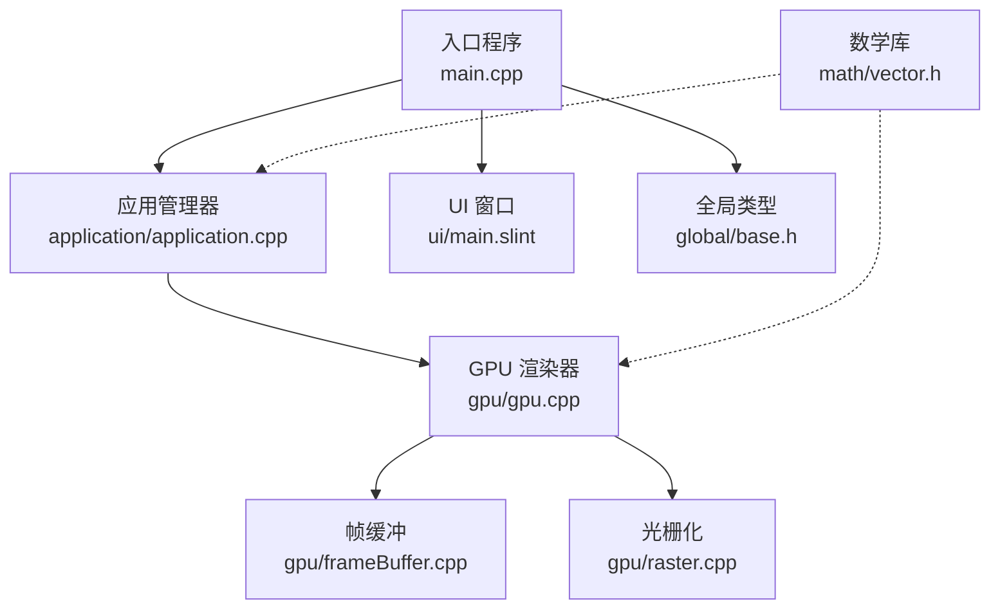
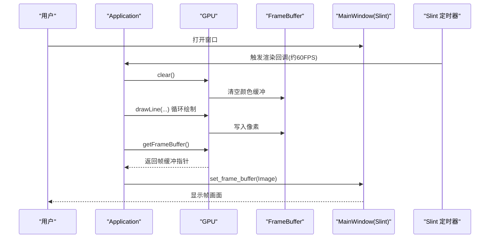
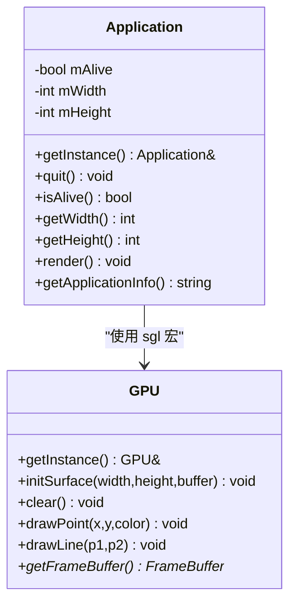
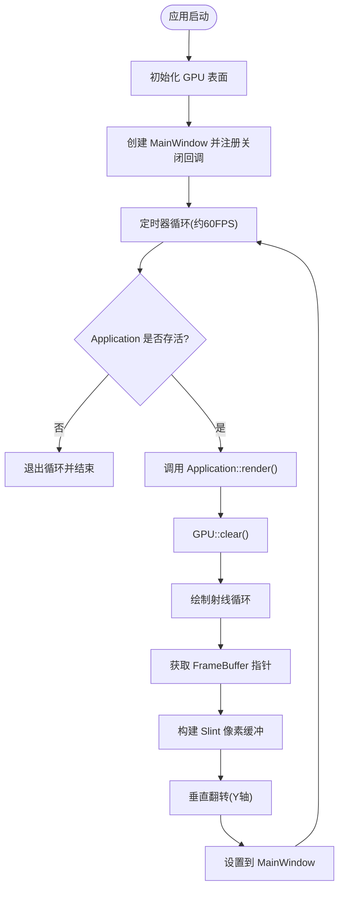
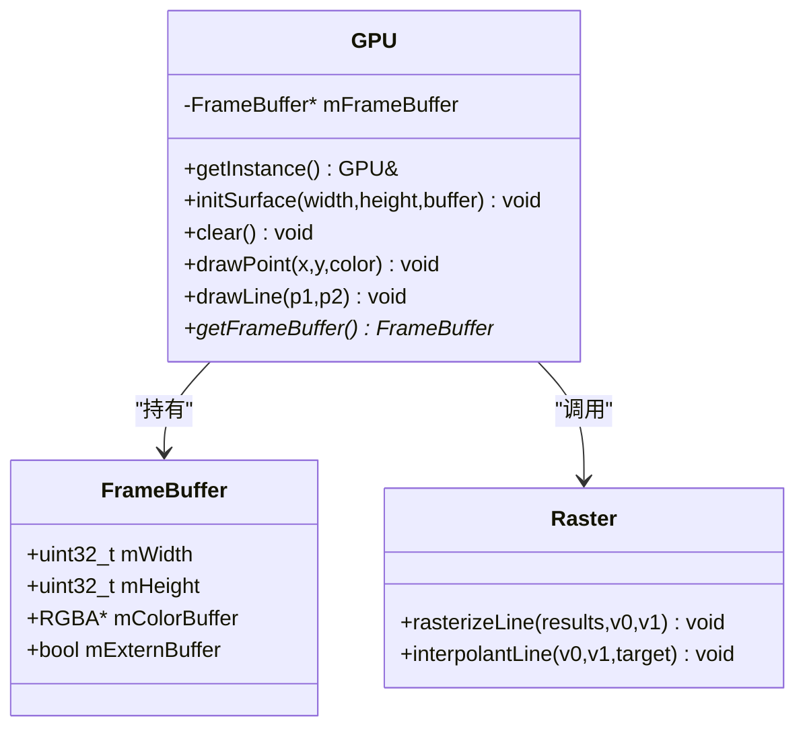
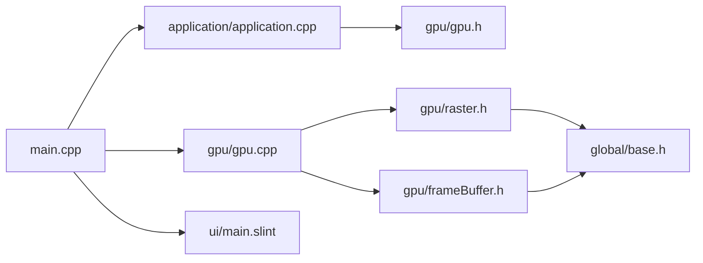

# 应用程序管理

<cite>
**本文引用的文件**
- [application.h](file://application/application.h)
- [application.cpp](file://application/application.cpp)
- [main.cpp](file://main.cpp)
- [gpu.h](file://gpu/gpu.h)
- [gpu.cpp](file://gpu/gpu.cpp)
- [frameBuffer.h](file://gpu/frameBuffer.h)
- [frameBuffer.cpp](file://gpu/frameBuffer.cpp)
- [raster.h](file://gpu/raster.h)
- [raster.cpp](file://gpu/raster.cpp)
- [base.h](file://global/base.h)
- [vector.h](file://math/vector.h)
- [math.h](file://math/math.h)
- [CMakeLists.txt](file://CMakeLists.txt)
- [main.slint](file://ui/main.slint)
</cite>

## 目录
1. [简介](#简介)
2. [项目结构](#项目结构)
3. [核心组件](#核心组件)
4. [架构总览](#架构总览)
5. [详细组件分析](#详细组件分析)
6. [依赖关系分析](#依赖关系分析)
7. [性能考量](#性能考量)
8. [故障排查指南](#故障排查指南)
9. [结论](#结论)
10. [附录](#附录)

## 简介
本技术文档围绕“应用程序管理模块”展开，重点解析 Application 类的设计与实现，涵盖单例模式、生命周期管理、渲染循环机制、帧率控制、事件处理、状态更新、与GPU渲染器及UI系统的协调方式，并提供扩展方法、错误处理与调试技巧，以及完整的启动与关闭流程说明。该工程是一个基于自研软渲染器的图形示例，结合 Slint UI 提供窗口与图像显示。

## 项目结构
该项目采用分层与按功能域组织的结构：
- 全局基础类型与常量定义位于 global/base.h
- 数学库位于 math/vector.h（含向量模板类）
- GPU子系统位于 gpu/（GPU、帧缓冲、光栅化）
- 应用程序管理位于 application/（Application 单例）
- UI 定义位于 ui/main.slint（Slint 组件）
- 入口程序位于 main.cpp
- 构建配置位于 CMakeLists.txt

图表来源
- [main.cpp](file://main.cpp#L1-L59)
- [application.cpp](file://application/application.cpp#L1-L46)
- [gpu.cpp](file://gpu/gpu.cpp#L1-L48)
- [frameBuffer.cpp](file://gpu/frameBuffer.cpp#L1-L21)
- [raster.cpp](file://gpu/raster.cpp#L1-L104)
- [base.h](file://global/base.h#L1-L42)
- [vector.h](file://math/vector.h#L1-L323)

章节来源
- [CMakeLists.txt](file://CMakeLists.txt#L21-L31)
- [main.cpp](file://main.cpp#L1-L59)

## 核心组件
- Application 单例：负责应用生命周期、信息查询、渲染调度
- GPU 渲染器：封装帧缓冲、清屏、点/线绘制
- FrameBuffer：承载颜色缓冲区，支持外部缓冲接管
- Raster：提供线段光栅化与插值
- Slint UI：窗口与图像显示桥接
- 全局类型：RGBA、Point、角度弧度转换等

章节来源
- [application.h](file://application/application.h#L5-L33)
- [application.cpp](file://application/application.cpp#L1-L46)
- [gpu.h](file://gpu/gpu.h#L11-L37)
- [gpu.cpp](file://gpu/gpu.cpp#L1-L48)
- [frameBuffer.h](file://gpu/frameBuffer.h#L8-L19)
- [frameBuffer.cpp](file://gpu/frameBuffer.cpp#L1-L21)
- [raster.h](file://gpu/raster.h#L8-L20)
- [raster.cpp](file://gpu/raster.cpp#L1-L104)
- [base.h](file://global/base.h#L18-L42)

## 架构总览
应用采用“应用管理器 + GPU 渲染器 + UI 显示”的分层架构。渲染循环由 Slint 的定时器驱动，每帧调用 Application::render，后者委托 GPU 清屏并绘制几何，随后将 GPU 帧缓冲转换为 Slint 图像并显示。

图表来源
- [main.cpp](file://main.cpp#L24-L53)
- [application.cpp](file://application/application.cpp#L23-L45)
- [gpu.cpp](file://gpu/gpu.cpp#L25-L47)
- [frameBuffer.h](file://gpu/frameBuffer.h#L14-L17)
- [main.slint](file://ui/main.slint#L9-L16)

## 详细组件分析

### Application 类设计与实现
- 单例模式：通过静态 getInstance() 返回唯一实例；构造与拷贝被私有化并删除，确保全局唯一性
- 生命周期管理：isAlive() 查询运行状态；quit() 设置停止标志并输出关闭日志
- 渲染接口：render() 在存活状态下执行清屏与绘制逻辑
- 资源协调：与 GPU 单例（sgl）协作，使用全局宏 sglApp 引用 Application 实例

图表来源
- [application.h](file://application/application.h#L5-L33)
- [application.cpp](file://application/application.cpp#L6-L45)
- [gpu.h](file://gpu/gpu.h#L11-L36)

章节来源
- [application.h](file://application/application.h#L5-L33)
- [application.cpp](file://application/application.cpp#L6-L45)

### 渲染循环与帧率控制
- 启动流程：main 中获取 Application 单例，初始化 GPU 表面尺寸，创建 MainWindow 并注册关闭回调
- 帧率控制：使用 Slint 定时器，周期约为 16ms（约 60FPS），在回调中检查 Application 是否存活
- 渲染步骤：清屏 -> 绘制多条射线 -> 从 GPU 帧缓冲构建 Slint 像素缓冲 -> 翻转 Y 轴 -> 设置到 UI
- 关闭流程：窗口关闭请求触发 Application::quit，后续帧不再渲染

图表来源
- [main.cpp](file://main.cpp#L10-L53)
- [application.cpp](file://application/application.cpp#L23-L45)
- [gpu.cpp](file://gpu/gpu.cpp#L25-L28)

章节来源
- [main.cpp](file://main.cpp#L10-L59)

### GPU 渲染器与帧缓冲
- GPU 单例：提供 initSurface、clear、drawPoint、drawLine、getFrameBuffer 等接口
- 帧缓冲：管理宽度、高度与颜色缓冲区，支持外部缓冲接管
- 光栅化：line rasterization 使用 Bresenham 变体，支持斜率归一化、XY 交换与 Y 翻转，最后进行颜色插值

图表来源
- [gpu.h](file://gpu/gpu.h#L11-L36)
- [gpu.cpp](file://gpu/gpu.cpp#L18-L47)
- [frameBuffer.h](file://gpu/frameBuffer.h#L8-L18)
- [raster.h](file://gpu/raster.h#L8-L19)

章节来源
- [gpu.h](file://gpu/gpu.h#L11-L37)
- [gpu.cpp](file://gpu/gpu.cpp#L1-L48)
- [frameBuffer.h](file://gpu/frameBuffer.h#L8-L19)
- [frameBuffer.cpp](file://gpu/frameBuffer.cpp#L1-L21)
- [raster.h](file://gpu/raster.h#L8-L20)
- [raster.cpp](file://gpu/raster.cpp#L7-L103)

### UI 系统与数据流
- Slint UI 定义 MainWindow，包含一个可绑定的 frame-buffer 属性
- 主程序将 GPU 帧缓冲转换为 Slint 的像素缓冲，设置到 UI 的 frame-buffer 属性后自动刷新显示
- 由于 GPU 坐标系原点在左下角，而 Slint 期望左上角，因此需要进行 Y 轴翻转

章节来源
- [main.slint](file://ui/main.slint#L1-L18)
- [main.cpp](file://main.cpp#L38-L52)

### 数学库与向量
- math/vector.h 提供 Vector2/3/4 模板类，支持加减乘除、索引访问、负号等操作
- 本项目示例未直接使用数学库进行渲染，但为后续扩展提供了向量运算能力

章节来源
- [vector.h](file://math/vector.h#L1-L323)
- [math.h](file://math/math.h#L1-L4)

## 依赖关系分析
- main.cpp 依赖 application、gpu、slint
- application.cpp 依赖 gpu.h
- gpu.cpp 依赖 frameBuffer.h、raster.h
- raster.cpp 依赖 base.h
- frameBuffer.cpp 依赖 frameBuffer.h
- main.slint 与 C++ 通过编译生成桥接代码

图表来源
- [main.cpp](file://main.cpp#L1-L59)
- [application.cpp](file://application/application.cpp#L1-L2)
- [gpu.cpp](file://gpu/gpu.cpp#L1-L2)
- [raster.cpp](file://gpu/raster.cpp#L1-L1)
- [frameBuffer.h](file://gpu/frameBuffer.h#L1-L2)
- [base.h](file://global/base.h#L1-L10)

章节来源
- [CMakeLists.txt](file://CMakeLists.txt#L21-L31)

## 性能考量
- 帧率控制：定时器周期约 16ms，适合演示用途；实际应用可根据目标设备动态调整
- 渲染开销：每帧绘制固定数量的射线，复杂场景建议减少绘制数量或采用更高效的光栅化策略
- 内存管理：FrameBuffer 支持外部缓冲接管，避免重复分配；注意释放策略
- 数据搬运：每帧将 GPU 帧缓冲复制到 Slint 像素缓冲并进行 Y 轴翻转，建议在 UI 层优化显示路径或使用共享内存
- 数学运算：向量运算可复用数学库，但需评估编译与运行时开销

## 故障排查指南
- 应用无法启动或崩溃
  - 检查 GPU 表面是否正确初始化（宽度/高度非零）
  - 确认 Slint 定时器回调中对 Application::isAlive 的检查
- 画面不显示或黑屏
  - 确认 GPU::clear 已执行且 FrameBuffer 指针有效
  - 检查 drawLine 是否正常写入像素
- 显示倒置或上下颠倒
  - 确认 Y 轴翻转逻辑已执行
- 性能过低或卡顿
  - 调整定时器周期或减少每帧绘制对象数量
  - 优化颜色插值与像素拷贝路径

章节来源
- [main.cpp](file://main.cpp#L16-L53)
- [gpu.cpp](file://gpu/gpu.cpp#L25-L47)
- [frameBuffer.cpp](file://gpu/frameBuffer.cpp#L16-L20)

## 结论
本模块以简洁清晰的方式实现了应用管理、软渲染与 UI 显示的协同：Application 作为控制中枢，GPU 提供底层绘制能力，Slint 负责窗口与图像展示。通过单例模式与定时器驱动的渲染循环，系统具备良好的可扩展性与可维护性。后续可在渲染逻辑、事件处理、资源管理等方面进一步增强。

## 附录

### 启动流程
- 获取 Application 单例
- 初始化 GPU 表面尺寸
- 创建 MainWindow 并注册关闭回调
- 启动渲染定时器（约 60FPS）
- 进入 UI 事件循环

章节来源
- [main.cpp](file://main.cpp#L10-L55)

### 关闭流程
- 用户关闭窗口触发回调
- 回调调用 Application::quit
- 定时器回调检测到停止标志后退出渲染循环
- 程序退出

章节来源
- [main.cpp](file://main.cpp#L20-L22)
- [application.cpp](file://application/application.cpp#L12-L16)

### 扩展方法
- 添加新功能
  - 在 Application::render 中增加新的绘制逻辑
  - 或新增独立的渲染器模块并通过 GPU 接口进行绘制
- 修改渲染逻辑
  - 替换或扩展 Raster::rasterizeLine，引入抗锯齿或多边形填充
- 集成外部库
  - 通过 CMakeLists.txt 增加链接库与头文件目录
  - 将外部库适配到 GPU 接口或 UI 层

章节来源
- [CMakeLists.txt](file://CMakeLists.txt#L56-L65)
- [application.cpp](file://application/application.cpp#L23-L45)
- [gpu.h](file://gpu/gpu.h#L18-L28)