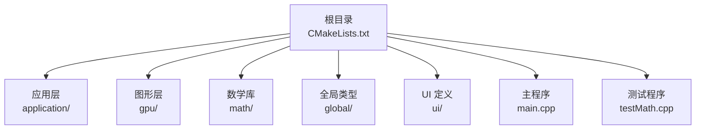
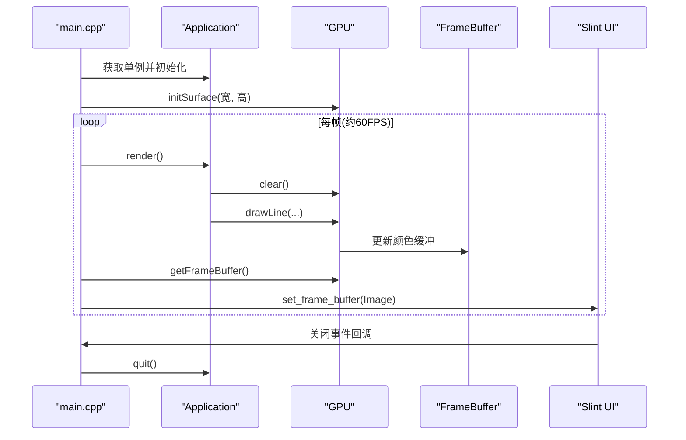
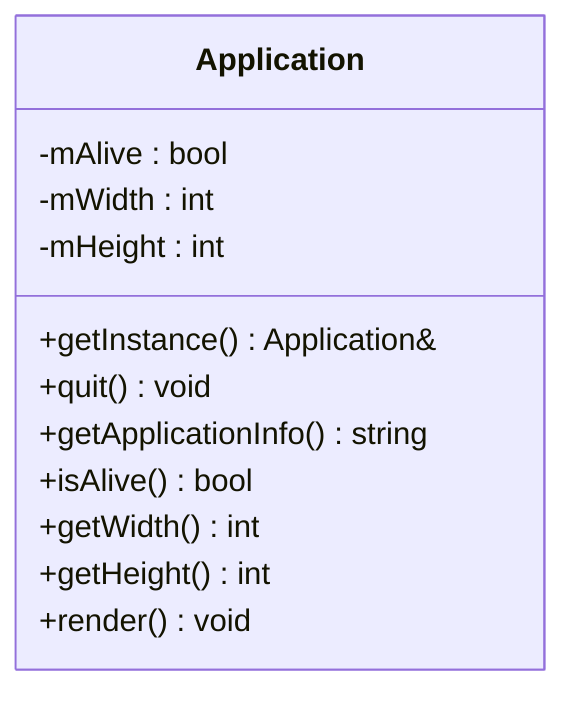
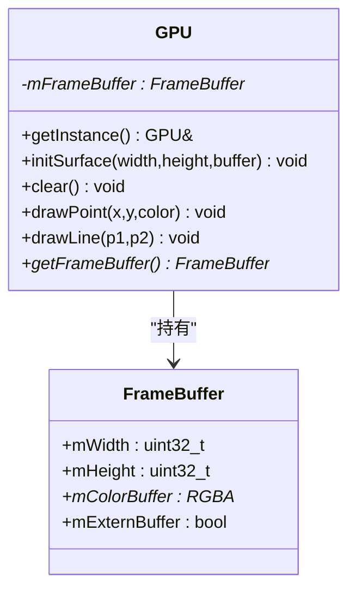
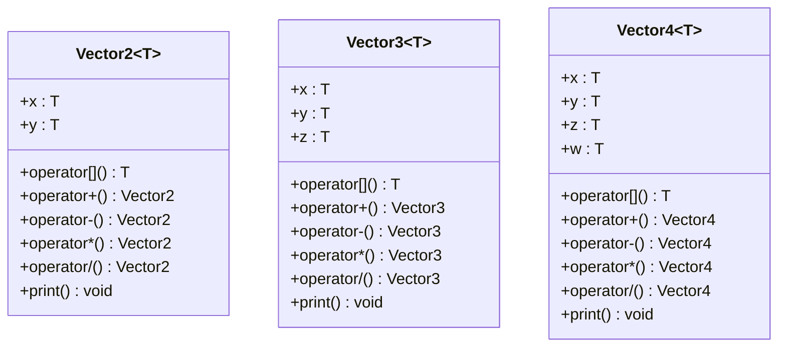
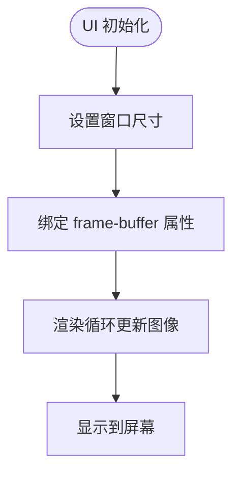
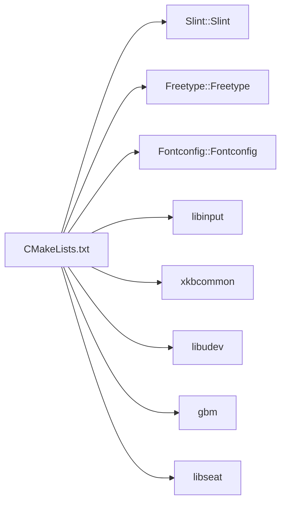

# 快速开始

<cite>
**本文引用的文件**
- [CMakeLists.txt](file://CMakeLists.txt)
- [main.cpp](file://main.cpp)
- [testMath.cpp](file://testMath.cpp)
- [ui/main.slint](file://ui/main.slint)
- [application/application.h](file://application/application.h)
- [application/application.cpp](file://application/application.cpp)
- [gpu/gpu.h](file://gpu/gpu.h)
- [gpu/frameBuffer.h](file://gpu/frameBuffer.h)
- [math/math.h](file://math/math.h)
- [math/vector.h](file://math/vector.h)
- [math/mathFunctions.h](file://math/mathFunctions.h)
- [global/base.h](file://global/base.h)
</cite>

## 目录
1. [简介](#简介)
2. [项目结构](#项目结构)
3. [核心组件](#核心组件)
4. [架构总览](#架构总览)
5. [详细组件分析](#详细组件分析)
6. [依赖关系分析](#依赖关系分析)
7. [性能考虑](#性能考虑)
8. [故障排查指南](#故障排查指南)
9. [结论](#结论)
10. [附录](#附录)

## 简介
本指南面向首次接触 04-Vectors 项目的开发者，目标是帮助你在 Linux、Windows、macOS 三大平台上完成环境准备、依赖安装、构建与运行，并提供常见问题的排查思路与调试技巧。该项目基于 C++20、CMake 3.21+、Clang 编译器，使用 Slint 框架进行界面渲染，并通过自研软光栅模块完成向量与图形绘制。

## 项目结构
该仓库采用按功能域分层的组织方式：
- 全局基础类型与常量定义位于 global/
- 应用生命周期与渲染调度位于 application/
- 图形处理与软光栅实现位于 gpu/
- 数学库位于 math/
- 用户界面定义位于 ui/
- 构建配置位于根目录 CMakeLists.txt
- 主程序入口与测试程序分别位于根目录 main.cpp 与 testMath.cpp

**图表来源**
- [CMakeLists.txt](file://CMakeLists.txt#L1-L69)
- [main.cpp](file://main.cpp#L1-L59)
- [testMath.cpp](file://testMath.cpp#L1-L30)

**章节来源**
- [CMakeLists.txt](file://CMakeLists.txt#L1-L69)
- [main.cpp](file://main.cpp#L1-L59)
- [testMath.cpp](file://testMath.cpp#L1-L30)

## 核心组件
- 应用管理器 Application：负责窗口尺寸、存活状态与每帧渲染逻辑的调度。
- GPU 与 FrameBuffer：模拟 GPU 行为，维护帧缓冲区并提供清屏、点线绘制等接口。
- 数学库 math：提供向量类模板与常用数学运算（加减乘除、点乘、叉乘、归一化等）。
- UI 层：基于 Slint 的窗口组件，接收来自帧缓冲区的图像数据并显示。

**章节来源**
- [application/application.h](file://application/application.h#L1-L33)
- [application/application.cpp](file://application/application.cpp#L1-L46)
- [gpu/gpu.h](file://gpu/gpu.h#L1-L37)
- [gpu/frameBuffer.h](file://gpu/frameBuffer.h#L1-L19)
- [math/math.h](file://math/math.h#L1-L4)
- [math/vector.h](file://math/vector.h#L1-L323)
- [math/mathFunctions.h](file://math/mathFunctions.h#L1-L155)
- [global/base.h](file://global/base.h#L1-L42)

## 架构总览
下图展示了从主程序启动到渲染循环、再到 UI 显示的整体流程。

**图表来源**
- [main.cpp](file://main.cpp#L10-L58)
- [application/application.cpp](file://application/application.cpp#L23-L45)
- [gpu/gpu.h](file://gpu/gpu.h#L18-L28)

**章节来源**
- [main.cpp](file://main.cpp#L10-L58)
- [application/application.cpp](file://application/application.cpp#L23-L45)
- [gpu/gpu.h](file://gpu/gpu.h#L18-L28)

## 详细组件分析

### 应用层 Application
- 单例模式设计，提供窗口尺寸查询、存活状态与渲染调度。
- 渲染逻辑在每帧中清屏并绘制一组从中心辐射的线条，用于演示向量与图形绘制。

**图表来源**
- [application/application.h](file://application/application.h#L5-L33)

**章节来源**
- [application/application.h](file://application/application.h#L1-L33)
- [application/application.cpp](file://application/application.cpp#L1-L46)

### 图形层 GPU 与 FrameBuffer
- GPU 提供初始化表面、清屏、点与线绘制等能力，并持有 FrameBuffer 指针。
- FrameBuffer 封装宽度、高度与颜色缓冲区指针，支持外部缓冲标记。

**图表来源**
- [gpu/gpu.h](file://gpu/gpu.h#L11-L36)
- [gpu/frameBuffer.h](file://gpu/frameBuffer.h#L8-L18)

**章节来源**
- [gpu/gpu.h](file://gpu/gpu.h#L1-L37)
- [gpu/frameBuffer.h](file://gpu/frameBuffer.h#L1-L19)

### 数学库 math
- 提供二维/三维/四维向量模板类，支持索引访问、算术运算、标量乘除、点乘、叉乘、长度与归一化等。
- 通过命名空间 math 暴露常用别名（如 vec2f、vec3f、vec4f）。

**图表来源**
- [math/vector.h](file://math/vector.h#L13-L322)

**章节来源**
- [math/vector.h](file://math/vector.h#L1-L323)
- [math/mathFunctions.h](file://math/mathFunctions.h#L1-L155)
- [math/math.h](file://math/math.h#L1-L4)

### UI 层（Slint）
- UI 定义了一个窗口组件，包含一个图像控件用于显示帧缓冲区生成的图像。
- 主程序通过定时器将 GPU 帧缓冲区转换为 Slint 图像并更新显示。

**图表来源**
- [ui/main.slint](file://ui/main.slint#L1-L18)

**章节来源**
- [ui/main.slint](file://ui/main.slint#L1-L18)
- [main.cpp](file://main.cpp#L38-L53)

## 依赖关系分析
项目通过 CMake 统一管理依赖与链接，主要依赖包括：
- Slint：本地 slint 目录下的静态库与头文件。
- FreeType 与 Fontconfig：字体渲染相关。
- libinput、xkbcommon、libudev、gbm、libseat：Linux 输入与显示栈。
- C++20 标准与 Clang 编译器。

**图表来源**
- [CMakeLists.txt](file://CMakeLists.txt#L12-L65)

**章节来源**
- [CMakeLists.txt](file://CMakeLists.txt#L1-L69)

## 性能考虑
- 渲染频率：主程序使用定时器以约 60 FPS 驱动渲染循环，可根据平台性能调整周期。
- 帧缓冲区拷贝：将 GPU 帧缓冲区复制到 Slint 像素缓冲时执行逐像素拷贝与垂直翻转，注意避免在高频路径中重复分配内存。
- 数学运算：向量运算为纯 CPU 计算，尽量减少不必要的临时对象创建。

[本节为通用指导，不直接分析具体文件]

## 故障排查指南
- CMake 找不到 Slint 或依赖库
  - 确认已正确放置 slint 目录并在 CMake 中启用本地查找。
  - 在 Linux 上确保 pkg-config 能找到 libinput、xkbcommon、libudev、gbm、libseat。
  - 在 macOS 上确认 Homebrew 安装了 FreeType 与 Fontconfig。
- 构建失败提示 C++ 标准或编译器版本过低
  - 确保使用 CMake 3.21+ 与 Clang 编译器。
- 运行时黑屏或无输出
  - 检查 GPU::initSurface 是否成功调用，确认 FrameBuffer 已初始化。
  - 确认渲染循环中每帧都调用了 clear 与 drawLine。
- Slint UI 不显示图像
  - 检查主程序是否正确将 FrameBuffer 数据转换为 Slint Image 并设置到 UI 的 frame-buffer 属性。

**章节来源**
- [CMakeLists.txt](file://CMakeLists.txt#L12-L65)
- [main.cpp](file://main.cpp#L15-L53)
- [application/application.cpp](file://application/application.cpp#L23-L45)
- [gpu/gpu.h](file://gpu/gpu.h#L18-L28)

## 结论
通过本指南，你可以在主流操作系统上完成环境准备、依赖安装与项目构建，并运行主程序与数学测试程序。建议先运行数学测试程序验证编译链路，再启动主程序观察渲染效果。遇到问题时优先检查 CMake 依赖查找与 Slint UI 的帧缓冲区绑定。

[本节为总结性内容，不直接分析具体文件]

## 附录

### 环境与依赖安装（按平台）

- Linux（以 Debian/Ubuntu 为例）
  - 安装构建工具与 CMake
    - sudo apt update
    - sudo apt install build-essential cmake pkg-config
  - 安装 Clang
    - sudo apt install clang clang++ lld
  - 安装 Slint 本地库（将 slint 目录置于项目根目录）
    - 确保 slint/lib/cmake/Slint 与 slint/include/slint 存在
  - 安装 FreeType 与 Fontconfig
    - sudo apt install libfreetype6-dev libfontconfig1-dev
  - 安装输入与显示相关库
    - sudo apt install libinput-dev libxkbcommon-dev libudev-dev libdrm-dev libseat-dev
  - 验证 pkg-config 能找到上述库
    - pkg-config --libs libinput xkbcommon udev gbm libseat

- Windows（使用 MSVC 或 MinGW）
  - 安装 Visual Studio 2022 或 MinGW-w64
  - 安装 CMake 3.21+
  - 安装 Clang（可选，若使用 Clang 编译器）
  - 安装 FreeType 与 Fontconfig（可通过 vcpkg 或预编译包）
  - 将 slint 目录置于项目根目录
  - 配置 CMake 时确保能找到 FreeType、Fontconfig 与 Slint

- macOS
  - 安装 Xcode Command Line Tools
    - xcode-select --install
  - 安装 CMake 3.21+
  - 安装 Clang（随 Xcode）
  - 安装 FreeType 与 Fontconfig（推荐通过 Homebrew）
    - brew install freetype fontconfig
  - 将 slint 目录置于项目根目录
  - 若使用 Slint 的 pkg-config 文件，请确保其可用

**章节来源**
- [CMakeLists.txt](file://CMakeLists.txt#L12-L65)

### 构建与运行流程

- 克隆仓库与进入目录
  - git clone <仓库地址>
  - cd 04-Vectors
- 准备本地 Slint（若未内置）
  - 将 slint 目录放入项目根目录，确保包含 slint/lib/cmake/Slint 与 slint/include/slint
- 配置 CMake（建议使用独立构建目录）
  - mkdir -p build && cd build
  - cmake .. -DCMAKE_BUILD_TYPE=Release
- 编译项目
  - cmake --build . --parallel
- 运行主程序
  - ./softRenderer
- 运行数学测试程序
  - ./testMath

**章节来源**
- [CMakeLists.txt](file://CMakeLists.txt#L33-L36)
- [main.cpp](file://main.cpp#L10-L58)
- [testMath.cpp](file://testMath.cpp#L5-L29)

### 第一次使用的最佳实践
- 先运行数学测试程序，确认编译链路与数学库可用。
- 在主程序中逐步注释/开启 drawLine 的循环，观察渲染效果与性能。
- 使用 CMake 的编译命令数据库（已启用）辅助编辑器补全与诊断。
- 如需调试 UI 帧缓冲区绑定问题，可在主程序中打印 FrameBuffer 的尺寸与首像素值。

**章节来源**
- [CMakeLists.txt](file://CMakeLists.txt#L5-L5)
- [main.cpp](file://main.cpp#L35-L53)
- [testMath.cpp](file://testMath.cpp#L1-L30)