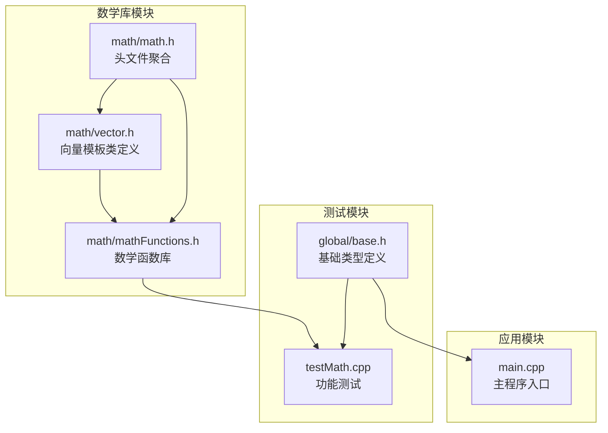
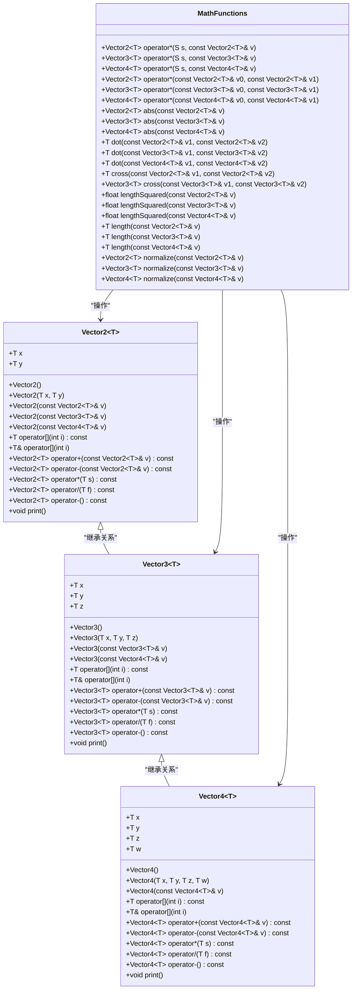
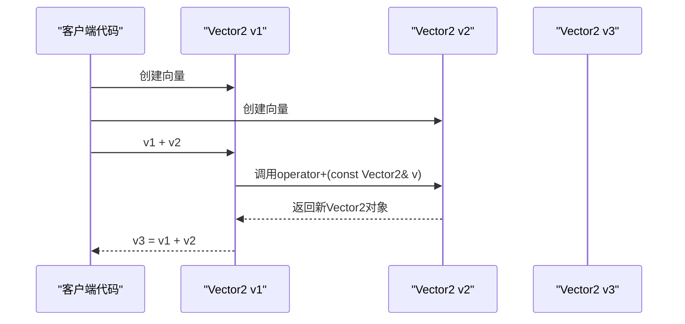
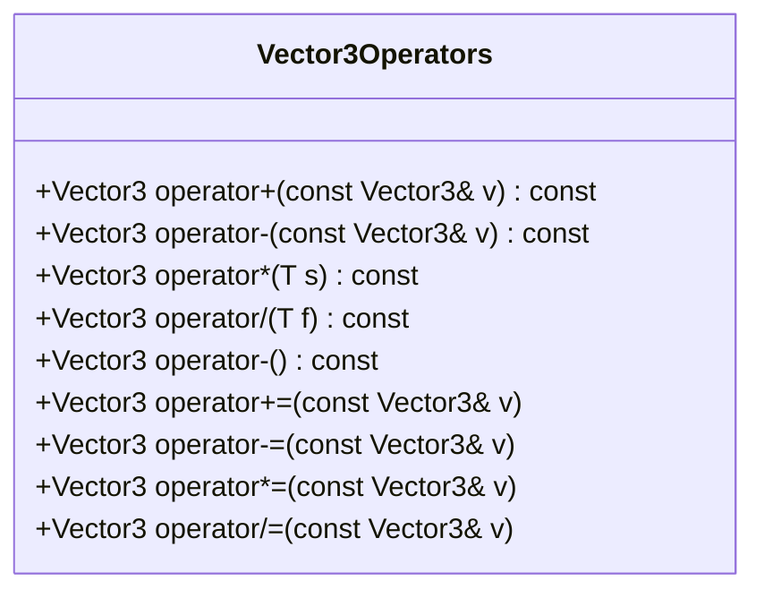
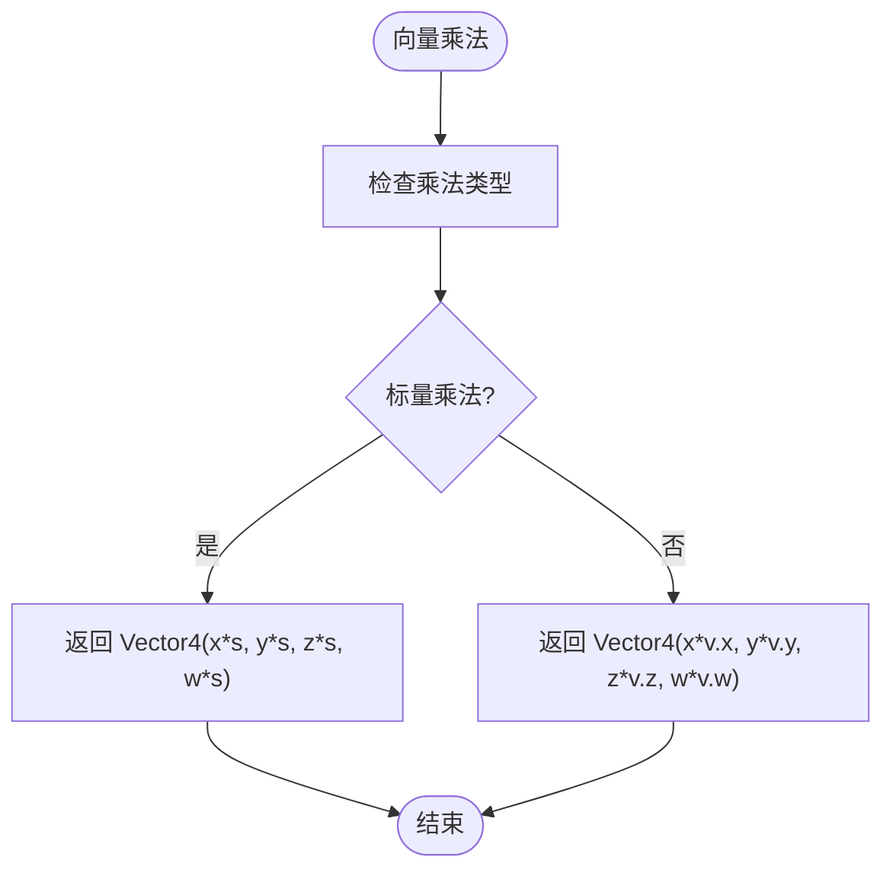
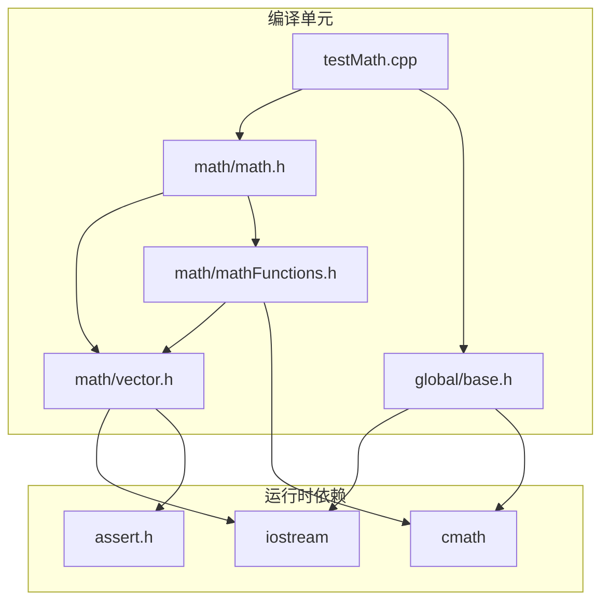
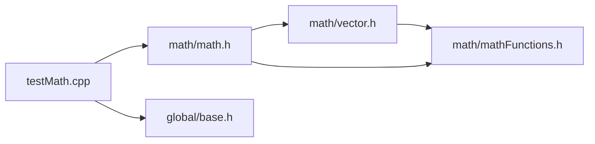

# 向量模板类实现

<cite>
**本文档引用的文件**
- [math/vector.h](file://math/vector.h)
- [math/mathFunctions.h](file://math/mathFunctions.h)
- [math/math.h](file://math/math.h)
- [testMath.cpp](file://testMath.cpp)
- [global/base.h](file://global/base.h)
- [main.cpp](file://main.cpp)
</cite>

## 目录
1. [简介](#简介)
2. [项目结构](#项目结构)
3. [核心组件](#核心组件)
4. [架构概览](#架构概览)
5. [详细组件分析](#详细组件分析)
6. [依赖关系分析](#依赖关系分析)
7. [性能考虑](#性能考虑)
8. [故障排除指南](#故障排除指南)
9. [结论](#结论)
10. [附录](#附录)

## 简介

本项目实现了完整的向量模板类库，包含Vector2、Vector3和Vector4三个模板类。这些类提供了丰富的数学运算功能，支持标量运算、向量运算、归一化、点乘、叉乘等常用向量操作。项目采用C++模板编程技术，通过单一接口支持多种数值类型（如float、int），体现了泛型编程的优势。

该向量库设计用于图形学和游戏开发中的数学计算，为更复杂的图形渲染系统提供基础数据结构支持。代码中包含了完善的断言检查机制，确保运行时的安全性。

## 项目结构

项目采用模块化的文件组织方式，主要分为以下几个部分：



**图表来源**
- [math/vector.h](file://math/vector.h#L1-L323)
- [math/mathFunctions.h](file://math/mathFunctions.h#L1-L155)
- [math/math.h](file://math/math.h#L1-L4)
- [testMath.cpp](file://testMath.cpp#L1-L30)
- [global/base.h](file://global/base.h#L1-L42)

**章节来源**
- [math/vector.h](file://math/vector.h#L1-L323)
- [math/math.h](file://math/math.h#L1-L4)
- [testMath.cpp](file://testMath.cpp#L1-L30)

## 核心组件

本项目的核心是三个向量模板类，它们共享相似的设计模式但具有不同的维度特性：

### 模板参数T
所有向量类都使用模板参数T，允许用户指定存储的数据类型：
- 支持浮点数类型（float、double）
- 支持整数类型（int、long）
- 支持自定义数值类型

### 成员变量
- Vector2: x, y两个分量
- Vector3: x, y, z三个分量  
- Vector4: x, y, z, w四个分量

### 基本构造函数
- 默认构造函数：初始化为零向量
- 参数化构造函数：按分量初始化
- 拷贝构造函数：从其他同类型向量复制
- 转换构造函数：从更高维度向量降维构造

**章节来源**
- [math/vector.h](file://math/vector.h#L13-L127)
- [math/vector.h](file://math/vector.h#L131-L218)
- [math/vector.h](file://math/vector.h#L221-L314)

## 架构概览

向量类库采用了清晰的分层架构设计：



**图表来源**
- [math/vector.h](file://math/vector.h#L13-L323)
- [math/mathFunctions.h](file://math/mathFunctions.h#L1-L155)

## 详细组件分析

### Vector2 类分析

Vector2是最基础的二维向量类，提供了完整的向量运算能力：

#### 成员变量
- `x`: X轴分量
- `y`: Y轴分量

#### 构造函数重载
- 默认构造函数：创建零向量
- 参数化构造函数：按X、Y分量初始化
- 拷贝构造函数：从其他Vector2对象复制
- 转换构造函数：从Vector3或Vector4降维构造

#### 运算符重载机制



**图表来源**
- [math/vector.h](file://math/vector.h#L60-L62)

##### 算术运算符
- 加法运算符 `+`：对应分量相加
- 减法运算符 `-`：对应分量相减  
- 乘法运算符 `*`：向量与标量相乘
- 除法运算符 `/`：向量与标量相除

##### 复合赋值运算符
- 加法赋值 `+=`：就地加法
- 乘法赋值 `*=`：就地乘法
- 除法赋值 `/=`：就地除法

##### 一元运算符
- 取反运算符 `-()`：返回相反向量

#### 数组索引访问运算符

Vector2实现了两个版本的`[]`运算符：

```mermaid
flowchart TD
Start([调用 operator[](int i)]) --> CheckBounds["检查索引范围<br/>0 ≤ i < 2"]
CheckBounds --> BoundsValid{"索引有效?"}
BoundsValid --> |否| AssertFail["触发断言错误"]
BoundsValid --> |是| CheckIndex["检查索引值"]
CheckIndex --> Case0{"i == 0?"}
Case0 --> |是| ReturnX["返回 x 分量"]
Case0 --> |否| ReturnY["返回 y 分量"]
AssertFail --> End([结束])
ReturnX --> End
ReturnY --> End
```

**图表来源**
- [math/vector.h](file://math/vector.h#L25-L43)

**章节来源**
- [math/vector.h](file://math/vector.h#L13-L127)

### Vector3 类分析

Vector3提供了三维向量的所有基本运算：

#### 成员变量
- `x`: X轴分量
- `y`: Y轴分量  
- `z`: Z轴分量

#### 构造函数重载
- 默认构造函数：创建零向量
- 参数化构造函数：按X、Y、Z分量初始化
- 拷贝构造函数：从其他Vector3对象复制
- 转换构造函数：从Vector4降维构造

#### 完整的运算支持

Vector3支持所有标准向量运算，并额外提供了叉乘运算：



**图表来源**
- [math/vector.h](file://math/vector.h#L166-L208)

**章节来源**
- [math/vector.h](file://math/vector.h#L131-L218)

### Vector4 类分析

Vector4是最完整的四维向量类，支持所有向量运算：

#### 成员变量
- `x`: X轴分量
- `y`: Y轴分量
- `z`: Z轴分量
- `w`: W轴分量

#### 构造函数重载
- 默认构造函数：创建零向量
- 参数化构造函数：按X、Y、Z、W分量初始化
- 拷贝构造函数：从其他Vector4对象复制

#### 特殊运算支持

Vector4提供了独特的标量乘法和向量乘法区分：



**图表来源**
- [math/vector.h](file://math/vector.h#L275-L287)

**章节来源**
- [math/vector.h](file://math/vector.h#L221-L314)

### 数学函数库分析

数学函数库提供了独立于向量类的通用数学运算：

#### 标量-向量乘法
- 支持 `s * v` 和 `v * s` 两种形式
- 使用模板函数确保类型安全

#### 向量-向量乘法
- 实现逐分量乘法（Hadamard积）
- 支持所有维度的向量

#### 几何运算函数
- `abs()`: 计算向量各分量的绝对值
- `dot()`: 计算点积
- `cross()`: 计算叉积（2D和3D）
- `lengthSquared()`: 计算长度平方
- `length()`: 计算向量长度
- `normalize()`: 归一化向量

**章节来源**
- [math/mathFunctions.h](file://math/mathFunctions.h#L1-L155)

## 依赖关系分析

向量库的依赖关系清晰且层次分明：



**图表来源**
- [math/vector.h](file://math/vector.h#L1-L3)
- [math/mathFunctions.h](file://math/mathFunctions.h#L1-L3)
- [math/math.h](file://math/math.h#L1-L4)
- [testMath.cpp](file://testMath.cpp#L1-L2)
- [global/base.h](file://global/base.h#L1-L10)

### 头文件包含关系



**图表来源**
- [math/math.h](file://math/math.h#L1-L4)
- [testMath.cpp](file://testMath.cpp#L1-L2)

**章节来源**
- [math/math.h](file://math/math.h#L1-L4)
- [testMath.cpp](file://testMath.cpp#L1-L30)

## 性能考虑

### 模板编译时优化
- 所有模板实例在编译时展开，运行时无额外开销
- 编译器可以进行内联优化，减少函数调用开销
- 不同类型的模板实例相互独立，避免虚函数调用成本

### 内存布局优化
- 向量类使用连续内存布局，便于缓存友好访问
- 成员变量按声明顺序排列，保证内存对齐
- 小对象（Vector2、Vector3）适合栈分配

### 断言检查的成本
- 断言仅在调试版本启用，发布版本无性能影响
- 索引边界检查在每次访问时执行，但现代编译器可进行分支预测优化

### 算术运算优化
- 简单算术运算（加减乘除）由编译器优化为高效的CPU指令
- 复合赋值运算避免不必要的对象创建

## 故障排除指南

### 常见问题及解决方案

#### 断言失败
**问题**：运行时出现断言错误
**原因**：数组索引越界访问
**解决方法**：确保索引在有效范围内（Vector2: 0-1, Vector3: 0-2, Vector4: 0-3）

#### 除零错误
**问题**：除法运算时出现断言错误
**原因**：除数为零
**解决方法**：在执行除法前检查除数是否为零

#### 类型不匹配
**问题**：编译时报错，提示类型不兼容
**原因**：模板参数类型不匹配
**解决方法**：确保向量和标量使用相同的数据类型

#### 转换精度损失
**问题**：从高维向量转换到低维向量时丢失分量
**原因**：降维构造函数会丢弃额外分量
**解决方法**：使用适当的构造函数或手动选择需要的分量

**章节来源**
- [math/vector.h](file://math/vector.h#L25-L43)
- [math/vector.h](file://math/vector.h#L94-L109)
- [math/vector.h](file://math/vector.h#L138-L154)
- [math/vector.h](file://math/vector.h#L227-L245)

## 结论

本向量模板类实现展现了C++模板编程的强大能力，通过单一接口支持多种数值类型，提供了完整的向量运算功能。代码设计遵循了以下原则：

1. **类型安全**：使用模板确保编译时类型检查
2. **性能优化**：模板实例化避免运行时开销
3. **易用性**：提供直观的运算符重载和函数接口
4. **扩展性**：支持自定义数值类型和几何运算

该实现为更复杂的图形渲染系统奠定了坚实的基础，其设计模式可以轻松扩展到更高维度的向量类和矩阵类。

## 附录

### 使用示例

#### 基本运算示例
- 向量加法：`auto result = v1 + v2;`
- 标量乘法：`auto scaled = v * scalar;`
- 向量归一化：`auto normalized = normalize(v);`

#### 类型转换示例
- 从Vector3到Vector2：`Vector2<float> v2(v3);`
- 从Vector4到Vector3：`Vector3<float> v3(v4);`

#### 复合运算示例
- 链式操作：`auto result = (v1 + v2) * 2.0f - v3;`
- 就地修改：`v1 += v2; v1 *= 2.0f;`

### 最佳实践建议

1. **类型一致性**：确保向量和标量使用相同的数据类型
2. **边界检查**：在调试阶段依赖断言，在生产环境添加显式检查
3. **性能考虑**：优先使用复合赋值运算符减少对象创建
4. **内存管理**：小向量对象适合栈分配，避免不必要的堆分配