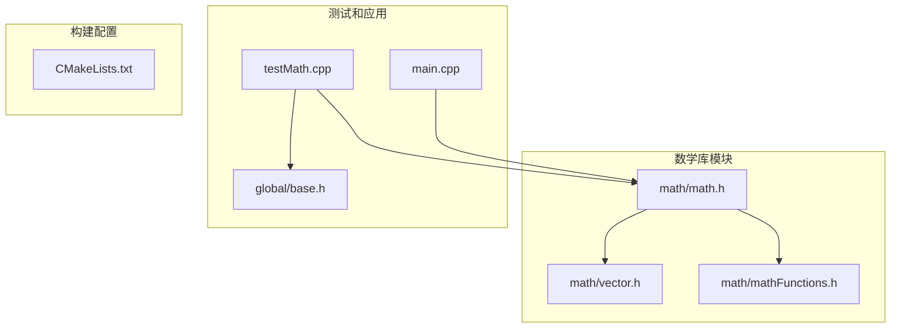
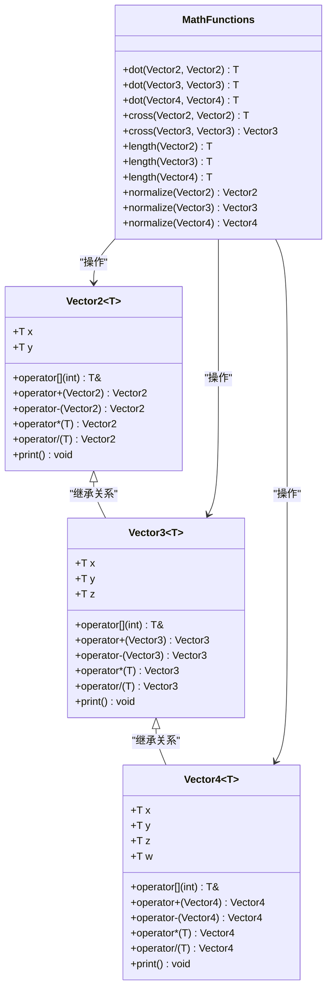
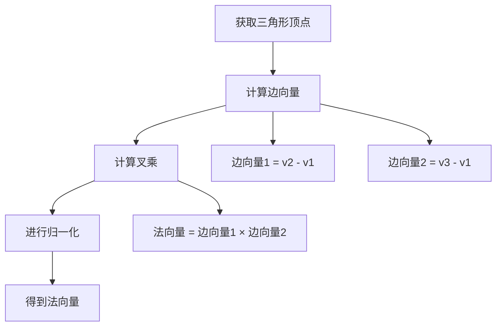
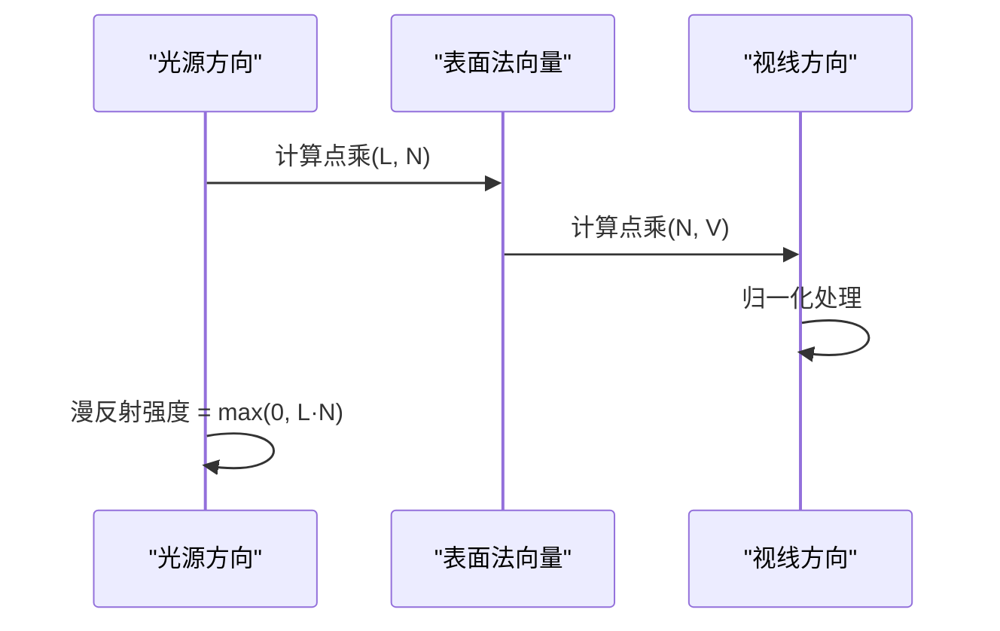
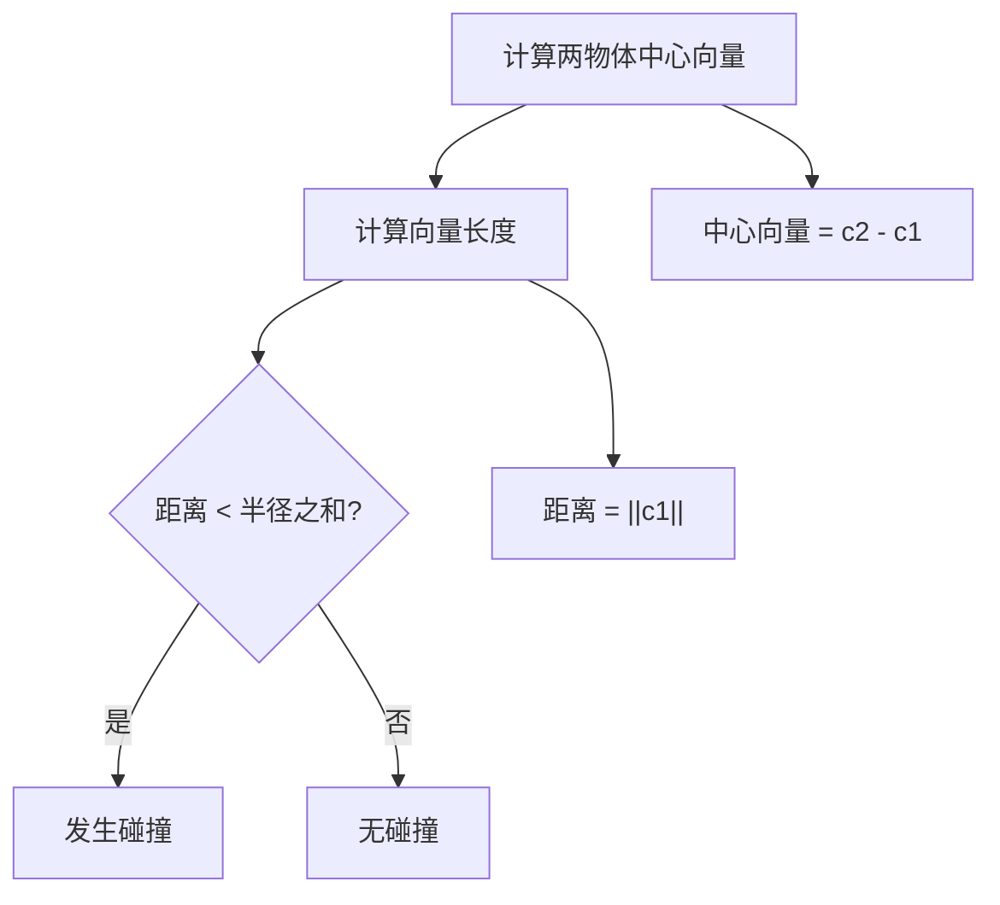
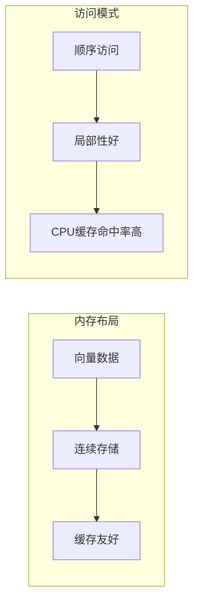

# 数学函数库

<cite>
**本文档引用的文件**
- [math/vector.h](file://math/vector.h)
- [math/mathFunctions.h](file://math/mathFunctions.h)
- [math/math.h](file://math/math.h)
- [testMath.cpp](file://testMath.cpp)
- [global/base.h](file://global/base.h)
- [main.cpp](file://main.cpp)
- [CMakeLists.txt](file://CMakeLists.txt)
</cite>

## 目录
1. [简介](#简介)
2. [项目结构](#项目结构)
3. [核心组件](#核心组件)
4. [架构概览](#架构概览)
5. [详细组件分析](#详细组件分析)
6. [数学函数详解](#数学函数详解)
7. [图形学应用场景](#图形学应用场景)
8. [性能考虑](#性能考虑)
9. [故障排除指南](#故障排除指南)
10. [结论](#结论)

## 简介

本数学函数库是一个专门为图形学和计算机视觉应用设计的向量数学库，提供了完整的向量运算支持。该库实现了2D、3D和4D向量的完整数学运算集，包括点乘、叉乘、向量归一化、长度计算等核心数学函数，并提供了高效的数值计算和丰富的类型支持。

该库采用模板编程技术，支持多种数据类型（float、int等），并通过精心设计的接口为图形学应用提供高性能的数学运算能力。

## 项目结构

该项目采用模块化的文件组织方式，主要包含以下核心目录和文件：



**图表来源**
- [math/math.h](file://math/math.h#L1-L4)
- [math/vector.h](file://math/vector.h#L1-L323)
- [math/mathFunctions.h](file://math/mathFunctions.h#L1-L155)

**章节来源**
- [CMakeLists.txt](file://CMakeLists.txt#L1-L53)

## 核心组件

数学库的核心由三个主要组件构成：

### 1. 向量类系统
- **Vector2<T>**: 二维向量类，支持所有基本的向量运算
- **Vector3<T>**: 三维向量类，提供完整的3D数学运算
- **Vector4<T>**: 四维向量类，主要用于齐次坐标和高级图形学应用

### 2. 数学函数库
- **点乘运算**: 计算两个向量的标量积
- **叉乘运算**: 计算两个向量的向量积（2D返回标量，3D返回向量）
- **长度计算**: 提供向量长度和长度平方的计算
- **向量归一化**: 将向量转换为单位向量

### 3. 类型别名系统
- **vec2f/vec2i**: float和int类型的2D向量别名
- **vec3f/vec3i**: float和int类型的3D向量别名  
- **vec4f/vec4i**: float和int类型的4D向量别名

**章节来源**
- [math/vector.h](file://math/vector.h#L13-L323)
- [math/mathFunctions.h](file://math/mathFunctions.h#L1-L155)

## 架构概览

该数学库采用了清晰的分层架构设计，确保了良好的模块化和可扩展性：



**图表来源**
- [math/vector.h](file://math/vector.h#L13-L323)
- [math/mathFunctions.h](file://math/mathFunctions.h#L63-L155)

## 详细组件分析

### Vector2<T> 类分析

Vector2<T> 是最基础的向量类，提供了完整的2D向量运算支持：

#### 核心特性
- **索引访问**: 支持 `v[0]` 和 `v[1]` 的数组式访问
- **运算符重载**: 实现了加法、减法、乘法、除法等标准运算
- **类型转换**: 支持从Vector3和Vector4到Vector2的隐式转换
- **打印功能**: 提供友好的调试输出格式

#### 运算符实现
- **加法运算**: `v1 + v2` 返回对应分量相加的新向量
- **标量乘法**: `v * s` 和 `s * v` 支持标量与向量的乘法
- **向量乘法**: `v1 * v2` 实现逐分量乘法（Hadamard积）
- **除法运算**: 支持标量除法，包含零除数检查

**章节来源**
- [math/vector.h](file://math/vector.h#L13-L127)

### Vector3<T> 类分析

Vector3<T> 提供了完整的3D向量数学运算，是图形学应用的核心：

#### 核心特性
- **三维几何**: 支持完整的3D空间向量运算
- **类型转换**: 支持从Vector4到Vector3的转换
- **齐次坐标**: 为透视投影等高级图形学运算做准备

#### 高级运算
- **点乘运算**: 计算向量间的夹角余弦值
- **叉乘运算**: 计算垂直于两个向量的第三个向量
- **长度计算**: 提供精确的欧几里得范数计算

**章节来源**
- [math/vector.h](file://math/vector.h#L131-L218)

### Vector4<T> 类分析

Vector4<T> 专门用于处理齐次坐标和高级图形学变换：

#### 特殊用途
- **齐次坐标**: 在4D空间中表示3D几何对象
- **颜色向量**: RGB颜色值的4D表示
- **变换矩阵**: 为4x4变换矩阵提供数据结构

#### 独特功能
- **颜色支持**: 内置alpha通道支持
- **类型转换**: 支持从Vector2和Vector3的转换
- **向量乘法**: 特殊的向量与向量乘法运算

**章节来源**
- [math/vector.h](file://math/vector.h#L221-L314)

## 数学函数详解

### 点乘运算 (Dot Product)

点乘是向量运算中最基础也是最重要的运算之一：

#### 数学原理
对于两个向量 **a** = (a₁, a₂, ..., aₙ) 和 **b** = (b₁, b₂, ..., bₙ)，点乘定义为：
**a** · **b** = Σ(aᵢ × bᵢ) = a₁b₁ + a₂b₂ + ... + aₙbₙ

#### 几何意义
- 计算两个向量之间的夹角余弦值
- 表示一个向量在另一个向量方向上的投影长度
- 当点乘为正时，两向量夹角小于90°；为负时大于90°；为零时垂直

#### 实现特点
- **时间复杂度**: O(n)，其中n为向量维度
- **空间复杂度**: O(1)
- **数值稳定性**: 逐分量相乘后求和，避免了中间结果溢出

**章节来源**
- [math/mathFunctions.h](file://math/mathFunctions.h#L63-L79)

### 叉乘运算 (Cross Product)

叉乘在2D和3D空间中有不同的数学含义和实现：

#### 2D叉乘
对于2D向量 **a** = (aₓ, aᵧ) 和 **b** = (bₓ, bᵧ)：
**a** × **b** = aₓbᵧ - aᵧbₓ

##### 几何意义
- 返回一个标量值，表示两个向量构成的平行四边形面积
- 正值表示从a到b的旋转方向为逆时针
- 负值表示顺时针旋转
- 零值表示两向量共线

#### 3D叉乘
对于3D向量 **a** = (aₓ, aᵧ, a_z) 和 **b** = (bₓ, bᵧ, b_z)：
**a** × **b** = (aᵧb_z - a_zbᵧ, a_zbₓ - aₓb_z, aₓbᵧ - aᵧbₓ)

##### 几何意义
- 返回一个垂直于两个输入向量的新向量
- 向量方向遵循右手定则
- 向量长度等于两向量长度乘积与夹角正弦值的乘积

**章节来源**
- [math/mathFunctions.h](file://math/mathFunctions.h#L82-L99)

### 向量长度计算

长度计算是向量运算的基础，提供了两种重要的计算方式：

#### 长度平方 (Length Squared)
```cpp
template<typename T>
inline float lengthSquared(const Vector2<T>& v) {
    return v.x * v.x + v.y * v.y;
}
```

##### 优势
- **性能优化**: 避免了开方运算，提高了比较效率
- **数值稳定**: 不会产生浮点误差累积
- **适用场景**: 距离比较、碰撞检测等不需要精确距离值的场合

#### 向量长度 (Length)
```cpp
template<typename T>
inline T length(const Vector2<T>& v) {
    return std::sqrt(lengthSquared(v));
}
```

##### 实现细节
- 使用标准库 `std::sqrt` 进行开方运算
- 先计算长度平方再开方，避免重复计算
- 支持浮点数和整数类型的统一接口

**章节来源**
- [math/mathFunctions.h](file://math/mathFunctions.h#L102-L135)

### 向量归一化 (Normalization)

向量归一化是将任意非零向量转换为单位向量的过程：

#### 数学原理
对于向量 **v**，其单位向量 **û** 定义为：
**û** = **v** / ||**v**||

其中 ||**v**|| 表示向量的长度。

#### 实现策略
```cpp
template<typename T>
inline Vector2<T> normalize(const Vector2<T>& v) {
    return v / length(v);
}
```

##### 关键考虑
- **零向量处理**: 需要检查长度是否为零，避免除零错误
- **数值精度**: 浮点运算中的舍入误差处理
- **性能优化**: 对于频繁使用的场景，可以考虑先计算长度平方

**章节来源**
- [math/mathFunctions.h](file://math/mathFunctions.h#L138-L154)

## 图形学应用场景

### 法向量计算

在3D图形学中，法向量是光照计算和着色的基础：

#### 三角形法向量


**图表来源**
- [math/mathFunctions.h](file://math/mathFunctions.h#L89-L99)

#### 应用场景
- **光照模型**: Phong光照、Blinn-Phong光照等
- **面剔除**: OpenGL的背面剔除功能
- **纹理映射**: 法线贴图的正确应用

### 光照计算

点乘运算在光照计算中发挥关键作用：

#### 漫反射光照


**图表来源**
- [math/mathFunctions.h](file://math/mathFunctions.h#L63-L79)

### 碰撞检测

向量运算在物理引擎和游戏开发中广泛应用于碰撞检测：

#### 距离计算


**图表来源**
- [math/mathFunctions.h](file://math/mathFunctions.h#L102-L135)

#### 碰撞响应
- **分离轴定理**: 使用点乘判断多边形间的分离
- **连续碰撞检测**: 通过向量插值预测碰撞时刻
- **弹性碰撞**: 利用向量反射公式计算反弹方向

### 3D变换和投影

向量运算在3D变换和投影中至关重要：

#### 视图变换
- **相机位置**: 使用向量表示相机位置和朝向
- **视图矩阵**: 通过向量运算构建视图变换
- **裁剪空间**: 利用向量运算进行视锥体裁剪

#### 投影变换
- **透视投影**: 使用向量运算实现透视除法
- **正交投影**: 通过向量截取实现正交投影
- **屏幕空间**: 将齐次坐标转换为屏幕坐标

## 性能考虑

### 时间复杂度分析

| 运算类型 | 时间复杂度 | 空间复杂度 | 备注 |
|---------|-----------|-----------|------|
| 向量加法 | O(n) | O(n) | n为向量维度 |
| 向量点乘 | O(n) | O(1) | 标量结果 |
| 向量叉乘 | O(1) | O(1) | 2D为标量，3D为向量 |
| 向量长度 | O(n) | O(1) | 包含开方运算 |
| 向量归一化 | O(n) | O(1) | 需要除法运算 |

### 内存访问模式



### 优化策略

#### 1. 避免不必要的开方运算
```cpp
// 推荐：使用长度平方进行比较
if (distanceSquared(p1, p2) < radiusSquared) {
    // 发生碰撞
}

// 不推荐：频繁调用sqrt
if (distance(p1, p2) < radius) {
    // 性能较差
}
```

#### 2. 批量向量化处理
- **SIMD指令**: 利用SSE/AVX指令集进行并行计算
- **向量批处理**: 同时处理多个向量以提高吞吐量
- **内存对齐**: 确保向量数据按16字节边界对齐

#### 3. 编译器优化
- **内联函数**: 使用`inline`关键字减少函数调用开销
- **常量传播**: 利用编译器优化常量表达式
- **循环展开**: 对简单循环进行手动展开

### 数值精度考虑

#### 浮点数精度问题
- **累积误差**: 连续运算可能导致精度损失
- **比较策略**: 使用epsilon值而非直接相等比较
- **舍入误差**: 注意浮点运算的舍入行为

#### 稳定性优化
```cpp
// 稳定的归一化
Vector3 normalizeStable(const Vector3& v) {
    float lenSq = lengthSquared(v);
    if (lenSq > EPSILON) {
        return v / sqrt(lenSq);
    }
    return Vector3(0, 0, 0);
}
```

## 故障排除指南

### 常见错误和解决方案

#### 1. 除零错误
**问题**: 归一化或除法运算时出现除零异常

**解决方案**:
```cpp
template<typename T>
Vector2<T> safeNormalize(const Vector2<T>& v) {
    float len = length(v);
    if (len > EPSILON) {
        return v / len;
    }
    return Vector2<T>(0, 0); // 返回零向量
}
```

#### 2. 精度丢失
**问题**: 长时间累积运算导致精度下降

**解决方案**:
- 使用更高精度的数据类型（double）
- 重新组织计算顺序以减少累积误差
- 定期对结果进行规范化

#### 3. 内存对齐问题
**问题**: SIMD优化时出现内存访问异常

**解决方案**:
```cpp
// 确保数据对齐
alignas(16) float data[N];
// 或使用std::aligned_storage
```

### 调试技巧

#### 1. 断言检查
```cpp
// 在关键位置添加断言
assert(i >= 0 && i < dimension);
assert(length(v) > EPSILON);
```

#### 2. 调试输出
```cpp
#ifdef DEBUG
void debugPrint(const Vector3& v) {
    std::cout << "Vector(" << v.x << ", " << v.y << ", " << v.z << ")" << std::endl;
}
#endif
```

#### 3. 性能监控
```cpp
auto start = std::chrono::high_resolution_clock::now();
// 执行向量运算
auto end = std::chrono::high_resolution_clock::now();
auto duration = std::chrono::duration_cast<std::microseconds>(end - start);
```

**章节来源**
- [math/vector.h](file://math/vector.h#L25-L43)
- [math/mathFunctions.h](file://math/mathFunctions.h#L94-L108)

## 结论

这个数学函数库为图形学和计算机视觉应用提供了完整而高效的向量数学运算支持。通过精心设计的模板类系统和丰富的数学函数，它能够满足从基础的2D图形到复杂的3D场景的各种需求。

### 主要优势

1. **完整的功能覆盖**: 提供了向量运算的所有核心功能
2. **高性能实现**: 通过模板和内联优化确保运行时效率
3. **类型安全**: 使用C++模板系统确保编译时类型检查
4. **易于使用**: 直观的接口设计降低了学习成本
5. **可扩展性**: 模块化设计便于功能扩展和维护

### 应用前景

该数学库特别适用于：
- **实时图形渲染**: 渲染管线中的向量运算
- **物理模拟**: 碰撞检测和动力学计算
- **游戏开发**: 游戏对象的位置、速度和加速度计算
- **科学计算**: 向量场和矩阵运算的应用

通过持续的优化和功能扩展，这个数学库有望成为图形学和科学计算领域的重要基础设施。