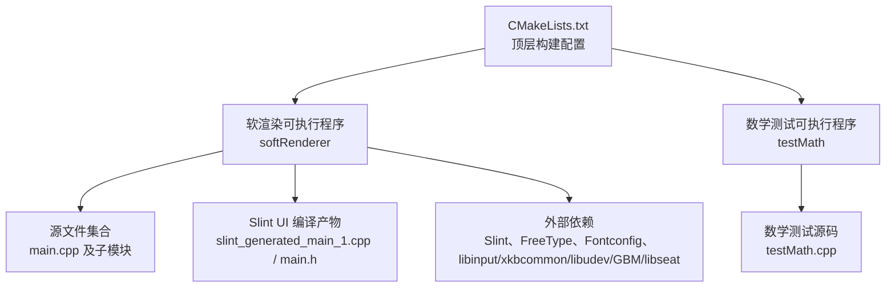
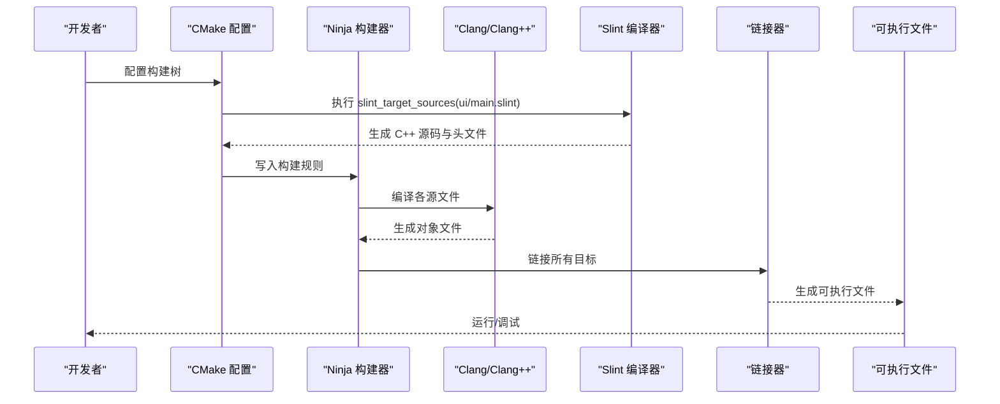
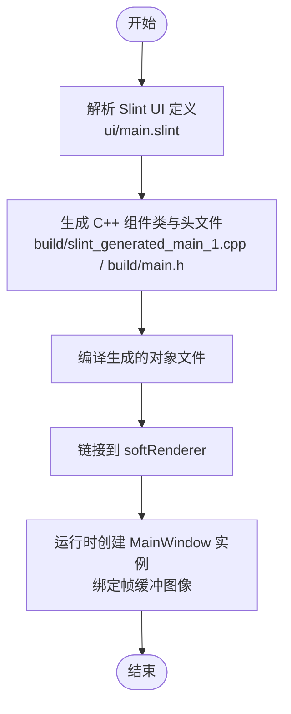
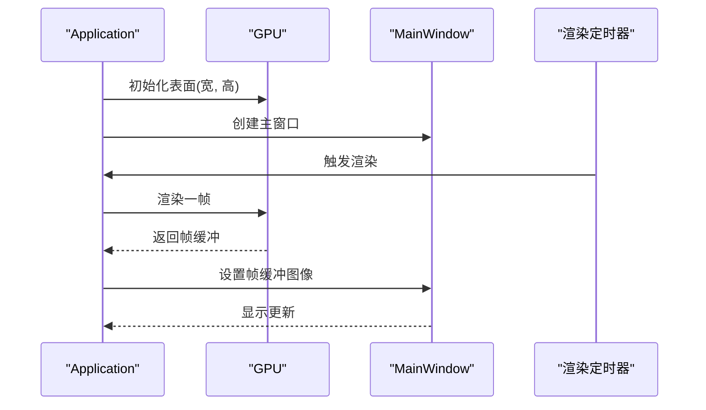
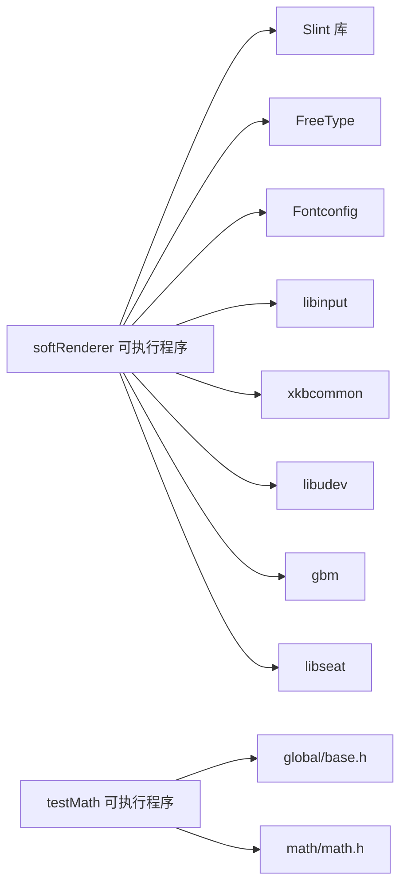

# 构建和部署

<cite>
**本文引用的文件**
- [CMakeLists.txt](file://CMakeLists.txt)
- [main.cpp](file://main.cpp)
- [testMath.cpp](file://testMath.cpp)
- [ui/main.slint](file://ui/main.slint)
- [build/slint_generated_main_1.cpp](file://build/slint_generated_main_1.cpp)
- [build/main.h](file://build/main.h)
- [application/application.h](file://application/application.h)
- [global/base.h](file://global/base.h)
- [gpu/gpu.h](file://gpu/gpu.h)
- [build/CMakeCache.txt](file://build/CMakeCache.txt)
- [build/compile_commands.json](file://build/compile_commands.json)
</cite>

## 目录
1. [简介](#简介)
2. [项目结构](#项目结构)
3. [核心组件](#核心组件)
4. [架构总览](#架构总览)
5. [详细组件分析](#详细组件分析)
6. [依赖关系分析](#依赖关系分析)
7. [性能与构建优化](#性能与构建优化)
8. [跨平台与部署指南](#跨平台与部署指南)
9. [故障排查](#故障排查)
10. [结论](#结论)

## 简介
本文件面向构建与部署工程师与高级开发者，系统性阐述本项目的 CMake 配置、编译流程、Slint UI 文件编译与集成、依赖管理、链接选项、并行构建、跨平台注意事项、以及打包与分发最佳实践。文档以仓库中实际存在的配置与代码为依据，避免臆测，确保可操作性。

## 项目结构
本项目采用 CMake 管理多源文件与目标，包含一个主可执行程序与一个数学库测试程序；UI 层使用 Slint 进行声明式界面定义，并通过 CMake 的 Slint 集成宏在构建期生成 C++ 组件类与资源。

图表来源
- [CMakeLists.txt](file://CMakeLists.txt#L1-L69)
- [main.cpp](file://main.cpp#L1-L59)
- [testMath.cpp](file://testMath.cpp#L1-L30)
- [build/slint_generated_main_1.cpp](file://build/slint_generated_main_1.cpp#L1-L243)
- [build/main.h](file://build/main.h#L1-L91)

章节来源
- [CMakeLists.txt](file://CMakeLists.txt#L1-L69)

## 核心组件
- 软渲染可执行程序 softRenderer：负责初始化应用、GPU 表面、渲染循环、并将 GPU 帧缓冲区转换为 Slint 图像进行显示。
- 数学测试可执行程序 testMath：验证数学库中的向量运算功能。
- Slint UI：声明式窗口组件，绑定帧缓冲图像属性，作为渲染结果的可视化载体。
- 构建系统：CMake 控制编译器、标准、依赖查找、链接与 Slint UI 源码注入。

章节来源
- [main.cpp](file://main.cpp#L10-L58)
- [testMath.cpp](file://testMath.cpp#L1-L30)
- [ui/main.slint](file://ui/main.slint#L1-L18)
- [CMakeLists.txt](file://CMakeLists.txt#L33-L69)

## 架构总览
下图展示从源码到可执行文件的典型构建路径，以及 Slint UI 的编译与集成流程。

图表来源
- [CMakeLists.txt](file://CMakeLists.txt#L67-L69)
- [build/compile_commands.json](file://build/compile_commands.json#L1-L44)

## 详细组件分析

### CMake 配置与编译器设置
- 最低版本与语言：要求 CMake 版本并指定 C++ 语言。
- 编译器选择：强制使用 Clang/Clang++，C++ 标准设为 C++20。
- 导出编译命令：开启导出 compile_commands.json，便于工具链与编辑器使用。
- 本地 Slint 集成：通过设置 Slint_DIR 并 find_package(Slint REQUIRED) 引入 Slint。
- 外部依赖：使用 find_package 与 pkg_check_modules 查找 FreeType、Fontconfig 以及 Linux 输入/图形栈（libinput、xkbcommon、libudev、gbm、libseat）。
- 目标与包含目录：softRenderer 与 testMath 分别设置私有包含目录，确保头文件可见性。
- 链接库：将 Slint、FreeType、Fontconfig 与上述系统库链接至 softRenderer。
- Slint UI 注入：通过 slint_target_sources 将 ui/main.slint 注入 softRenderer 目标，构建期自动生成 C++ 组件类与头文件。

章节来源
- [CMakeLists.txt](file://CMakeLists.txt#L1-L69)

### Slint UI 编译与集成
- UI 定义：ui/main.slint 声明了 MainWindow 组件，包含标题、尺寸、背景与绑定的帧缓冲图像属性。
- 生成物：构建后生成 slint_generated_main_1.cpp 与 main.h，其中 main.h 中包含版本断言与 MainWindow 类声明。
- 运行时绑定：主程序通过定时器将 GPU 帧缓冲区数据转换为 Slint Image 并设置到 UI 组件属性，完成显示。

图表来源
- [ui/main.slint](file://ui/main.slint#L1-L18)
- [build/slint_generated_main_1.cpp](file://build/slint_generated_main_1.cpp#L1-L243)
- [build/main.h](file://build/main.h#L1-L91)
- [main.cpp](file://main.cpp#L18-L55)

章节来源
- [ui/main.slint](file://ui/main.slint#L1-L18)
- [build/slint_generated_main_1.cpp](file://build/slint_generated_main_1.cpp#L1-L243)
- [build/main.h](file://build/main.h#L6-L6)

### 渲染与显示流程
- 应用生命周期：获取单例、初始化 GPU 表面、创建主窗口、注册关闭回调。
- 渲染循环：以约 60FPS 的定时器触发渲染，将 GPU 帧缓冲区数据按 Slint 像素格式复制并垂直翻转，设置到 UI 组件的帧缓冲属性。
- 事件循环：启动 Slint 事件循环，处理窗口与输入。

图表来源
- [main.cpp](file://main.cpp#L10-L58)
- [gpu/gpu.h](file://gpu/gpu.h#L11-L36)
- [application/application.h](file://application/application.h#L5-L33)

章节来源
- [main.cpp](file://main.cpp#L10-L58)
- [gpu/gpu.h](file://gpu/gpu.h#L11-L36)
- [application/application.h](file://application/application.h#L5-L33)

### 数据模型与基础类型
- 基础类型：RGBA、Point 等基础结构体，用于像素与点位表示。
- 全局常量：如 PI、角度换算等数学常量与辅助宏。

章节来源
- [global/base.h](file://global/base.h#L18-L42)

## 依赖关系分析
- 软渲染可执行程序 softRenderer 依赖：
  - Slint 运行时与生成的 UI 组件类
  - FreeType 字体渲染
  - Fontconfig 字体配置
  - Linux 输入/图形栈：libinput、xkbcommon、libudev、gbm、libseat
- testMath 仅依赖全局基础头文件与数学库头文件。

图表来源
- [CMakeLists.txt](file://CMakeLists.txt#L56-L65)
- [build/CMakeCache.txt](file://build/CMakeCache.txt#L17-L200)

章节来源
- [CMakeLists.txt](file://CMakeLists.txt#L56-L65)
- [build/CMakeCache.txt](file://build/CMakeCache.txt#L17-L200)

## 性能与构建优化
- 并行构建：默认使用 Ninja 作为生成器，具备良好的增量构建与并行能力。可通过 Ninja 参数控制并发度。
- 编译器与标准：使用 Clang/Clang++ 与 C++20，有助于现代语言特性的利用与优化。
- 编译数据库：开启导出 compile_commands.json，便于 clangd、CodeSearch 等工具索引与补全。
- 构建类型：CMakeCache 中包含 Debug/Release 等构建类型标志，可在不同模式下调整优化级别与调试信息。
- 链接优化：建议在 Release 下启用链接时的符号去除与优化选项，具体参数可按需追加至链接器标志。

章节来源
- [CMakeLists.txt](file://CMakeLists.txt#L5-L10)
- [build/CMakeCache.txt](file://build/CMakeCache.txt#L24-L71)
- [build/compile_commands.json](file://build/compile_commands.json#L1-L44)

## 跨平台与部署指南
- Linux（已验证）
  - 依赖：确保系统已安装 FreeType、Fontconfig、libinput、xkbcommon、libudev、gbm、libseat 等开发包。
  - 工具链：使用 Clang/Clang++ 与 Ninja。
  - 构建步骤：配置、生成、构建、运行。
- Windows（概念性说明）
  - 工具链：Visual Studio 或 Clang-cl。
  - 依赖：通过 vcpkg 或预编译 Slint 二进制集成。
  - 注意：Linux 输入/图形栈在 Windows 上不可用，需替换为平台适配层或禁用相关功能。
- macOS（概念性说明）
  - 工具链：Xcode 或 Clang。
  - 依赖：Homebrew 安装 FreeType、Fontconfig、xkbcommon 等，或使用预编译 Slint。
  - 注意：输入与图形栈差异较大，需平台适配。

[本节为通用指导，不直接分析具体文件，故无“章节来源”]

## 故障排查
- Slint 版本不匹配
  - 现象：生成的头文件包含版本断言失败。
  - 处理：确保构建使用的 Slint 编译器版本与运行库版本一致。
- 依赖未找到
  - 现象：find_package 或 pkg_check_modules 报错。
  - 处理：检查系统是否安装对应开发包，或在 CMake 配置中提供正确的路径变量。
- 编译数据库缺失
  - 现象：编辑器无法索引。
  - 处理：确认已开启导出编译数据库并在构建目录生成。
- 运行时黑屏或无输出
  - 现象：窗口创建但无图像。
  - 处理：检查渲染定时器是否触发、GPU 是否正确初始化、帧缓冲数据是否有效、像素格式转换是否正确。

章节来源
- [build/main.h](file://build/main.h#L6-L6)
- [CMakeLists.txt](file://CMakeLists.txt#L12-L14)
- [build/CMakeCache.txt](file://build/CMakeCache.txt#L78-L78)
- [main.cpp](file://main.cpp#L24-L55)

## 结论
本项目以 CMake 为核心，结合 Slint 的声明式 UI 与本地依赖管理，实现了从源码到可执行文件的完整构建链路。通过明确的编译器与标准设置、清晰的目标与包含目录、以及对 Slint UI 的自动化集成，项目具备良好的可维护性与可移植性。建议在生产环境中进一步完善跨平台适配、打包与版本化策略，并根据目标平台补充必要的依赖与链接选项。