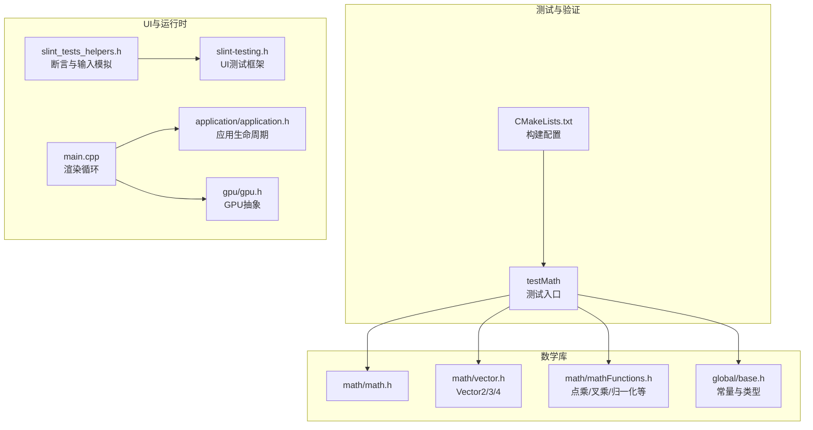
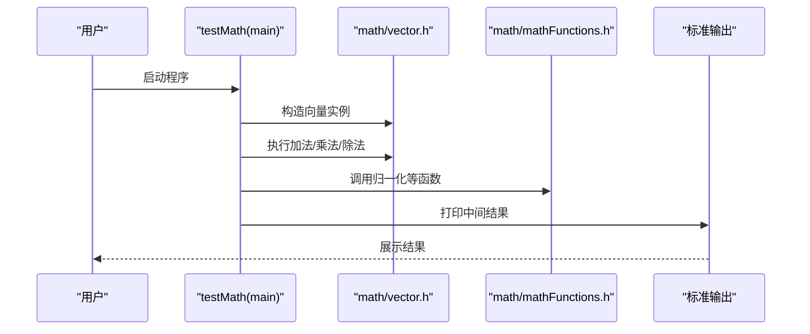
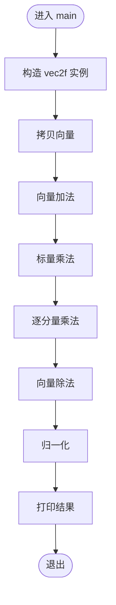
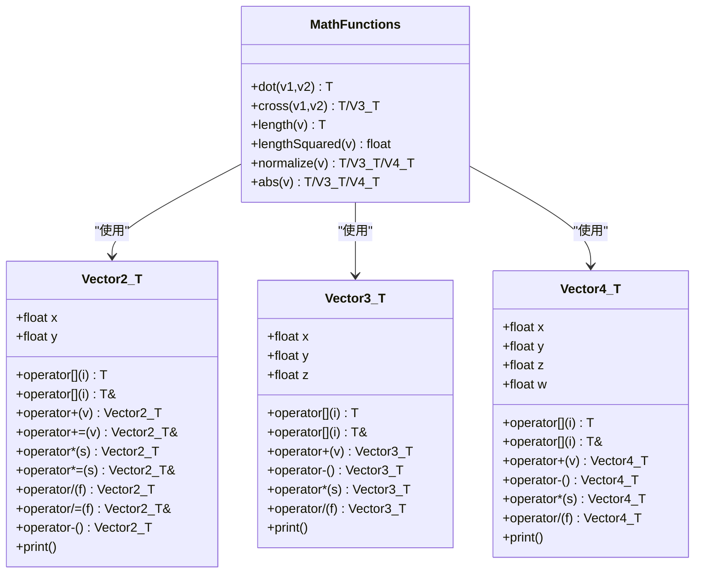
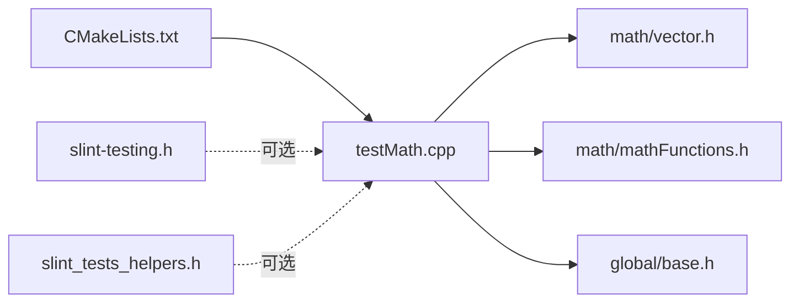

# 测试和验证

<cite>
**本文引用的文件**
- [testMath.cpp](file://testMath.cpp)
- [CMakeLists.txt](file://CMakeLists.txt)
- [math.h](file://math/math.h)
- [vector.h](file://math/vector.h)
- [mathFunctions.h](file://math/mathFunctions.h)
- [base.h](file://global/base.h)
- [slint-testing.h](file://slint/include/slint/slint-testing.h)
- [slint_tests_helpers.h](file://slint/include/slint/slint_tests_helpers.h)
- [main.cpp](file://main.cpp)
- [application.h](file://application/application.h)
- [gpu.h](file://gpu/gpu.h)
</cite>

## 目录
1. [引言](#引言)
2. [项目结构](#项目结构)
3. [核心组件](#核心组件)
4. [架构总览](#架构总览)
5. [详细组件分析](#详细组件分析)
6. [依赖关系分析](#依赖关系分析)
7. [性能考量](#性能考量)
8. [故障排查指南](#故障排查指南)
9. [结论](#结论)
10. [附录](#附录)

## 引言
本文件面向“测试和验证”主题，围绕项目中的 testMath 程序进行系统性说明。testMath 是一个轻量级的数学库验证程序，用于演示与验证向量类的构造、算术运算、标量乘法、归一化等基础能力。本文将从设计目的、实现方式、测试用例设计思路、结果解读方法、常见问题诊断、扩展建议、以及单元/集成/系统测试最佳实践等方面展开，并结合仓库中现有的 Slint UI 测试辅助工具，给出可操作的测试策略。

## 项目结构
该工程采用模块化组织，数学库位于 math 子目录，testMath 作为独立可执行目标被 CMake 添加；同时项目还包含图形渲染主程序、GPU 抽象层、应用生命周期管理以及 Slint UI 测试辅助头文件。下图展示了与测试验证直接相关的模块关系：

图表来源
- [testMath.cpp](file://testMath.cpp#L1-L30)
- [CMakeLists.txt](file://CMakeLists.txt#L35-L48)
- [math.h](file://math/math.h#L1-L4)
- [vector.h](file://math/vector.h#L1-L323)
- [mathFunctions.h](file://math/mathFunctions.h#L1-L155)
- [base.h](file://global/base.h#L1-L42)
- [slint-testing.h](file://slint/include/slint/slint-testing.h#L1-L533)
- [slint_tests_helpers.h](file://slint/include/slint/slint_tests_helpers.h#L1-L69)
- [main.cpp](file://main.cpp#L1-L59)
- [application.h](file://application/application.h#L1-L33)
- [gpu.h](file://gpu/gpu.h#L1-L37)

章节来源
- [CMakeLists.txt](file://CMakeLists.txt#L1-L69)
- [testMath.cpp](file://testMath.cpp#L1-L30)

## 核心组件
- testMath：最小可运行示例，验证向量加法、乘法（标量与逐分量）、除法、归一化等基本运算，输出中间结果以供人工核验。
- 数学库(math/vector.h, math/mathFunctions.h)：提供模板化的向量类与常用数学函数，是 testMath 的直接被测对象。
- 构建系统(CMakeLists.txt)：定义了 testMath 目标的编译规则与包含路径，确保其能访问 math 与 global 头文件。
- Slint UI 测试辅助(slnt-testing.h, slint_tests_helpers.h)：提供 UI 元素查询、断言宏、时间模拟与输入事件注入等能力，可用于 UI 驱动的系统测试。

章节来源
- [testMath.cpp](file://testMath.cpp#L5-L29)
- [vector.h](file://math/vector.h#L12-L323)
- [mathFunctions.h](file://math/mathFunctions.h#L1-L155)
- [CMakeLists.txt](file://CMakeLists.txt#L35-L48)
- [slint-testing.h](file://slint/include/slint/slint-testing.h#L14-L533)
- [slint_tests_helpers.h](file://slint/include/slint/slint_tests_helpers.h#L10-L68)

## 架构总览
testMath 的运行流程如下：main 进程启动后，通过数学库提供的向量类完成若干运算，随后打印结果。该流程简单清晰，适合用于验证数学库的正确性与稳定性。

图表来源
- [testMath.cpp](file://testMath.cpp#L5-L29)
- [vector.h](file://math/vector.h#L12-L323)
- [mathFunctions.h](file://math/mathFunctions.h#L138-L155)

## 详细组件分析

### testMath 设计与实现
- 设计目的：以最小代价验证数学库向量运算的正确性，便于快速回归与集成。
- 实现要点：
  - 使用向量类进行构造、拷贝、四则运算与标量乘除。
  - 调用归一化函数生成单位向量并打印。
  - 通过标准输出观察中间结果，便于人工核验。
- 可扩展点：增加边界条件（零向量、负数、极大/极小值）、精度比较、异常路径（除零断言）等。

图表来源
- [testMath.cpp](file://testMath.cpp#L6-L29)

章节来源
- [testMath.cpp](file://testMath.cpp#L5-L29)

### 数学库组件（向量类与函数）
- 向量类族：Vector2/Templated、Vector3/Templated、Vector4/Templated，支持索引访问、四则运算、标量运算、取负、打印等。
- 数学函数族：点乘、叉乘、长度/长度平方、归一化、逐分量绝对值、标量与向量的逐分量乘法等。
- 断言保护：除法运算对除数进行断言，防止非法输入导致未定义行为。

图表来源
- [vector.h](file://math/vector.h#L12-L323)
- [mathFunctions.h](file://math/mathFunctions.h#L6-L155)

章节来源
- [vector.h](file://math/vector.h#L12-L323)
- [mathFunctions.h](file://math/mathFunctions.h#L6-L155)

### 构建与集成（CMake）
- 定义 testMath 可执行目标，设置包含路径，确保其能访问 math 与 global 头文件。
- 主程序 softRenderer 的构建配置与链接参数与 testMath 独立，互不干扰。

章节来源
- [CMakeLists.txt](file://CMakeLists.txt#L35-L48)

### UI 测试辅助（Slint）
- 提供 UI 元素查询、断言宏、时间模拟与鼠标/键盘事件注入等能力，适用于 UI 驱动的系统测试。
- 断言宏支持整型与浮点型比较，其中浮点比较引入容差以避免精度误差导致的误判。

章节来源
- [slint-testing.h](file://slint/include/slint/slint-testing.h#L14-L533)
- [slint_tests_helpers.h](file://slint/include/slint/slint_tests_helpers.h#L42-L68)

## 依赖关系分析
- testMath 对 math/vector.h 与 math/mathFunctions.h 的直接依赖，间接依赖 global/base.h 中的基础类型与常量。
- 构建脚本确保 testMath 能正确解析这些头文件。
- UI 测试辅助库与 testMath 无直接耦合，但可作为系统测试阶段的补充工具。

图表来源
- [testMath.cpp](file://testMath.cpp#L1-L3)
- [CMakeLists.txt](file://CMakeLists.txt#L35-L48)
- [vector.h](file://math/vector.h#L1-L3)
- [mathFunctions.h](file://math/mathFunctions.h#L1-L3)
- [base.h](file://global/base.h#L1-L10)
- [slint-testing.h](file://slint/include/slint/slint-testing.h#L1-L10)
- [slint_tests_helpers.h](file://slint/include/slint/slint_tests_helpers.h#L1-L10)

章节来源
- [testMath.cpp](file://testMath.cpp#L1-L3)
- [CMakeLists.txt](file://CMakeLists.txt#L35-L48)

## 性能考量
- 当前 testMath 仅进行少量向量运算并打印结果，性能开销极低，不适合作为性能基准测试。
- 若需进行性能评估，建议：
  - 批量重复执行同一运算序列，统计平均耗时与方差。
  - 使用高分辨率计时器（如 std::chrono）测量 CPU 时间或 GPU 时间（若涉及渲染）。
  - 控制编译优化级别（Release），排除调试开销。
  - 关注缓存局部性与 SIMD 指令集利用情况（视具体实现而定）。

## 故障排查指南
- 除零断言失败
  - 现象：程序在除法运算处触发断言。
  - 排查：检查除数是否为零；确认输入数据范围；必要时在调用前添加显式校验。
  - 参考位置：向量类的除法运算断言。
- 索引越界
  - 现象：[] 操作访问超出维度范围。
  - 排查：核对索引范围（Vector2 为 0..1，Vector3 为 0..2，Vector4 为 0..3）。
- 结果不符合预期
  - 现象：加法/乘法/归一化结果与期望不符。
  - 排查：对比中间步骤；检查数据类型与精度；使用断言宏进行数值比较（浮点比较需考虑容差）。
- UI 测试不稳定
  - 现象：元素查找失败或事件注入不生效。
  - 排查：确认测试后端已初始化；确保元素可见且有效；使用断言宏定位差异。

章节来源
- [vector.h](file://math/vector.h#L25-L43)
- [vector.h](file://math/vector.h#L94-L109)
- [vector.h](file://math/vector.h#L138-L154)
- [vector.h](file://math/vector.h#L193-L204)
- [vector.h](file://math/vector.h#L227-L245)
- [vector.h](file://math/vector.h#L289-L300)
- [slint_tests_helpers.h](file://slint/include/slint/slint_tests_helpers.h#L42-L68)

## 结论
testMath 以简洁的方式验证了数学库的核心能力，适合作为单元测试与回归测试的基线。结合 Slint 的 UI 测试辅助工具，可在更高层次进行系统测试与验收。建议在现有基础上逐步扩展边界条件、精度与性能测试，并将断言与日志规范化，形成可维护的测试体系。

## 附录

### 测试用例设计思路
- 边界条件测试
  - 零向量、单位向量、负向量、极大/极小值。
  - 不同维度向量间的兼容性（如从 Vector4 到 Vector2 的赋值）。
- 精度验证
  - 归一化后的长度应接近 1.0；使用断言宏进行浮点比较。
  - 逐分量乘法与标量乘法的一致性。
- 性能基准测试
  - 在 Release 模式下批量执行大量运算，记录耗时并分析趋势。
- 异常路径
  - 除零断言、索引越界断言的触发与处理。

### 结果解读方法
- 人工核验：观察打印输出，确认格式与数值范围合理。
- 断言核验：使用断言宏比较计算结果与期望值，浮点比较需设定容差。
- 日志与报告：记录每次测试的输入、期望与实际输出，便于回溯与回归。

### 扩展建议
- 新增单元测试套件：针对每个向量类与数学函数编写独立用例。
- 集成测试：结合主程序渲染流程，验证数学库在真实场景下的表现。
- 系统测试：利用 UI 测试辅助工具，模拟用户交互并断言界面状态变化。
- 测试驱动开发（TDD）实践
  - 先编写失败的测试用例，再实现满足需求的代码。
  - 保持测试覆盖率稳定提升，优先覆盖关键路径与边界条件。
  - 将测试作为设计说明书，指导接口演进与重构。

### 最佳实践
- 单元测试
  - 使用断言宏进行等值判断；对浮点数比较引入容差。
  - 将测试数据参数化，覆盖多种输入组合。
- 集成测试
  - 模拟外部依赖（如 GPU、窗口系统）的行为，隔离不确定性因素。
  - 保证测试顺序与环境一致性，避免竞态条件。
- 系统测试
  - 使用 UI 测试辅助工具注入事件并断言结果。
  - 对关键交互路径进行端到端验证。