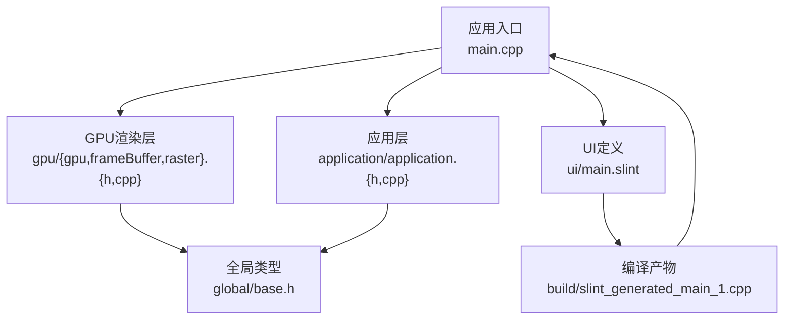
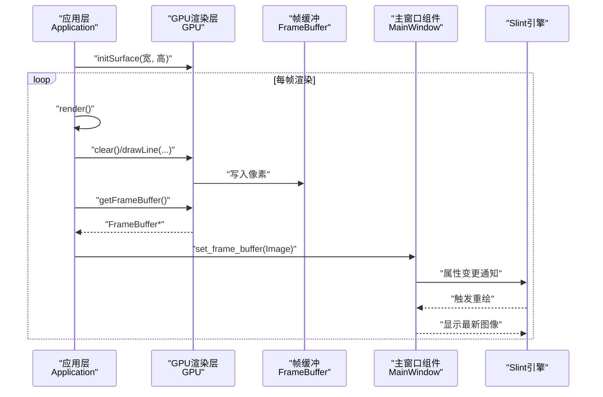
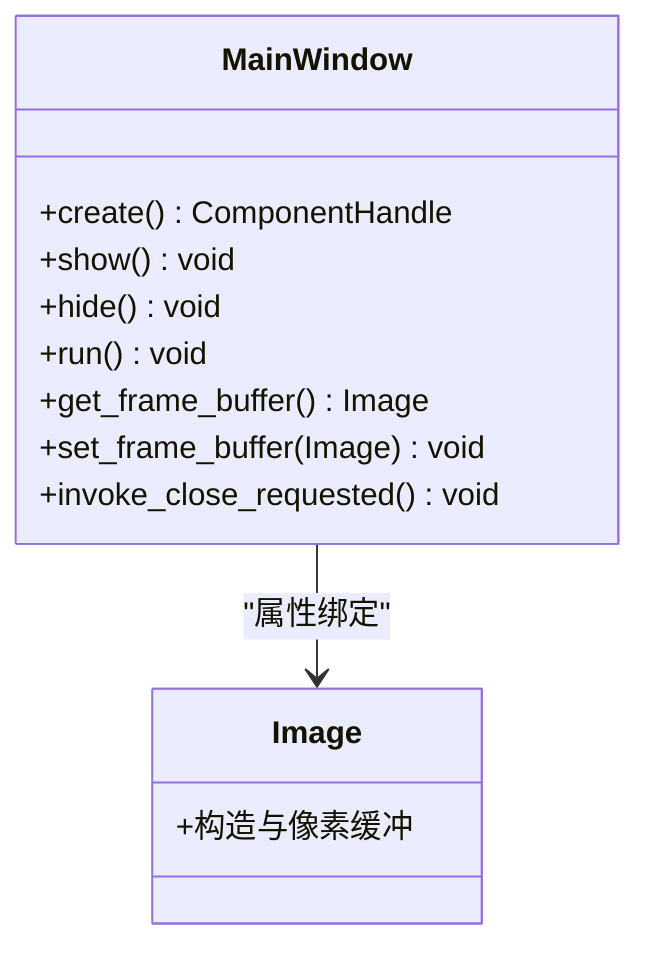
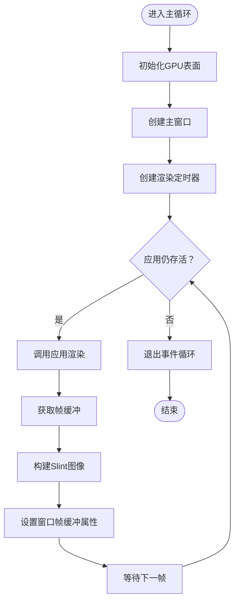
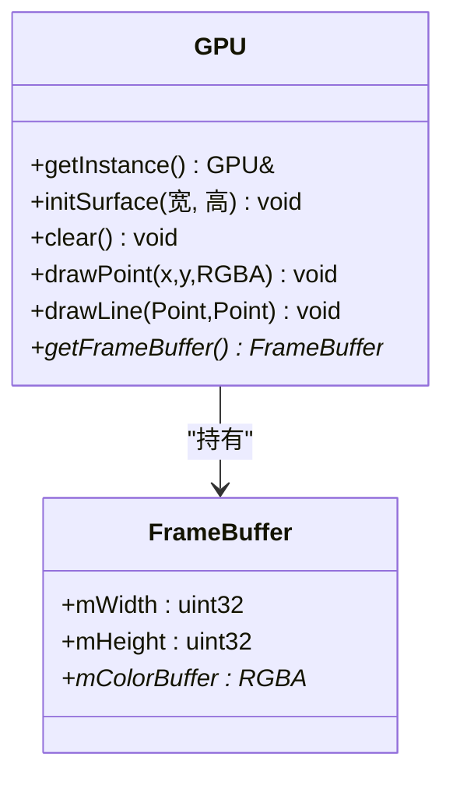
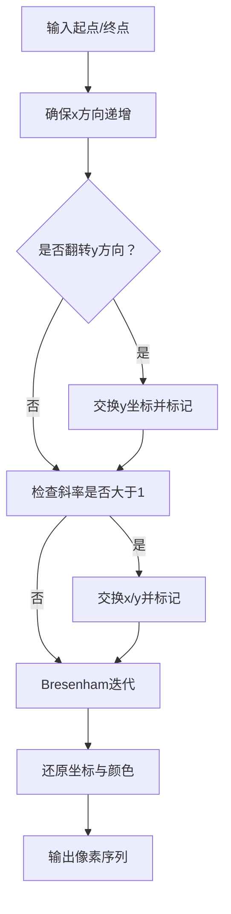
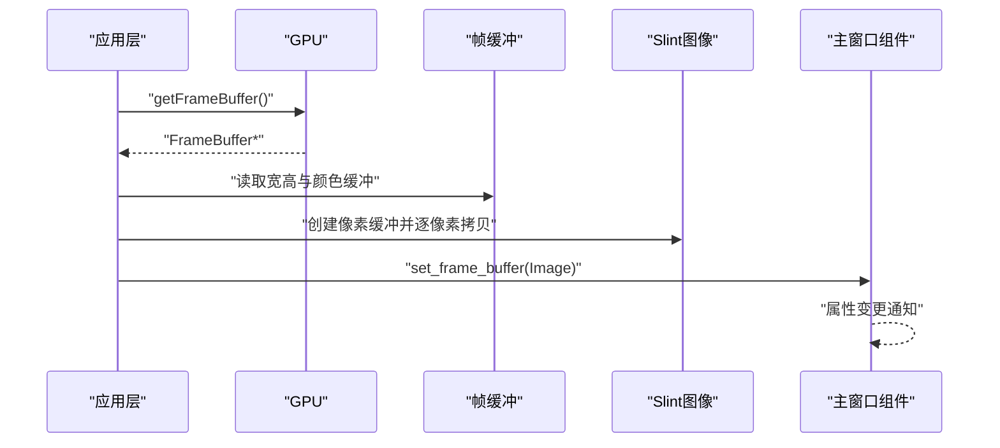
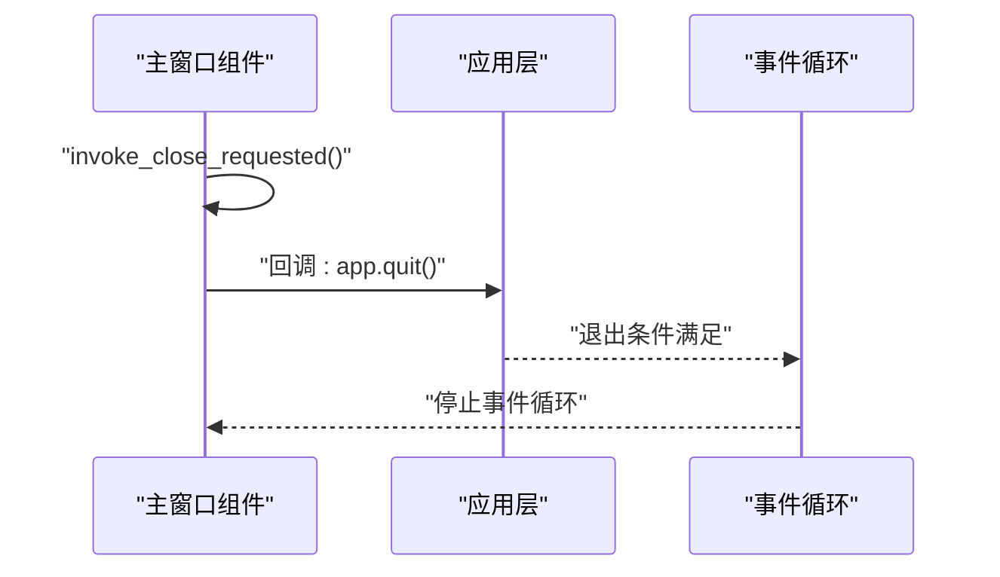
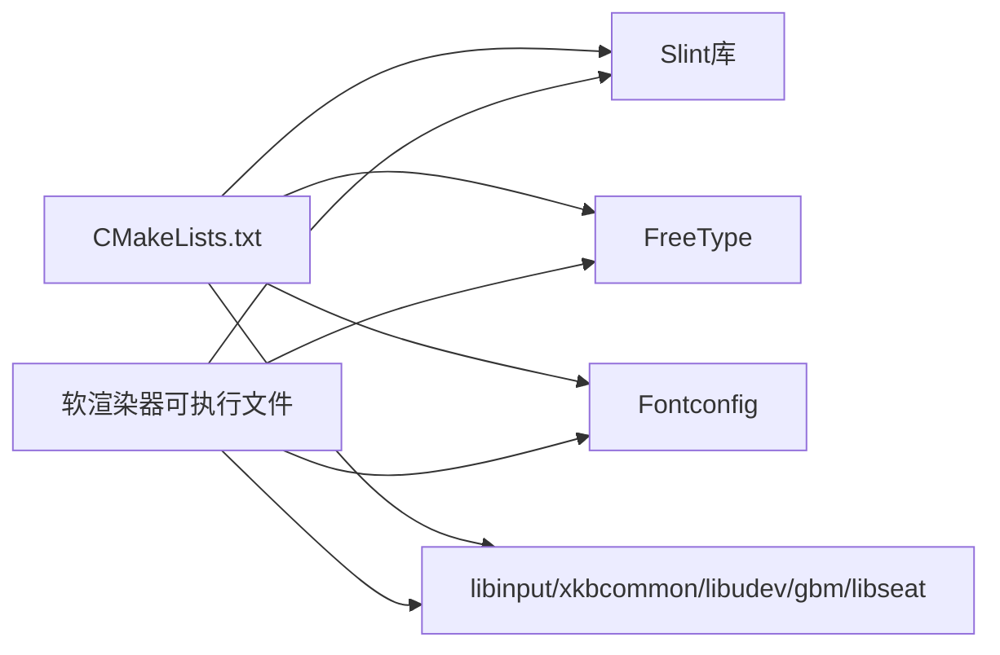

# UI集成架构

<cite>
**本文引用的文件**
- [ui/main.slint](file://ui/main.slint)
- [main.cpp](file://main.cpp)
- [build/slint_generated_main_1.cpp](file://build/slint_generated_main_1.cpp)
- [application/application.h](file://application/application.h)
- [application/application.cpp](file://application/application.cpp)
- [gpu/gpu.h](file://gpu/gpu.h)
- [gpu/gpu.cpp](file://gpu/gpu.cpp)
- [gpu/frameBuffer.h](file://gpu/frameBuffer.h)
- [gpu/raster.h](file://gpu/raster.h)
- [gpu/raster.cpp](file://gpu/raster.cpp)
- [global/base.h](file://global/base.h)
- [CMakeLists.txt](file://CMakeLists.txt)
</cite>

## 目录
1. [引言](#引言)
2. [项目结构](#项目结构)
3. [核心组件](#核心组件)
4. [架构总览](#架构总览)
5. [详细组件分析](#详细组件分析)
6. [依赖关系分析](#依赖关系分析)
7. [性能考量](#性能考量)
8. [故障排查指南](#故障排查指南)
9. [结论](#结论)
10. [附录](#附录)

## 引言
本文件面向UI集成系统，聚焦于Slint UI框架在该图形渲染示例中的集成方式与设计理念，涵盖以下要点：
- Slint声明式UI语法与C++代码的绑定机制
- 主窗口布局与控件组织（图像显示区域、交互回调）
- 事件处理机制（从用户输入到应用响应的事件流）
- UI与渲染系统的数据交换（帧缓冲数据传递与显示更新）
- UI框架选择理由与替代方案比较
- UI定制与扩展思路（主题切换、多语言支持）

## 项目结构
该项目采用“模块化+分层”的组织方式：
- 应用入口与控制流位于顶层源文件
- UI定义位于独立目录，通过编译器生成C++组件类
- 渲染管线位于gpu子系统，负责绘制与帧缓冲管理
- 全局基础类型与数学工具位于global与math目录
- 构建系统使用CMake，集成Slint并链接系统依赖

图表来源
- [main.cpp](file://main.cpp#L1-L59)
- [application/application.cpp](file://application/application.cpp#L1-L46)
- [gpu/gpu.cpp](file://gpu/gpu.cpp#L1-L48)
- [gpu/frameBuffer.h](file://gpu/frameBuffer.h#L1-L19)
- [gpu/raster.cpp](file://gpu/raster.cpp#L1-L104)
- [global/base.h](file://global/base.h#L1-L42)
- [CMakeLists.txt](file://CMakeLists.txt#L1-L69)

章节来源
- [CMakeLists.txt](file://CMakeLists.txt#L1-L69)

## 核心组件
- 主窗口组件：由Slint UI文件编译生成，包含窗口标题、尺寸、背景色及一个图像控件用于显示帧缓冲
- 应用层：单例模式封装应用生命周期、尺寸信息与渲染调度
- GPU渲染层：模拟GPU表面初始化、清屏、像素写入与线段光栅化
- 帧缓冲：承载颜色像素的内存块，供UI直接显示
- 数学与基础类型：RGBA颜色、Point点、角度换算常量等

章节来源
- [ui/main.slint](file://ui/main.slint#L1-L18)
- [build/slint_generated_main_1.cpp](file://build/slint_generated_main_1.cpp#L1-L243)
- [application/application.h](file://application/application.h#L1-L33)
- [application/application.cpp](file://application/application.cpp#L1-L46)
- [gpu/gpu.h](file://gpu/gpu.h#L1-L37)
- [gpu/gpu.cpp](file://gpu/gpu.cpp#L1-L48)
- [gpu/frameBuffer.h](file://gpu/frameBuffer.h#L1-L19)
- [global/base.h](file://global/base.h#L1-L42)

## 架构总览
整体架构围绕“渲染—传输—显示”闭环展开：
- 渲染阶段：应用层每帧调用GPU进行绘制，输出到帧缓冲
- 数据传输阶段：将帧缓冲中的像素转换为Slint可识别的图像格式，并设置到UI组件属性
- 显示阶段：Slint根据属性变化触发重绘，图像控件展示最新帧

图表来源
- [main.cpp](file://main.cpp#L10-L59)
- [application/application.cpp](file://application/application.cpp#L23-L45)
- [gpu/gpu.cpp](file://gpu/gpu.cpp#L18-L47)
- [gpu/frameBuffer.h](file://gpu/frameBuffer.h#L8-L18)
- [build/slint_generated_main_1.cpp](file://build/slint_generated_main_1.cpp#L214-L224)

## 详细组件分析

### Slint UI定义与绑定
- UI定义：主窗口组件继承窗口，设置标题、尺寸、背景色；声明一个只读属性用于接收帧缓冲图像
- 图像控件：占满容器尺寸，绑定到根节点的帧缓冲属性
- 组件生成：编译器生成的组件类提供构造、显示、事件循环、属性访问器等方法

图表来源
- [ui/main.slint](file://ui/main.slint#L1-L18)
- [build/slint_generated_main_1.cpp](file://build/slint_generated_main_1.cpp#L190-L242)

章节来源
- [ui/main.slint](file://ui/main.slint#L1-L18)
- [build/slint_generated_main_1.cpp](file://build/slint_generated_main_1.cpp#L1-L243)

### 应用层与渲染调度
- 单例应用：提供尺寸查询、生命周期控制、渲染入口
- 渲染逻辑：清屏后绘制一组从中心辐射的线条，形成动态视觉效果
- 定时器驱动：以约60fps频率触发渲染与UI更新

图表来源
- [main.cpp](file://main.cpp#L10-L59)
- [application/application.cpp](file://application/application.cpp#L23-L45)

章节来源
- [main.cpp](file://main.cpp#L10-L59)
- [application/application.h](file://application/application.h#L1-L33)
- [application/application.cpp](file://application/application.cpp#L1-L46)

### GPU渲染与帧缓冲
- 表面初始化：按指定宽高创建帧缓冲对象
- 清屏：将帧缓冲填充为指定颜色
- 绘制：将线段光栅化为像素点并写入帧缓冲
- 帧缓冲：保存颜色像素，供UI读取显示

图表来源
- [gpu/gpu.h](file://gpu/gpu.h#L11-L36)
- [gpu/gpu.cpp](file://gpu/gpu.cpp#L18-L47)
- [gpu/frameBuffer.h](file://gpu/frameBuffer.h#L8-L18)

章节来源
- [gpu/gpu.h](file://gpu/gpu.h#L1-L37)
- [gpu/gpu.cpp](file://gpu/gpu.cpp#L1-L48)
- [gpu/frameBuffer.h](file://gpu/frameBuffer.h#L1-L19)

### 线段光栅化与插值
- 光栅化：使用改进的Bresenham算法，处理x/y方向与斜率范围，生成离散像素序列
- 插值：按比例混合端点颜色，得到中间像素的颜色

图表来源
- [gpu/raster.cpp](file://gpu/raster.cpp#L7-L84)
- [gpu/raster.cpp](file://gpu/raster.cpp#L86-L103)

章节来源
- [gpu/raster.h](file://gpu/raster.h#L1-L20)
- [gpu/raster.cpp](file://gpu/raster.cpp#L1-L104)

### 帧缓冲到Slint图像的数据交换
- 像素翻转：由于GPU坐标系与Slint坐标系差异，需垂直翻转像素行
- 像素格式转换：将内部RGBA结构映射到Slint的Rgba8Pixel
- 属性更新：通过组件的setter方法将图像设置到UI属性，触发重绘

图表来源
- [main.cpp](file://main.cpp#L31-L53)
- [gpu/frameBuffer.h](file://gpu/frameBuffer.h#L14-L16)
- [build/slint_generated_main_1.cpp](file://build/slint_generated_main_1.cpp#L220-L224)

章节来源
- [main.cpp](file://main.cpp#L31-L53)
- [build/slint_generated_main_1.cpp](file://build/slint_generated_main_1.cpp#L214-L224)

### 事件处理机制
- 关闭请求：UI组件发出关闭请求回调，应用层收到后设置退出标志并结束事件循环
- 事件循环：组件运行时启动事件循环，处理窗口消息与重绘

图表来源
- [main.cpp](file://main.cpp#L20-L22)
- [build/slint_generated_main_1.cpp](file://build/slint_generated_main_1.cpp#L208-L212)
- [build/slint_generated_main_1.cpp](file://build/slint_generated_main_1.cpp#L238-L242)

章节来源
- [main.cpp](file://main.cpp#L20-L22)
- [build/slint_generated_main_1.cpp](file://build/slint_generated_main_1.cpp#L208-L212)
- [build/slint_generated_main_1.cpp](file://build/slint_generated_main_1.cpp#L238-L242)

## 依赖关系分析
- 构建系统通过CMake集成Slint库与字体/输入等系统依赖
- 应用二进制链接Slint、FreeType、Fontconfig以及若干系统库
- UI定义通过slint_target_sources参与编译，生成组件类与属性绑定

图表来源
- [CMakeLists.txt](file://CMakeLists.txt#L56-L65)

章节来源
- [CMakeLists.txt](file://CMakeLists.txt#L1-L69)

## 性能考量
- 帧率控制：定时器周期约为16ms以逼近60FPS，避免过高的CPU占用
- 像素拷贝优化：在逐像素拷贝时注意内存对齐与缓存友好性，必要时考虑SIMD或批量操作
- 帧缓冲大小：窗口尺寸越大，拷贝成本越高，应权衡分辨率与性能
- 光栅化复杂度：线段数量与长度影响绘制时间，可通过减少线段密度或简化几何来优化

## 故障排查指南
- UI不显示或黑屏
  - 检查帧缓冲是否成功初始化与清屏
  - 确认像素拷贝流程中未越界，且已进行垂直翻转
  - 验证Slint图像创建与属性设置是否正确
- 关闭无响应
  - 确认关闭回调已注册并调用应用退出
  - 检查事件循环是否正常启动与退出
- 性能抖动
  - 检查渲染逻辑是否包含昂贵计算
  - 调整定时器周期或减少每帧绘制对象数量

章节来源
- [main.cpp](file://main.cpp#L16-L53)
- [application/application.cpp](file://application/application.cpp#L23-L45)
- [build/slint_generated_main_1.cpp](file://build/slint_generated_main_1.cpp#L208-L212)

## 结论
本系统以Slint为UI框架，结合自研GPU渲染管线，实现了从渲染到显示的完整链路。通过组件化的UI定义与C++绑定，配合定时器驱动的渲染循环，能够稳定地将帧缓冲内容呈现给用户。该架构简洁清晰，便于扩展与维护。

## 附录

### UI框架选择理由与替代方案比较
- 选择Slint的理由
  - 声明式语法直观易用，便于快速搭建界面原型
  - 与C++绑定紧密，编译期生成组件类，运行时开销低
  - 跨平台良好，适合桌面环境
- 替代方案
  - Qt Widgets：功能丰富但学习曲线较高，资源占用较大
  - GLFW/GLAD + 自绘：完全自控，但需要大量样板代码与平台适配
  - Web技术栈：适合跨浏览器场景，但与原生桌面体验有差距

### UI定制与扩展指导
- 主题切换
  - 将颜色、字体等样式参数抽象为配置项，通过属性绑定动态切换
  - 在组件中暴露主题枚举或样式表路径，运行时更新
- 多语言支持
  - 使用字符串资源与本地化键值，运行时根据区域设置切换
  - 在组件中提供语言切换回调，更新文本与布局
- 交互增强
  - 扩展回调接口，如鼠标点击、拖拽、键盘快捷键
  - 通过模型/视图分离，支持列表、树形等复杂控件