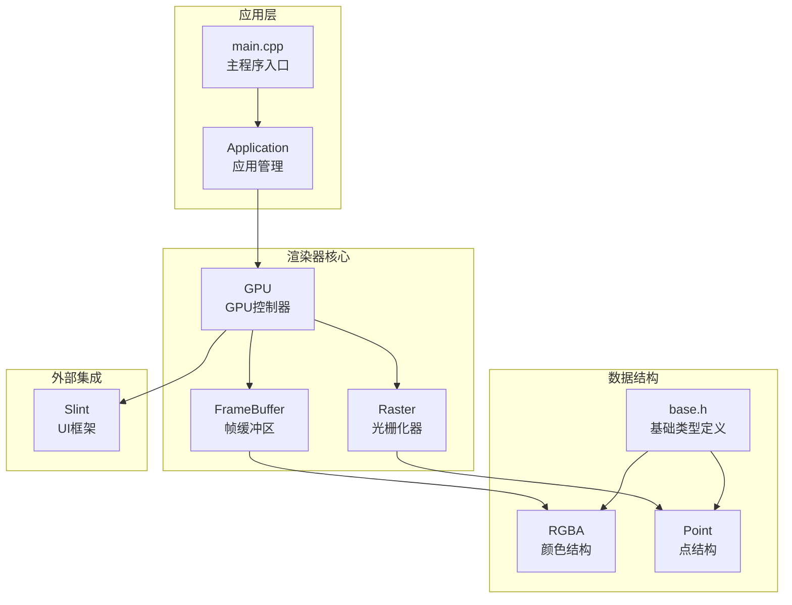
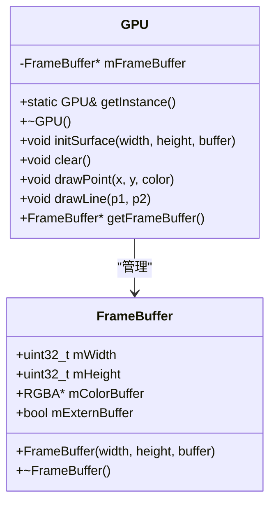
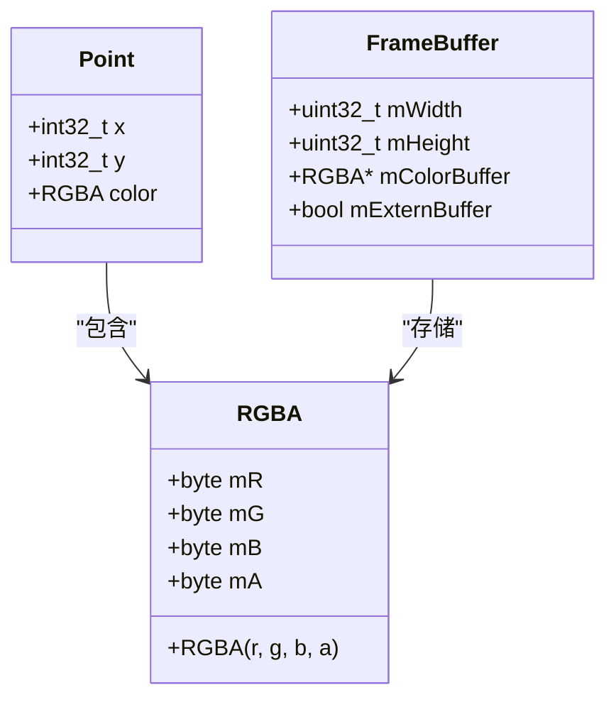
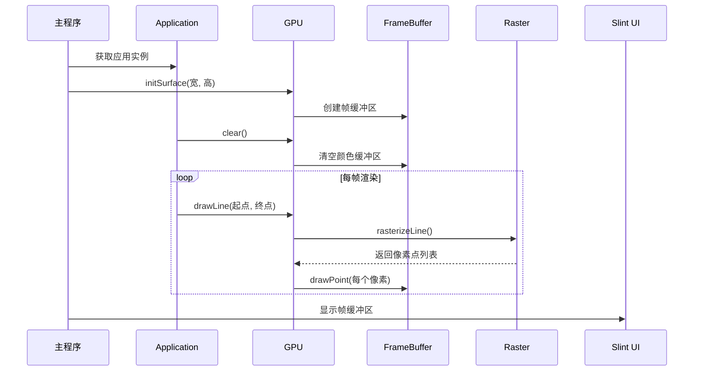
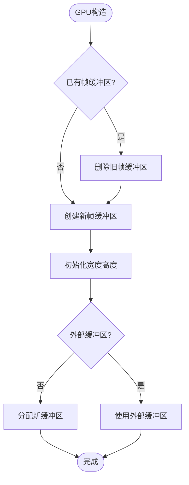
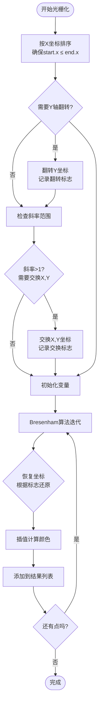
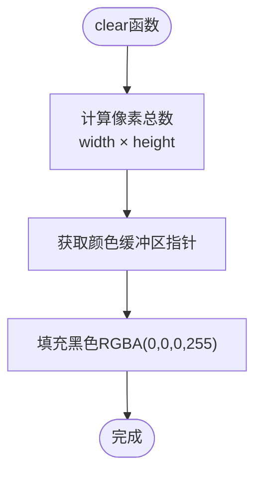
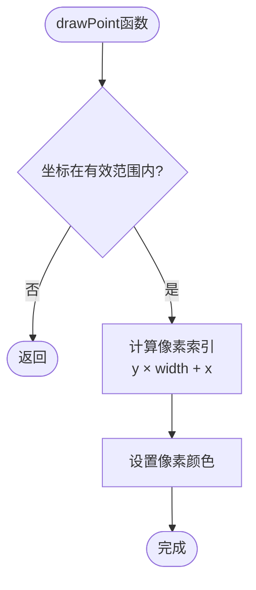
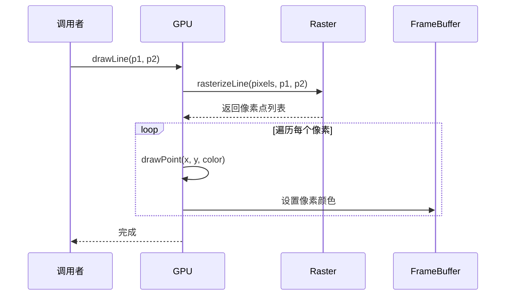
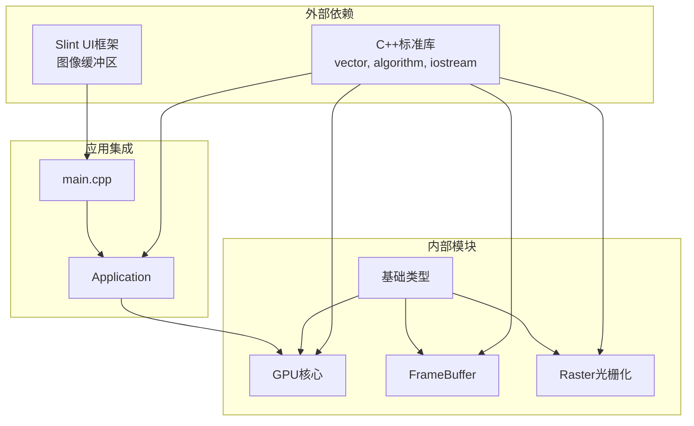

# GPU渲染器核心

<cite>
**本文档引用的文件**
- [gpu.h](file://gpu/gpu.h)
- [gpu.cpp](file://gpu/gpu.cpp)
- [frameBuffer.h](file://gpu/frameBuffer.h)
- [frameBuffer.cpp](file://gpu/frameBuffer.cpp)
- [raster.h](file://gpu/raster.h)
- [raster.cpp](file://gpu/raster.cpp)
- [base.h](file://global/base.h)
- [main.cpp](file://main.cpp)
- [application.h](file://application/application.h)
- [application.cpp](file://application/application.cpp)
</cite>

## 目录
1. [简介](#简介)
2. [项目结构](#项目结构)
3. [核心组件](#核心组件)
4. [架构概览](#架构概览)
5. [详细组件分析](#详细组件分析)
6. [依赖关系分析](#依赖关系分析)
7. [性能考量](#性能考量)
8. [故障排除指南](#故障排除指南)
9. [结论](#结论)

## 简介

本文件为GPU渲染器核心模块的详细技术文档，深入解析了基于软件光栅化的GPU渲染系统。该系统实现了完整的渲染管线，包括GPU单例管理、帧缓冲区管理、光栅化算法和渲染接口设计。文档重点涵盖：

- GPU类的单例模式实现及其线程安全性
- 渲染接口设计：initSurface()、clear()、drawPoint()、drawLine()的实现细节
- GPU类与FrameBuffer的协作关系
- 全局宏sgl的API简化机制
- 渲染器初始化最佳实践和错误处理策略
- 性能优化建议和内存管理注意事项

## 项目结构

该渲染器采用模块化设计，主要分为以下层次：



**图表来源**
- [gpu.h](file://gpu/gpu.h#L11-L36)
- [frameBuffer.h](file://gpu/frameBuffer.h#L8-L18)
- [raster.h](file://gpu/raster.h#L8-L19)
- [base.h](file://global/base.h#L18-L41)

**章节来源**
- [gpu.h](file://gpu/gpu.h#L1-L37)
- [frameBuffer.h](file://gpu/frameBuffer.h#L1-L19)
- [raster.h](file://gpu/raster.h#L1-L20)
- [base.h](file://global/base.h#L1-L42)

## 核心组件

### GPU单例管理

GPU类实现了标准的C++单例模式，通过静态成员函数提供全局访问点：



**图表来源**
- [gpu.h](file://gpu/gpu.h#L11-L36)
- [frameBuffer.h](file://gpu/frameBuffer.h#L8-L18)

单例实现特点：
- 使用局部静态变量确保线程安全的延迟初始化
- 禁止拷贝构造和赋值操作，防止多实例创建
- 提供RAII资源管理，析构时自动清理帧缓冲区

**章节来源**
- [gpu.h](file://gpu/gpu.h#L11-L36)
- [gpu.cpp](file://gpu/gpu.cpp#L5-L16)

### 渲染接口设计

渲染接口采用简洁明了的设计，提供基础的图形绘制能力：

| 方法 | 参数 | 返回值 | 功能描述 |
|------|------|--------|----------|
| initSurface | width, height, buffer | void | 初始化渲染表面，创建或绑定帧缓冲区 |
| clear | 无 | void | 清空画布内容为黑色 |
| drawPoint | x, y, color | void | 在指定位置绘制像素点 |
| drawLine | p1, p2 | void | 绘制线段，内部调用光栅化算法 |

**章节来源**
- [gpu.h](file://gpu/gpu.h#L17-L26)
- [gpu.cpp](file://gpu/gpu.cpp#L18-L47)

### 数据结构定义

系统使用轻量级的数据结构来表示图形元素：



**图表来源**
- [base.h](file://global/base.h#L18-L41)
- [frameBuffer.h](file://gpu/frameBuffer.h#L14-L17)

**章节来源**
- [base.h](file://global/base.h#L18-L41)
- [frameBuffer.h](file://gpu/frameBuffer.h#L8-L18)

## 架构概览

渲染器采用分层架构，各组件职责清晰分离：



**图表来源**
- [main.cpp](file://main.cpp#L10-L59)
- [application.cpp](file://application/application.cpp#L23-L45)
- [gpu.cpp](file://gpu/gpu.cpp#L18-L47)
- [raster.cpp](file://gpu/raster.cpp#L7-L84)

## 详细组件分析

### GPU类实现分析

GPU类是整个渲染系统的核心控制器，负责协调各个组件的工作：

#### 单例模式实现

单例模式采用C++11标准的静态局部变量实现，具有以下优势：

- **线程安全**：C++11标准保证静态局部变量的初始化是线程安全的
- **延迟初始化**：只有在第一次调用时才创建实例，节省内存
- **自动销毁**：程序结束时自动调用析构函数清理资源

#### 内存管理策略

GPU类采用智能指针风格的原始指针管理，结合RAII原则：



**图表来源**
- [gpu.cpp](file://gpu/gpu.cpp#L18-L23)
- [frameBuffer.cpp](file://gpu/frameBuffer.cpp#L3-L14)

**章节来源**
- [gpu.cpp](file://gpu/gpu.cpp#L5-L16)
- [gpu.cpp](file://gpu/gpu.cpp#L18-L23)

### FrameBuffer组件分析

FrameBuffer负责管理实际的像素数据存储：

#### 外部缓冲区支持

FrameBuffer提供了灵活的缓冲区管理机制：

- **内部管理**：当未提供外部缓冲区时，自动分配内存
- **外部管理**：支持用户提供的外部缓冲区，避免重复内存分配
- **智能释放**：根据缓冲区来源决定是否释放内存

#### 坐标系统设计

渲染器采用OpenGL风格的坐标系统，原点位于左下角：

```mermaid
graph LR
subgraph "坐标系统"
Origin[原点(0,0)<br/>左下角]
XAxis[X轴正方向<br/>向右]
YAxis[Y轴正方向<br/>向上]
end
subgraph "像素索引计算"
Calc[像素索引 = y * 宽度 + x]
Width[宽度: mWidth]
Height[高度: mHeight]
end
Origin --> XAxis
Origin --> YAxis
Width --> Calc
Height --> Calc
```

**图表来源**
- [frameBuffer.h](file://gpu/frameBuffer.h#L14-L17)
- [gpu.cpp](file://gpu/gpu.cpp#L36-L37)

**章节来源**
- [frameBuffer.cpp](file://gpu/frameBuffer.cpp#L3-L20)
- [frameBuffer.h](file://gpu/frameBuffer.h#L8-L18)

### 光栅化算法实现

光栅化器实现了Bresenham直线算法的完整版本：

#### 算法流程



**图表来源**
- [raster.cpp](file://gpu/raster.cpp#L15-L82)

#### 算法优化特性

- **四象限统一处理**：通过坐标变换将任意方向的线段转换到第一象限
- **斜率归一化**：确保算法在0≤斜率≤1范围内执行
- **整数运算**：完全使用整数运算避免浮点误差
- **颜色插值**：沿线段进行RGB通道的线性插值

**章节来源**
- [raster.cpp](file://gpu/raster.cpp#L7-L103)
- [raster.h](file://gpu/raster.h#L8-L19)

### 渲染接口实现细节

#### clear()函数实现

clear()函数使用STL算法进行高效填充：



**图表来源**
- [gpu.cpp](file://gpu/gpu.cpp#L25-L28)

#### drawPoint()函数实现

drawPoint()函数包含完整的边界检查和坐标验证：



**图表来源**
- [gpu.cpp](file://gpu/gpu.cpp#L30-L38)

#### drawLine()函数实现

drawLine()函数展示了典型的渲染器工作流程：



**图表来源**
- [gpu.cpp](file://gpu/gpu.cpp#L40-L47)
- [raster.cpp](file://gpu/raster.cpp#L7-L84)

**章节来源**
- [gpu.cpp](file://gpu/gpu.cpp#L25-L47)

## 依赖关系分析

渲染器的依赖关系体现了清晰的分层设计：



**图表来源**
- [gpu.h](file://gpu/gpu.h#L1-L3)
- [frameBuffer.h](file://gpu/frameBuffer.h#L1-L2)
- [raster.h](file://gpu/raster.h#L1-L2)
- [base.h](file://global/base.h#L3-L10)

**章节来源**
- [gpu.h](file://gpu/gpu.h#L1-L3)
- [frameBuffer.h](file://gpu/frameBuffer.h#L1-L2)
- [raster.h](file://gpu/raster.h#L1-L2)

## 性能考量

### 内存访问模式优化

渲染器采用了高效的内存访问模式：

- **连续内存布局**：像素数据按行优先顺序存储，提高缓存命中率
- **局部性优化**：相邻像素在内存中也相邻，有利于CPU缓存
- **批量操作**：clear()函数使用STL算法进行批量填充

### 算法复杂度分析

| 操作 | 时间复杂度 | 空间复杂度 | 说明 |
|------|------------|------------|------|
| initSurface | O(w×h) 或 O(1) | O(w×h) | w×h为内部缓冲区时为O(n)，外部缓冲区时为O(1) |
| clear | O(w×h) | O(1) | n为像素总数 |
| drawPoint | O(1) | O(1) | 常数时间访问 |
| drawLine | O(d) | O(d) | d为线段长度，结果存储 |

### 性能优化建议

1. **批处理优化**：对于大量相似操作，考虑合并到单次调用
2. **内存池管理**：对于频繁创建销毁的场景，考虑使用内存池
3. **SIMD指令**：利用现代CPU的SIMD指令加速像素操作
4. **多线程渲染**：将不同区域的渲染任务并行化

## 故障排除指南

### 常见问题及解决方案

#### 内存泄漏问题

**症状**：程序运行一段时间后内存持续增长
**原因**：FrameBuffer未正确释放或外部缓冲区管理不当
**解决方案**：
- 确保GPU实例正确销毁
- 检查mExternBuffer标志位的正确设置
- 避免重复调用initSurface导致的内存泄漏

#### 坐标越界异常

**症状**：程序崩溃或显示异常
**原因**：drawPoint参数超出帧缓冲区边界
**解决方案**：
- 在调用drawPoint前进行边界检查
- 确保坐标系统的一致性（左下角原点）

#### 性能问题

**症状**：渲染速度慢于预期
**原因**：频繁的内存分配、低效的算法实现
**解决方案**：
- 预分配足够的缓冲区空间
- 使用更高效的光栅化算法
- 减少不必要的对象创建

**章节来源**
- [gpu.cpp](file://gpu/gpu.cpp#L12-L16)
- [frameBuffer.cpp](file://gpu/frameBuffer.cpp#L16-L20)
- [gpu.cpp](file://gpu/gpu.cpp#L30-L38)

## 结论

本GPU渲染器核心模块展现了优秀的软件渲染设计：

### 设计优势

1. **清晰的架构**：分层设计使各组件职责明确，易于维护
2. **高效的实现**：采用成熟的算法和优化策略
3. **良好的扩展性**：模块化设计便于功能扩展
4. **完善的资源管理**：RAII原则确保资源正确释放

### 技术特色

- **线程安全的单例模式**：符合现代C++标准
- **灵活的缓冲区管理**：支持内部和外部缓冲区
- **高效的光栅化算法**：基于Bresenham算法的完整实现
- **简洁的API设计**：通过全局宏简化调用

### 应用价值

该渲染器为学习计算机图形学提供了优秀的实践案例，其设计理念和实现技巧可直接应用于其他渲染系统的开发中。通过深入理解其实现原理，开发者可以更好地掌握软件渲染的核心技术和最佳实践。