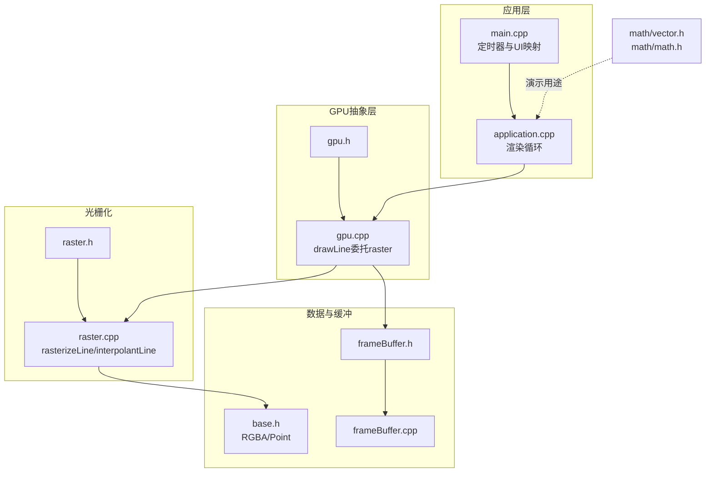
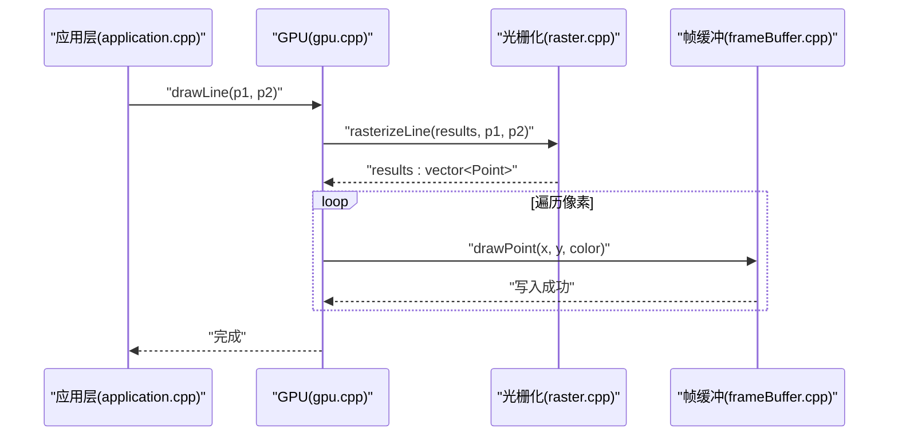
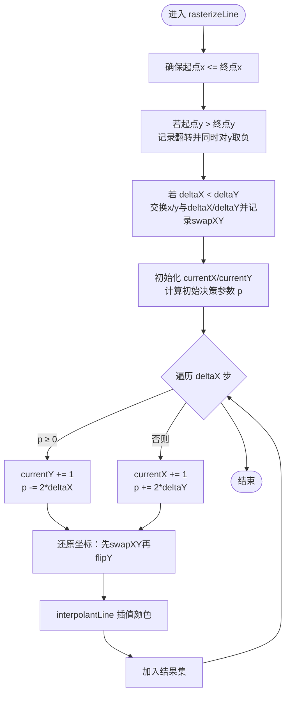
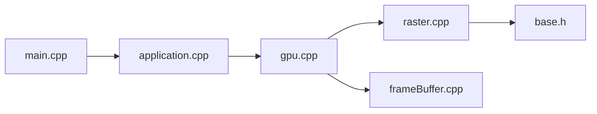

# 光栅化算法

<cite>
**本文引用的文件**
- [raster.h](file://gpu/raster.h)
- [raster.cpp](file://gpu/raster.cpp)
- [base.h](file://global/base.h)
- [frameBuffer.h](file://gpu/frameBuffer.h)
- [frameBuffer.cpp](file://gpu/frameBuffer.cpp)
- [gpu.h](file://gpu/gpu.h)
- [gpu.cpp](file://gpu/gpu.cpp)
- [application.h](file://application/application.h)
- [application.cpp](file://application/application.cpp)
- [main.cpp](file://main.cpp)
- [vector.h](file://math/vector.h)
- [math.h](file://math/math.h)
</cite>

## 目录
1. [引言](#引言)
2. [项目结构](#项目结构)
3. [核心组件](#核心组件)
4. [架构总览](#架构总览)
5. [详细组件分析](#详细组件分析)
6. [依赖关系分析](#依赖关系分析)
7. [性能考量](#性能考量)
8. [故障排查指南](#故障排查指南)
9. [结论](#结论)
10. [附录](#附录)

## 引言
本技术文档围绕光栅化算法模块展开，聚焦于线段绘制算法的实现与优化。仓库中的实现采用中点Bresenham算法思想，结合坐标变换与插值策略，完成从连续几何线段到离散像素点集的转换，并在像素级进行颜色插值。文档将系统阐述以下内容：
- 中点Bresenham算法的数学基础与实现细节
- 像素填充策略、时间复杂度与边界条件处理
- 针对不同方向线段的优化策略（含斜率大于1的处理）
- 与传统DDA算法的差异与性能对比
- 算法扩展思路（抗锯齿、渐变填充等）

## 项目结构
该模块位于 gpu/raster.*，并与全局数据类型、帧缓冲、GPU抽象及应用渲染流程紧密耦合。关键文件职责如下：
- gpu/raster.h/.cpp：提供线段光栅化的静态接口与插值逻辑
- global/base.h：定义像素点与颜色的数据结构
- gpu/frameBuffer.h/.cpp：封装帧缓冲区的内存管理与尺寸信息
- gpu/gpu.h/.cpp：对外暴露绘图API（清屏、画点、画线），内部委托光栅化模块
- application/application.h/.cpp：应用层渲染循环，调用GPU绘制多条射线
- main.cpp：主程序入口，驱动渲染定时器并将帧缓冲映射为UI图像
- math/vector.h 与 math/math.h：数学向量库（用于演示用途，非光栅化核心）

图表来源
- [gpu.cpp](file://gpu/gpu.cpp#L40-L47)
- [gpu/raster.cpp](file://gpu/raster.cpp#L7-L84)
- [global/base.h](file://global/base.h#L18-L41)
- [gpu/frameBuffer.h](file://gpu/frameBuffer.h#L8-L18)
- [gpu/frameBuffer.cpp](file://gpu/frameBuffer.cpp#L3-L20)
- [application.cpp](file://application/application.cpp#L23-L44)
- [main.cpp](file://main.cpp#L24-L53)
- [math/vector.h](file://math/vector.h#L1-L323)
- [math/math.h](file://math/math.h#L1-L4)

章节来源
- [gpu/raster.h](file://gpu/raster.h#L1-L20)
- [gpu/raster.cpp](file://gpu/raster.cpp#L1-L104)
- [global/base.h](file://global/base.h#L1-L42)
- [gpu/frameBuffer.h](file://gpu/frameBuffer.h#L1-L19)
- [gpu/frameBuffer.cpp](file://gpu/frameBuffer.cpp#L1-L21)
- [gpu/gpu.h](file://gpu/gpu.h#L1-L37)
- [gpu/gpu.cpp](file://gpu/gpu.cpp#L1-L48)
- [application/application.h](file://application/application.h#L1-L33)
- [application/application.cpp](file://application/application.cpp#L1-L46)
- [main.cpp](file://main.cpp#L1-L59)
- [math/vector.h](file://math/vector.h#L1-L323)
- [math/math.h](file://math/math.h#L1-L4)

## 核心组件
- 数据模型
  - RGBA：存储像素颜色分量（R、G、B、A）
  - Point：整数坐标(x, y)与颜色插值结果
- 光栅化接口
  - Raster::rasterizeLine：输入起点终点，输出像素序列
  - Raster::interpolantLine：沿线段对颜色进行插值
- GPU抽象
  - GPU::drawLine：对外API，内部委托Raster并写入帧缓冲
- 帧缓冲
  - FrameBuffer：封装宽度、高度与颜色缓冲区指针

章节来源
- [global/base.h](file://global/base.h#L18-L41)
- [gpu/raster.h](file://gpu/raster.h#L13-L19)
- [gpu/gpu.cpp](file://gpu/gpu.cpp#L40-L47)
- [gpu/frameBuffer.h](file://gpu/frameBuffer.h#L8-L18)

## 架构总览
下图展示了从应用层发起一次画线请求，到最终写入帧缓冲的完整流程。

图表来源
- [application.cpp](file://application/application.cpp#L23-L44)
- [gpu.cpp](file://gpu/gpu.cpp#L40-L47)
- [raster.cpp](file://gpu/raster.cpp#L7-L84)
- [frameBuffer.cpp](file://gpu/frameBuffer.cpp#L30-L38)

## 详细组件分析

### 中点Bresenham算法实现与数学基础
- 坐标预处理
  - 方向规范化：确保起点x坐标不大于终点，若需交换端点
  - Y轴翻转：若起点y大于终点y，则同时对y取负并记录翻转标记，便于统一处理
  - 斜率归一化：通过交换x、y与deltaX/deltaY，将斜率限制在[0,1]区间内
- 决策参数初始化与迭代
  - 使用增量式决策参数，避免浮点运算
  - 每步仅进行整数加减与位移操作，提升性能
- 像素生成与坐标还原
  - 在归一化空间生成(currentX, currentY)，根据swapXY与flipY标志还原到原坐标系
  - 将还原后的坐标写入目标点，并调用插值函数计算颜色

图表来源
- [raster.cpp](file://gpu/raster.cpp#L15-L82)
- [raster.cpp](file://gpu/raster.cpp#L86-L103)

章节来源
- [gpu/raster.cpp](file://gpu/raster.cpp#L7-L84)
- [gpu/raster.cpp](file://gpu/raster.cpp#L86-L103)

### 像素填充策略与边界条件
- 边界检查
  - 画点时对坐标越界进行保护，防止访问越界内存
- 颜色插值
  - 插值依据当前点在线段上的投影权重，优先使用x或y方向的比例，避免除零
- 结果收集
  - 将每一步生成的像素点及其插值颜色存入结果向量，供上层逐个写入

章节来源
- [gpu/gpu.cpp](file://gpu/gpu.cpp#L30-L38)
- [gpu/raster.cpp](file://gpu/raster.cpp#L86-L103)

### 复杂度与数值稳定性
- 时间复杂度
  - 迭代次数为Δx，每步常数时间，整体O(Δx)
- 空间复杂度
  - 输出像素序列O(Δx)，中间变量O(1)
- 数值稳定性
  - 使用整数与增量式决策参数，避免累积浮点误差
  - 通过交换坐标将斜率限制在[0,1]，减少极端情况下的舍入影响

章节来源
- [gpu/raster.cpp](file://gpu/raster.cpp#L54-L82)

### 与DDA算法的差异与对比
- DDA（数字微分分析）特点
  - 每步使用浮点运算累加，逐步推进x或y
  - 需要除法与浮点乘法，开销较大
- 本实现优势
  - 仅使用整数加减与位移，无浮点运算
  - 决策参数增量更新，避免重复除法
- 性能收益
  - 在Δx较大时，整数运算显著优于浮点运算
  - 由于无浮点，可直接在嵌入式或低功耗设备上高效运行

章节来源
- [gpu/raster.cpp](file://gpu/raster.cpp#L52-L61)

### 算法扩展思路
- 抗锯齿（AA）
  - 在决策参数接近阈值时，按投影距离分配子像素权重，混合邻近像素颜色
  - 适用于高分辨率显示与平滑边缘需求
- 渐变填充
  - 在interpolantLine中扩展更多属性（如透明度、纹理坐标）进行插值
  - 支持多属性混合，实现更丰富的视觉效果
- 线宽与端点样式
  - 通过额外的几何偏移与模板生成，支持线宽变化与圆角/方头端点
- 扫描线填充
  - 将线段光栅化扩展为多边形扫描线填充，结合边表与活性边表

（本节为概念性扩展说明，不直接对应具体源码）

## 依赖关系分析
- 组件耦合
  - GPU对外暴露drawLine，内部依赖Raster；与FrameBuffer解耦，便于替换缓冲实现
  - Raster仅依赖Point与RGBA，保持算法独立性
- 外部依赖
  - 使用标准容器与算术库，无第三方依赖
- 可能的改进
  - 将插值函数抽离为可配置策略，支持不同插值模式
  - 将坐标变换与决策参数计算封装为独立模块，提高复用性

图表来源
- [gpu.cpp](file://gpu/gpu.cpp#L1-L48)
- [raster.cpp](file://gpu/raster.cpp#L1-L104)
- [frameBuffer.cpp](file://gpu/frameBuffer.cpp#L1-L21)
- [base.h](file://global/base.h#L18-L41)
- [application.cpp](file://application/application.cpp#L1-L46)
- [main.cpp](file://main.cpp#L1-L59)

章节来源
- [gpu/gpu.cpp](file://gpu/gpu.cpp#L1-L48)
- [gpu/raster.cpp](file://gpu/raster.cpp#L1-L104)
- [gpu/frameBuffer.cpp](file://gpu/frameBuffer.cpp#L1-L21)
- [global/base.h](file://global/base.h#L18-L41)
- [application/application.cpp](file://application/application.cpp#L1-L46)
- [main.cpp](file://main.cpp#L1-L59)

## 性能考量
- 运算开销
  - 整数加减与位移替代浮点乘除，降低指令周期
  - 决策参数增量更新，避免重复计算
- 内存访问
  - 结果向量顺序写入，局部性良好
  - 帧缓冲按行主序写入，利于缓存命中
- 并行化潜力
  - 多线程可将不同线段并行处理
  - 扫描线阶段可按行并行，但需注意像素写入的原子性

（本节提供通用指导，不直接分析具体代码片段）

## 故障排查指南
- 线段未显示
  - 检查drawPoint的越界保护是否生效
  - 确认帧缓冲尺寸与坐标范围匹配
- 颜色异常
  - 核对interpolantLine的权重计算与边界分支
  - 确保起点与终点颜色均有效
- 方向错误或镜像
  - 检查flipY与swapXY标志是否正确应用
  - 确认起点x小于等于终点x的预处理逻辑

章节来源
- [gpu/gpu.cpp](file://gpu/gpu.cpp#L30-L38)
- [gpu/raster.cpp](file://gpu/raster.cpp#L24-L30)
- [gpu/raster.cpp](file://gpu/raster.cpp#L63-L73)
- [gpu/raster.cpp](file://gpu/raster.cpp#L86-L103)

## 结论
本模块以中点Bresenham为核心，结合坐标变换与整数运算，实现了高效、稳定的线段光栅化。其设计具备良好的可读性与可扩展性，适合进一步集成抗锯齿、渐变与多属性插值等高级特性。通过合理的边界处理与插值策略，可在多种平台上获得一致且高质量的渲染效果。

## 附录
- 关键流程路径
  - 线段光栅化入口：[rasterizeLine](file://gpu/raster.cpp#L7-L84)
  - 颜色插值：[interpolantLine](file://gpu/raster.cpp#L86-L103)
  - 画线API：[GPU::drawLine](file://gpu/gpu.cpp#L40-L47)
  - 帧缓冲写入：[GPU::drawPoint](file://gpu/gpu.cpp#L30-L38)
  - 数据结构定义：[RGBA/Point](file://global/base.h#L18-L41)
  - 帧缓冲管理：[FrameBuffer构造/析构](file://gpu/frameBuffer.cpp#L3-L20)