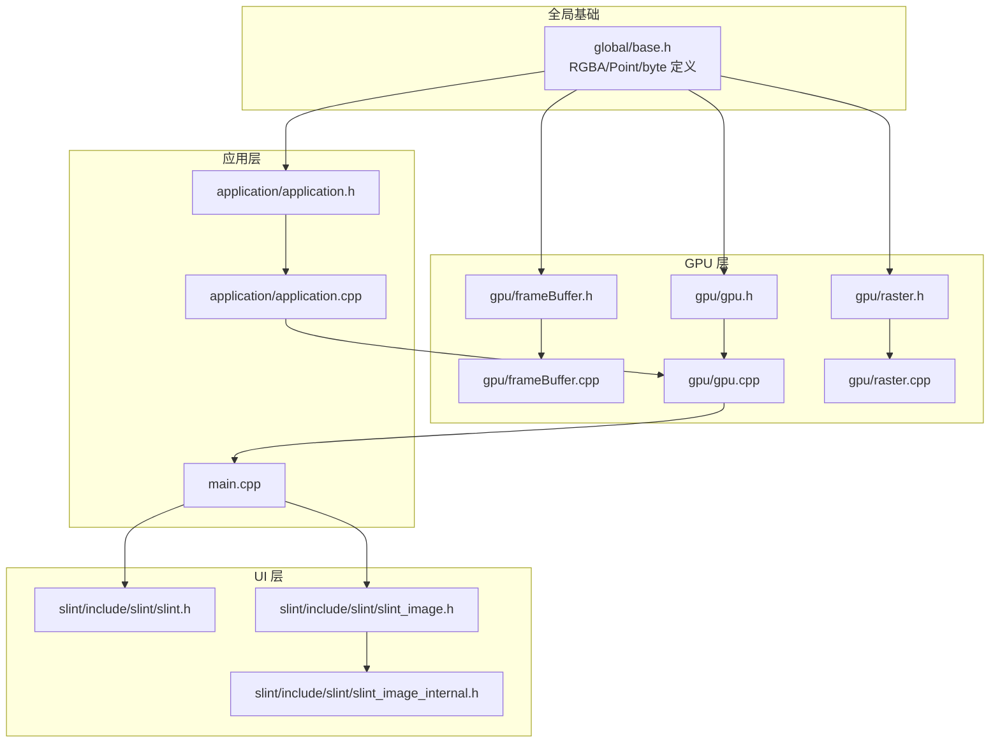
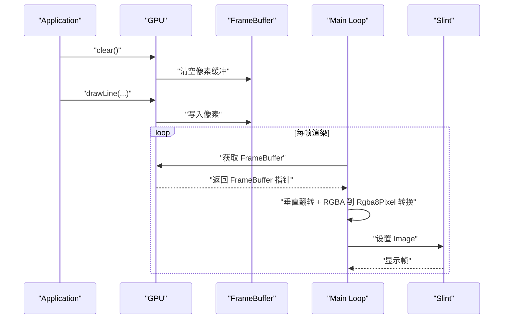
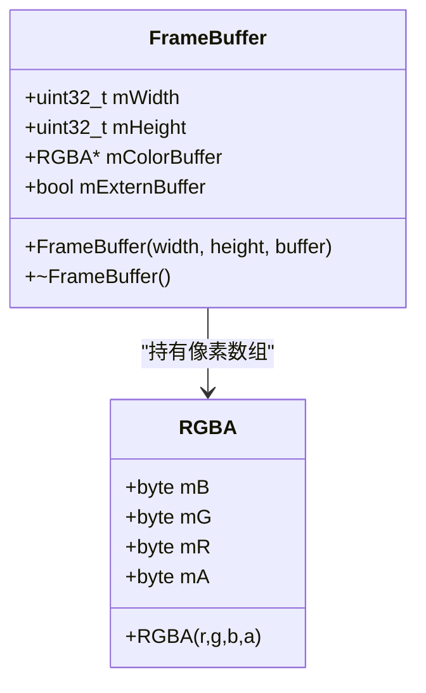
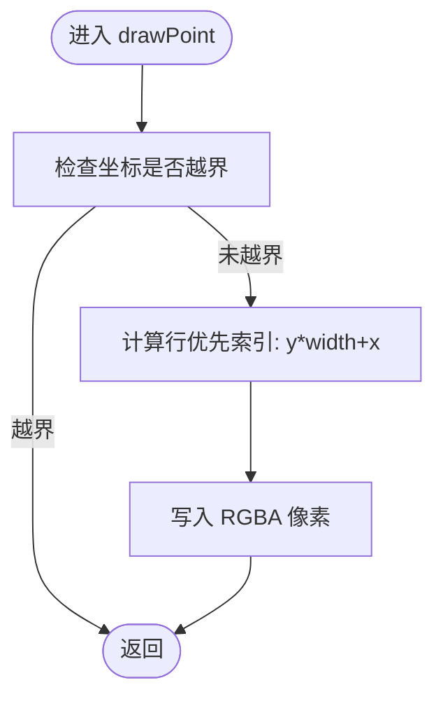
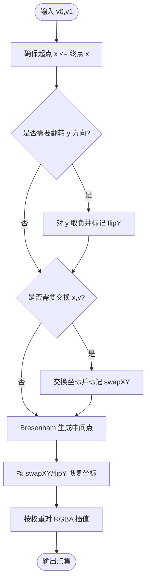
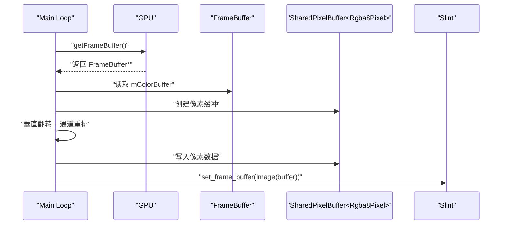
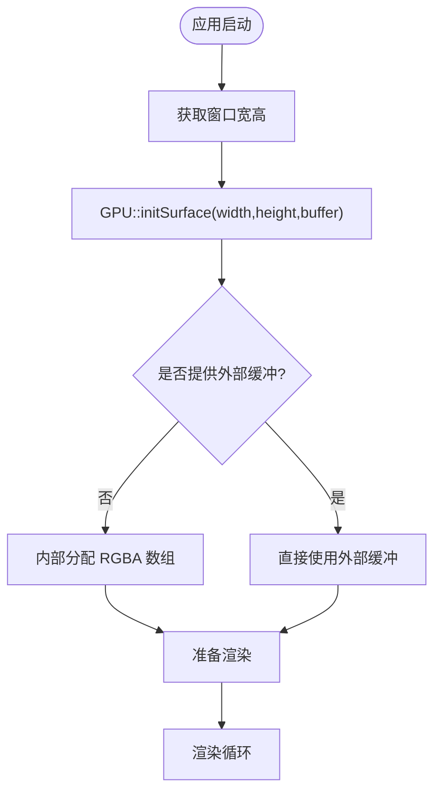
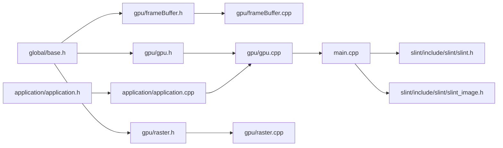

# 帧缓冲管理

<cite>
**本文引用的文件**
- [frameBuffer.h](file://gpu/frameBuffer.h)
- [frameBuffer.cpp](file://gpu/frameBuffer.cpp)
- [gpu.h](file://gpu/gpu.h)
- [gpu.cpp](file://gpu/gpu.cpp)
- [raster.h](file://gpu/raster.h)
- [raster.cpp](file://gpu/raster.cpp)
- [base.h](file://global/base.h)
- [main.cpp](file://main.cpp)
- [application.h](file://application/application.h)
- [application.cpp](file://application/application.cpp)
- [slint.h](file://slint/include/slint/slint.h)
- [slint_image.h](file://slint/include/slint/slint_image.h)
- [slint_image_internal.h](file://slint/include/slint/slint_image_internal.h)
</cite>

## 目录
1. [简介](#简介)
2. [项目结构](#项目结构)
3. [核心组件](#核心组件)
4. [架构总览](#架构总览)
5. [详细组件分析](#详细组件分析)
6. [依赖关系分析](#依赖关系分析)
7. [性能考虑](#性能考虑)
8. [故障排查指南](#故障排查指南)
9. [结论](#结论)
10. [附录](#附录)

## 简介
本技术文档围绕帧缓冲管理系统展开，重点解析 FrameBuffer 类的设计架构与实现细节，涵盖：
- 内存布局与像素存储格式
- 颜色空间与 RGBA 结构
- 像素读写与内存对齐策略
- 初始化流程与缓冲区指针管理
- 与 GPU 渲染器的集成方式
- 与 Slint UI 框架的数据交换机制
- 内存优化与性能调优建议

该系统采用软件光栅化管线，通过 GPU 类协调 FrameBuffer 的像素写入，并在渲染循环中将帧缓冲数据转换为 Slint 可消费的图像格式进行显示。

## 项目结构
该项目采用分层组织方式：
- global：基础类型定义（RGBA、Point、byte 等）
- gpu：GPU 渲染器与帧缓冲管理（FrameBuffer、GPU、Raster）
- application：应用生命周期与渲染调度
- slint：Slint 头文件与图像类型定义
- 根目录：主程序入口与构建配置

图表来源
- [frameBuffer.h](file://gpu/frameBuffer.h#L1-L19)
- [frameBuffer.cpp](file://gpu/frameBuffer.cpp#L1-L21)
- [gpu.h](file://gpu/gpu.h#L1-L37)
- [gpu.cpp](file://gpu/gpu.cpp#L1-L48)
- [raster.h](file://gpu/raster.h#L1-L20)
- [raster.cpp](file://gpu/raster.cpp#L1-L104)
- [base.h](file://global/base.h#L1-L42)
- [application.h](file://application/application.h#L1-L33)
- [application.cpp](file://application/application.cpp#L1-L46)
- [main.cpp](file://main.cpp#L1-L59)
- [slint.h](file://slint/include/slint/slint.h#L1-L200)
- [slint_image.h](file://slint/include/slint/slint_image.h#L102-L248)
- [slint_image_internal.h](file://slint/include/slint/slint_image_internal.h#L287-L381)

章节来源
- [frameBuffer.h](file://gpu/frameBuffer.h#L1-L19)
- [gpu.h](file://gpu/gpu.h#L1-L37)
- [base.h](file://global/base.h#L1-L42)
- [main.cpp](file://main.cpp#L1-L59)

## 核心组件
- FrameBuffer：封装帧缓冲尺寸与像素缓冲指针，支持外部缓冲接管与自动内存释放。
- GPU：单例渲染器，负责初始化表面、清屏、点绘制与线段光栅化。
- Raster：提供线段光栅化与插值计算的静态接口。
- Application：应用生命周期与每帧渲染逻辑。
- 主程序：驱动渲染循环并将帧缓冲转换为 Slint 图像。

章节来源
- [frameBuffer.h](file://gpu/frameBuffer.h#L8-L18)
- [frameBuffer.cpp](file://gpu/frameBuffer.cpp#L3-L20)
- [gpu.h](file://gpu/gpu.h#L11-L36)
- [gpu.cpp](file://gpu/gpu.cpp#L5-L47)
- [raster.h](file://gpu/raster.h#L8-L19)
- [raster.cpp](file://gpu/raster.cpp#L7-L103)
- [application.h](file://application/application.h#L5-L30)
- [application.cpp](file://application/application.cpp#L23-L45)
- [main.cpp](file://main.cpp#L10-L53)

## 架构总览
系统采用“应用调度 + 软件光栅 + 帧缓冲 + UI 显示”的流水线式架构。渲染循环中，Application 调用 GPU 清屏与绘制，随后 GPU 将像素写入 FrameBuffer；主程序在每次渲染周期将 FrameBuffer 的像素按 Slint 的像素格式进行垂直翻转与拷贝，最终交给 Slint 进行显示。

图表来源
- [application.cpp](file://application/application.cpp#L23-L45)
- [gpu.cpp](file://gpu/gpu.cpp#L25-L47)
- [frameBuffer.cpp](file://gpu/frameBuffer.cpp#L16-L20)
- [main.cpp](file://main.cpp#L25-L53)
- [slint_image.h](file://slint/include/slint/slint_image.h#L111-L248)

## 详细组件分析

### FrameBuffer 设计与内存布局
- 成员变量
  - mWidth/mHeight：帧缓冲宽高
  - mColorBuffer：指向 RGBA 像素数组的指针
  - mExternBuffer：是否使用外部提供的缓冲（避免重复释放）
- 构造与析构
  - 若未提供外部缓冲，则内部动态分配 RGBA 数组
  - 析构时仅在非外部缓冲情况下释放内存
- 内存布局
  - 像素按行优先顺序存储，索引公式为 y * width + x
  - 像素通道顺序为 B-G-R-A（RGBA 结构体字段顺序）

图表来源
- [frameBuffer.h](file://gpu/frameBuffer.h#L8-L18)
- [frameBuffer.cpp](file://gpu/frameBuffer.cpp#L3-L20)
- [base.h](file://global/base.h#L18-L35)

章节来源
- [frameBuffer.h](file://gpu/frameBuffer.h#L8-L18)
- [frameBuffer.cpp](file://gpu/frameBuffer.cpp#L3-L20)
- [base.h](file://global/base.h#L18-L35)

### GPU 渲染器与像素写入
- 单例模式：通过静态实例获取 GPU 实例
- 表面初始化：initSurface 支持外部缓冲接管，避免重复分配
- 清屏：使用标准库填充函数批量设置像素
- 点绘制：边界检查后按行优先索引写入像素
- 线段绘制：委托 Raster 光栅化生成像素序列，再逐点绘制

图表来源
- [gpu.cpp](file://gpu/gpu.cpp#L30-L38)

章节来源
- [gpu.h](file://gpu/gpu.h#L11-L36)
- [gpu.cpp](file://gpu/gpu.cpp#L5-L47)

### 光栅化与颜色插值
- 线段光栅化：先保证起点 x/y 方向单调性，必要时翻转或交换坐标，使斜率在 0-1 区间内，然后使用 Bresenham 算法生成中间点
- 插值计算：根据目标点与端点的相对位置，按 x 或 y 的权重对 RGBA 通道进行线性插值
- 输出：生成的点包含坐标与插值后的颜色

图表来源
- [raster.cpp](file://gpu/raster.cpp#L7-L84)
- [raster.cpp](file://gpu/raster.cpp#L86-L103)

章节来源
- [raster.h](file://gpu/raster.h#L8-L19)
- [raster.cpp](file://gpu/raster.cpp#L7-L103)

### 与 Slint 的数据交换机制
- 帧缓冲到 Slint 图像的转换步骤
  - 从 GPU 获取 FrameBuffer 指针
  - 使用 Slint 的 SharedPixelBuffer<Rgba8Pixel> 构建像素缓冲
  - 垂直翻转：GPU 以左下角为原点，Slint 以左上角为原点，因此按行翻转
  - 像素拷贝：将 RGBA 通道复制到 Rgba8Pixel，保持通道顺序一致
- 关键类型
  - RGBA：B-G-R-A 顺序
  - Rgba8Pixel：R-G-B-A 顺序（Slint 默认）
  - 因此在拷贝时需注意通道顺序映射

图表来源
- [main.cpp](file://main.cpp#L31-L53)
- [slint_image.h](file://slint/include/slint/slint_image.h#L111-L248)
- [slint_image_internal.h](file://slint/include/slint/slint_image_internal.h#L287-L381)

章节来源
- [main.cpp](file://main.cpp#L31-L53)
- [slint_image.h](file://slint/include/slint/slint_image.h#L111-L248)
- [slint_image_internal.h](file://slint/include/slint/slint_image_internal.h#L287-L381)

### 初始化流程与内存管理
- 应用启动时，Application 提供窗口尺寸
- GPU::initSurface(width,height,buffer) 创建/替换 FrameBuffer
- 外部缓冲策略：若传入 buffer 指针，则 FrameBuffer 标记为外部缓冲，不负责释放
- 渲染循环：Application::render 调用 GPU::clear 与 GPU::drawLine，完成一帧绘制

图表来源
- [application.cpp](file://application/application.cpp#L23-L45)
- [gpu.cpp](file://gpu/gpu.cpp#L18-L23)
- [frameBuffer.cpp](file://gpu/frameBuffer.cpp#L3-L14)

章节来源
- [application.cpp](file://application/application.cpp#L23-L45)
- [gpu.cpp](file://gpu/gpu.cpp#L18-L23)
- [frameBuffer.cpp](file://gpu/frameBuffer.cpp#L3-L14)

## 依赖关系分析
- FrameBuffer 依赖 global/base.h 中的 RGBA/Point 定义
- GPU 依赖 FrameBuffer 与 Raster
- Application 依赖 GPU 并驱动渲染
- 主程序依赖 Application 与 Slint 头文件进行图像转换与显示

图表来源
- [base.h](file://global/base.h#L1-L42)
- [frameBuffer.h](file://gpu/frameBuffer.h#L1-L3)
- [gpu.h](file://gpu/gpu.h#L1-L3)
- [raster.h](file://gpu/raster.h#L1-L3)
- [frameBuffer.cpp](file://gpu/frameBuffer.cpp#L1)
- [gpu.cpp](file://gpu/gpu.cpp#L1)
- [raster.cpp](file://gpu/raster.cpp#L1)
- [application.h](file://application/application.h#L1-L3)
- [application.cpp](file://application/application.cpp#L1-L3)
- [main.cpp](file://main.cpp#L1-L3)
- [slint.h](file://slint/include/slint/slint.h#L1-L12)

章节来源
- [base.h](file://global/base.h#L1-L42)
- [frameBuffer.h](file://gpu/frameBuffer.h#L1-L3)
- [gpu.h](file://gpu/gpu.h#L1-L3)
- [raster.h](file://gpu/raster.h#L1-L3)
- [frameBuffer.cpp](file://gpu/frameBuffer.cpp#L1)
- [gpu.cpp](file://gpu/gpu.cpp#L1)
- [raster.cpp](file://gpu/raster.cpp#L1)
- [application.h](file://application/application.h#L1-L3)
- [application.cpp](file://application/application.cpp#L1-L3)
- [main.cpp](file://main.cpp#L1-L3)
- [slint.h](file://slint/include/slint/slint.h#L1-L12)

## 性能考虑
- 内存访问局部性
  - 行优先存储与连续内存布局有利于缓存命中
  - 清屏使用批量填充可利用 CPU SIMD/向量化优化
- 光栅化优化
  - Bresenham 算法减少浮点运算，适合 CPU 光栅化
  - 插值按通道线性插值，避免复杂颜色空间转换
- 数据搬运
  - 垂直翻转与通道重排为 O(W×H) 操作，建议在单线程渲染循环中执行
  - 可考虑使用更高效的像素格式转换（如预分配临时缓冲）
- 并发与多线程
  - 当前实现为单线程渲染循环，若扩展为多线程，需确保 FrameBuffer 写入的原子性与一致性
- 内存对齐
  - 建议在外部缓冲场景中确保缓冲区对齐（如 16 字节），以提升内存访问效率

[本节为通用性能指导，不直接分析具体文件]

## 故障排查指南
- 坐标越界导致像素丢失
  - 现象：部分像素未被绘制
  - 排查：确认 drawPoint 的边界检查逻辑与坐标范围
  - 参考路径：[gpu.cpp](file://gpu/gpu.cpp#L30-L38)
- 像素颜色异常
  - 现象：颜色通道顺序错误或透明度异常
  - 排查：确认 RGBA 与 Rgba8Pixel 的通道顺序差异及转换逻辑
  - 参考路径：[main.cpp](file://main.cpp#L42-L50)，[base.h](file://global/base.h#L18-L35)
- 帧画面倒置
  - 现象：画面上下颠倒
  - 排查：确认垂直翻转逻辑是否正确
  - 参考路径：[main.cpp](file://main.cpp#L42-L44)
- 内存泄漏
  - 现象：多次 initSurface 后内存增长
  - 排查：确认 FrameBuffer 析构是否释放内部缓冲
  - 参考路径：[frameBuffer.cpp](file://gpu/frameBuffer.cpp#L16-L20)

章节来源
- [gpu.cpp](file://gpu/gpu.cpp#L30-L38)
- [main.cpp](file://main.cpp#L42-L50)
- [frameBuffer.cpp](file://gpu/frameBuffer.cpp#L16-L20)
- [base.h](file://global/base.h#L18-L35)

## 结论
本帧缓冲管理系统以简洁的行优先像素布局与清晰的职责划分实现了从软件光栅化到 UI 显示的完整链路。FrameBuffer 提供了灵活的缓冲管理策略，GPU 渲染器通过光栅化与点线绘制形成基础图形能力，主程序将帧缓冲转换为 Slint 可消费的图像格式，完成最终显示。通过合理的内存布局与转换策略，系统在保证正确性的同时具备良好的可扩展性与性能潜力。

[本节为总结性内容，不直接分析具体文件]

## 附录
- 关键数据结构
  - RGBA：B-G-R-A 通道顺序
  - Point：整数坐标与 RGBA 颜色
  - Rgba8Pixel：Slint 使用的 R-G-B-A 通道顺序
- API 路径参考
  - 帧缓冲初始化：[gpu.cpp](file://gpu/gpu.cpp#L18-L23)
  - 清屏：[gpu.cpp](file://gpu/gpu.cpp#L25-L28)
  - 点绘制：[gpu.cpp](file://gpu/gpu.cpp#L30-L38)
  - 线段光栅化：[raster.cpp](file://gpu/raster.cpp#L7-L84)
  - 帧缓冲到 Slint：[main.cpp](file://main.cpp#L31-L53)

[本节为补充信息，不直接分析具体文件]