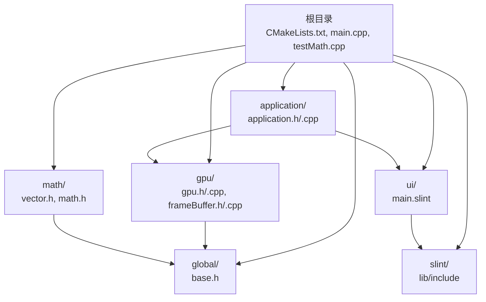
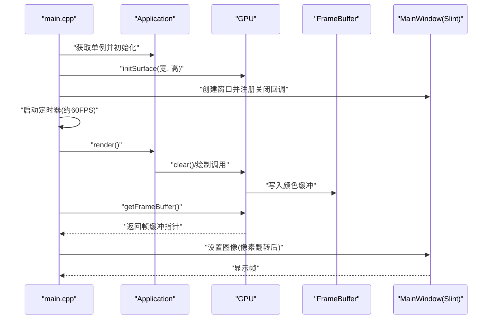
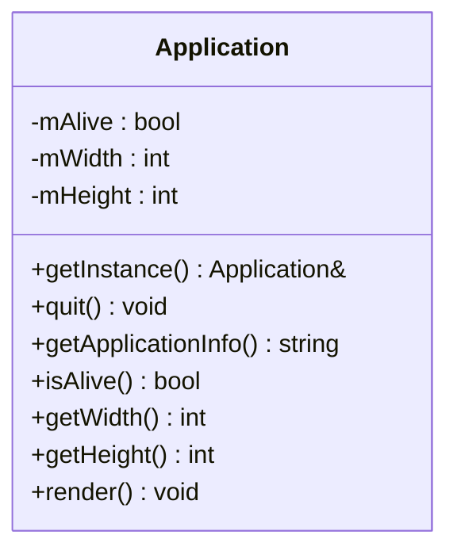
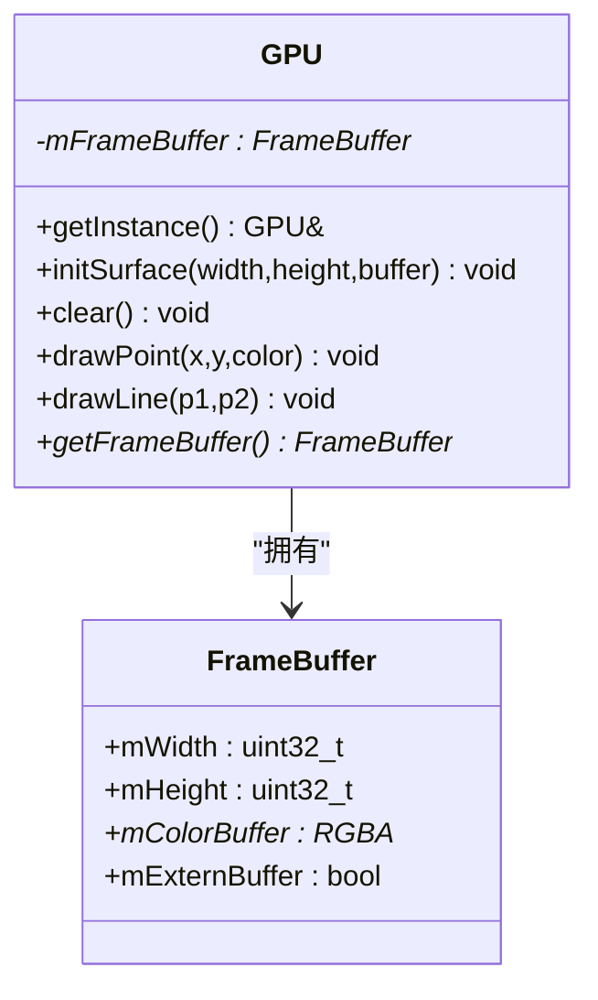
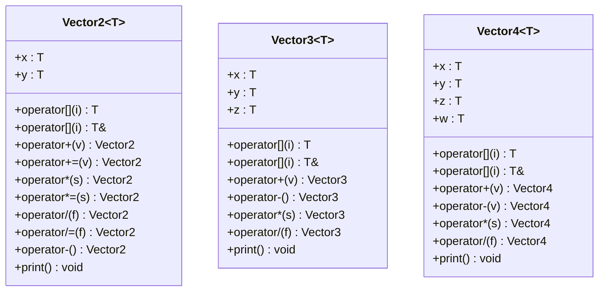
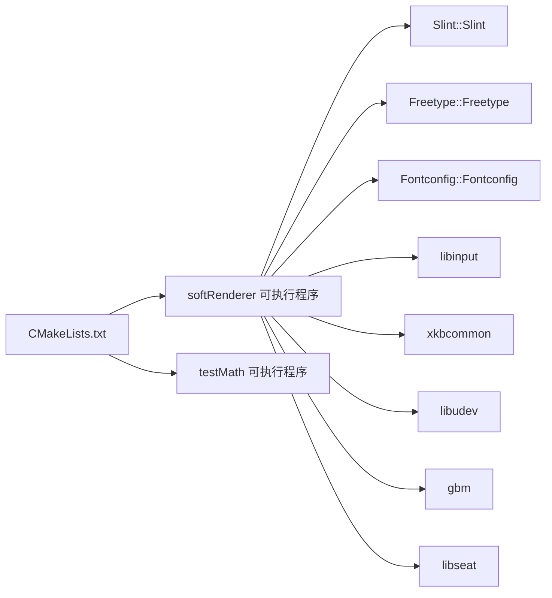

# 开发指南

<cite>
**本文引用的文件**
- [CMakeLists.txt](file://CMakeLists.txt)
- [main.cpp](file://main.cpp)
- [testMath.cpp](file://testMath.cpp)
- [application.h](file://application/application.h)
- [application.cpp](file://application/application.cpp)
- [gpu.h](file://gpu/gpu.h)
- [gpu.cpp](file://gpu/gpu.cpp)
- [frameBuffer.h](file://gpu/frameBuffer.h)
- [frameBuffer.cpp](file://gpu/frameBuffer.cpp)
- [vector.h](file://math/vector.h)
- [math.h](file://math/math.h)
- [base.h](file://global/base.h)
- [main.slint](file://ui/main.slint)
- [.vscode/settings.json](file://.vscode/settings.json)
- [.vscode/launch.json](file://.vscode/launch.json)
- [.vscode/tasks.json](file://.vscode/tasks.json)
</cite>

## 目录
1. [简介](#简介)
2. [项目结构](#项目结构)
3. [核心组件](#核心组件)
4. [架构总览](#架构总览)
5. [详细组件分析](#详细组件分析)
6. [依赖关系分析](#依赖关系分析)
7. [性能考虑](#性能考虑)
8. [故障排除指南](#故障排除指南)
9. [结论](#结论)
10. [附录](#附录)

## 简介
本开发指南面向希望参与或学习该项目的开发者，目标是帮助你快速搭建开发环境、理解代码组织与模块划分、掌握调试与故障排除方法，并在遵循统一规范的前提下进行扩展与定制。项目以 C++20 为核心语言，使用 CMake/Ninja 构建系统，集成 Slint UI 框架，并通过自研软光栅渲染管线演示向量运算与图形绘制。

## 项目结构
项目采用按功能域分层的目录组织方式：
- 根目录包含构建入口与顶层配置（CMakeLists.txt、main.cpp、testMath.cpp）
- 应用层：application 目录封装应用生命周期与渲染调度
- 图形硬件抽象层：gpu 目录封装 GPU 表面、帧缓冲与光栅化
- 数学库：math 目录提供向量类型与常用数学函数
- 全局基础类型：global 目录定义通用数据结构（RGBA、Point 等）
- 用户界面：ui 目录存放 Slint UI 定义文件
- IDE 集成：.vscode 目录提供 VS Code 的 CMake、任务与调试配置

图表来源
- [CMakeLists.txt](file://CMakeLists.txt#L21-L36)
- [main.cpp](file://main.cpp#L1-L59)
- [application.h](file://application/application.h#L1-L33)
- [gpu.h](file://gpu/gpu.h#L1-L37)
- [frameBuffer.h](file://gpu/frameBuffer.h#L1-L19)
- [vector.h](file://math/vector.h#L1-L323)
- [base.h](file://global/base.h#L1-L42)
- [main.slint](file://ui/main.slint#L1-L18)

章节来源
- [CMakeLists.txt](file://CMakeLists.txt#L1-L69)
- [main.cpp](file://main.cpp#L1-L59)

## 核心组件
- 应用层 Application：负责窗口尺寸、生命周期管理、每帧渲染调度
- GPU 抽象 GPU：负责初始化渲染表面、清屏、点线绘制、帧缓冲访问
- 帧缓冲 FrameBuffer：承载颜色缓冲区，记录当前画布像素
- 数学库 math：提供向量类模板与常用运算（加减乘除、归一化等）
- 全局基础类型 base：定义 RGBA、Point 等通用数据结构
- UI 层 main.slint：定义窗口与图像显示属性
- 构建与工具链：CMake/Ninja、Clang/Clang++、VS Code 调试任务

章节来源
- [application.h](file://application/application.h#L1-L33)
- [gpu.h](file://gpu/gpu.h#L1-L37)
- [frameBuffer.h](file://gpu/frameBuffer.h#L1-L19)
- [vector.h](file://math/vector.h#L1-L323)
- [base.h](file://global/base.h#L1-L42)
- [main.slint](file://ui/main.slint#L1-L18)

## 架构总览
整体运行时流程如下：
- main 中创建 Application 单例并初始化 GPU 表面
- 启动 Slint 主窗口，注册关闭回调
- 设置定时器周期性触发渲染
- 渲染阶段调用 Application::render，由 GPU 将结果写入 FrameBuffer
- 将 FrameBuffer 内容转换为 Slint Image 并更新 UI

图表来源
- [main.cpp](file://main.cpp#L10-L58)
- [application.h](file://application/application.h#L17-L18)
- [gpu.h](file://gpu/gpu.h#L17-L28)
- [frameBuffer.h](file://gpu/frameBuffer.h#L8-L18)
- [main.slint](file://ui/main.slint#L1-L18)

## 详细组件分析

### 应用层 Application
职责
- 提供全局单例访问
- 管理窗口尺寸与存活状态
- 每帧渲染入口，委托 GPU 执行绘制

设计要点
- 单例模式确保全局唯一实例
- 生命周期标志 mAlive 控制渲染循环
- 宽高信息用于初始化 GPU 表面

图表来源
- [application.h](file://application/application.h#L5-L30)

章节来源
- [application.h](file://application/application.h#L1-L33)

### GPU 抽象 GPU
职责
- 初始化渲染表面
- 清屏与像素绘制
- 提供帧缓冲访问接口

设计要点
- 单例持有当前 FrameBuffer
- drawPoint/drawLine 为后续绘制扩展点
- initSurface 支持外部缓冲或内部分配

图表来源
- [gpu.h](file://gpu/gpu.h#L11-L36)
- [frameBuffer.h](file://gpu/frameBuffer.h#L8-L18)

章节来源
- [gpu.h](file://gpu/gpu.h#L1-L37)
- [frameBuffer.h](file://gpu/frameBuffer.h#L1-L19)

### 帧缓冲 FrameBuffer
职责
- 管理颜色缓冲区的尺寸与内存
- 标记是否使用外部缓冲

设计要点
- 禁止拷贝构造，避免悬挂指针
- 外部缓冲标记用于复用宿主内存

章节来源
- [frameBuffer.h](file://gpu/frameBuffer.h#L1-L19)

### 数学库 math
职责
- 提供向量类模板 Vector2/3/4
- 支持索引访问、算术运算、负号取反、打印输出
- 提供别名类型（vec2f、vec3f、vec4f 等）

设计要点
- 模板化设计支持多种数值类型
- 运算符重载保证语义清晰
- 断言保护越界访问与除零错误

图表来源
- [vector.h](file://math/vector.h#L13-L322)

章节来源
- [vector.h](file://math/vector.h#L1-L323)
- [math.h](file://math/math.h#L1-L4)

### 全局基础类型 base
职责
- 定义通用常量与类型别名
- 定义 RGBA 与 Point 结构体

设计要点
- 使用 byte 与 RGBA 字节序约定
- Point 包含坐标与颜色，便于绘制

章节来源
- [base.h](file://global/base.h#L1-L42)

### UI 层 main.slint
职责
- 定义窗口标题、尺寸与背景
- 暴露 frame-buffer 属性供渲染结果注入
- 使用 Image 组件展示像素缓冲

设计要点
- 与 C++ 侧通过属性绑定交互
- 适配 Slint 后端（示例中指定 X11）

章节来源
- [main.slint](file://ui/main.slint#L1-L18)

## 依赖关系分析
构建与运行时依赖
- CMake/Ninja：构建系统与生成器
- Clang/Clang++：编译器与标准 C++20
- Slint：UI 框架与资源编译
- FreeType、Fontconfig：字体渲染
- Linux 输入/设备库：libinput、xkbcommon、libudev、gbm、libseat

图表来源
- [CMakeLists.txt](file://CMakeLists.txt#L12-L65)

章节来源
- [CMakeLists.txt](file://CMakeLists.txt#L1-L69)

## 性能考虑
- 帧率控制：定时器周期约为 16ms（约 60FPS），平衡流畅度与 CPU 占用
- 像素拷贝优化：在 main.cpp 中进行垂直翻转与像素复制，注意内存带宽与缓存局部性
- 数学运算：向量运算为 O(n) 操作，尽量减少临时对象创建
- 渲染路径：GPU::clear 与 drawPoint/drawLine 为热点，建议在 Application::render 中最小化重复计算
- UI 更新：仅在帧缓冲变化时更新 Slint Image，避免频繁重建 SharedPixelBuffer

章节来源
- [main.cpp](file://main.cpp#L24-L53)
- [gpu.h](file://gpu/gpu.h#L20-L26)

## 故障排除指南
常见问题与排查步骤
- 构建失败（找不到依赖）
  - 确认系统已安装 FreeType、Fontconfig、libinput、xkbcommon、libudev、gbm、libseat
  - 检查 CMake 输出与 pkg-config 能否解析库
- 运行时崩溃（断言失败）
  - vector 索引越界或除零断言：检查访问下标与除数合法性
  - 帧缓冲为空：确认 GPU::initSurface 已调用且成功
- 显示异常（画面不显示或全黑）
  - 检查 Application::render 是否被定时器触发
  - 确认 Slint 后端环境变量（如 SLINT_BACKEND）与显示环境一致
- 调试器无法连接
  - 确认 VS Code 调试配置中的程序路径与构建产物一致
  - 检查 DISPLAY/WAYLAND_DISPLAY 环境变量是否正确传递

章节来源
- [vector.h](file://math/vector.h#L25-L98)
- [gpu.h](file://gpu/gpu.h#L18-L28)
- [.vscode/launch.json](file://.vscode/launch.json#L12-L25)

## 结论
本项目以清晰的模块划分与简洁的渲染管线展示了向量运算与图形绘制的基本原理。通过统一的构建与调试配置，开发者可以快速上手并在保证一致性的同时进行扩展与定制。

## 附录

### 开发环境搭建与 IDE 配置
- 编辑器与插件
  - VS Code：安装 CMake Tools、C/C++、Slint 扩展
- 构建工具链
  - CMake：启用导出编译命令，生成 compile_commands.json
  - Ninja：提升增量构建速度
  - Clang/Clang++：符合 C++20 标准
- 依赖安装
  - FreeType、Fontconfig、libinput、xkbcommon、libudev、gbm、libseat
- VS Code 配置要点
  - CMake 插件自动配置与构建目录
  - 调试配置中设置 DISPLAY/WAYLAND_DISPLAY 与 SLINT_BACKEND
  - 任务脚本统一构建参数与并行度

章节来源
- [.vscode/settings.json](file://.vscode/settings.json#L1-L25)
- [.vscode/launch.json](file://.vscode/launch.json#L1-L77)
- [.vscode/tasks.json](file://.vscode/tasks.json#L1-L75)
- [CMakeLists.txt](file://CMakeLists.txt#L1-L11)

### 代码规范与最佳实践
- 命名约定
  - 类型：大驼峰（Vector2、GPU、FrameBuffer）
  - 变量：小驼峰（width、height、colorBuffer）
  - 常量：全大写（PI、SLINT_BACKEND）
- 注释标准
  - 类与公共接口使用简要说明其职责与用途
  - 关键算法与边界条件使用注释标注
- 错误处理
  - 使用断言保护非法输入（索引越界、除零）
  - 在公共接口返回前验证前置条件
- 模块化与耦合
  - GPU 与 FrameBuffer 强内聚弱耦合
  - Application 仅依赖 GPU 接口，避免直接访问底层细节

章节来源
- [vector.h](file://math/vector.h#L1-L323)
- [gpu.h](file://gpu/gpu.h#L1-L37)
- [frameBuffer.h](file://gpu/frameBuffer.h#L1-L19)
- [base.h](file://global/base.h#L1-L42)

### 版本控制工作流与协作
- 分支策略
  - 主分支保持稳定，特性开发在功能分支
- 提交规范
  - 标题简洁描述变更；正文说明动机与影响
- 审查与合并
  - 代码审查后合并，优先保证构建与测试通过

（本节为通用实践建议，无需特定文件引用）

### 扩展与定制指导
- 添加新功能
  - 在 math 目录新增数学类型或函数，遵循现有模板与命名风格
  - 在 gpu 目录扩展绘制原语（如三角形填充），并通过 Application::render 调用
- 修改现有实现
  - 保持接口不变，优先在私有成员与内部逻辑中调整
  - 对外暴露的 API 变更需同步更新 UI 与调用方
- 集成第三方库
  - 在 CMakeLists.txt 中通过 find_package/pkg_check_modules 声明
  - 在 target_link_libraries 中链接，并在 include 目录中声明头文件路径

章节来源
- [CMakeLists.txt](file://CMakeLists.txt#L12-L65)
- [math/math.h](file://math/math.h#L1-L4)
- [gpu/gpu.h](file://gpu/gpu.h#L17-L28)