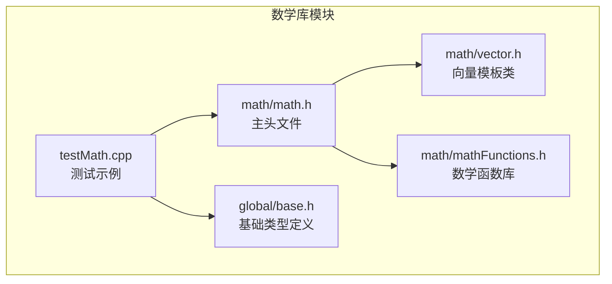
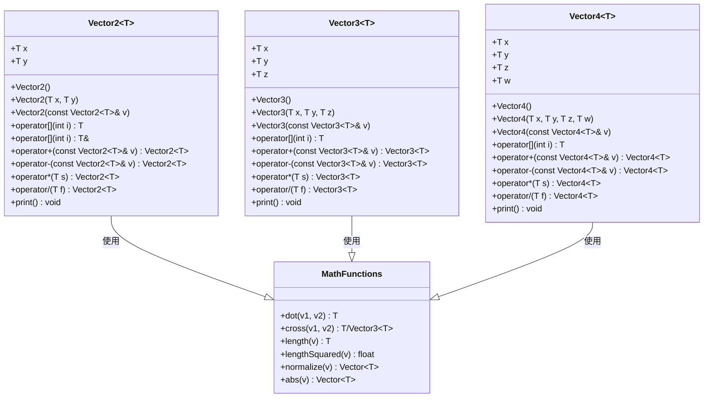
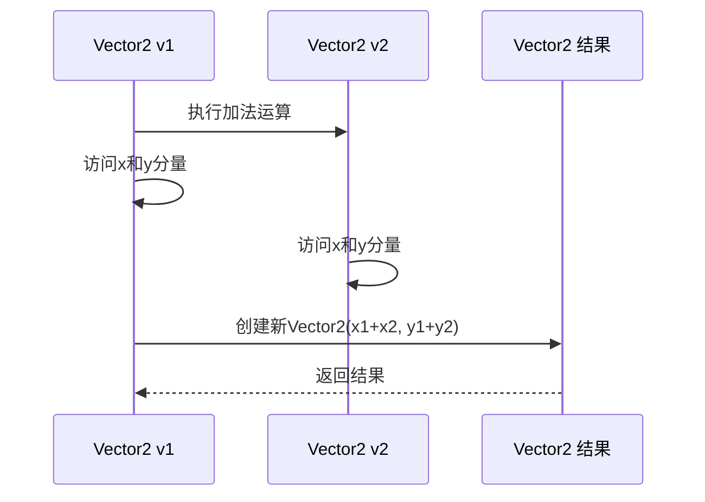
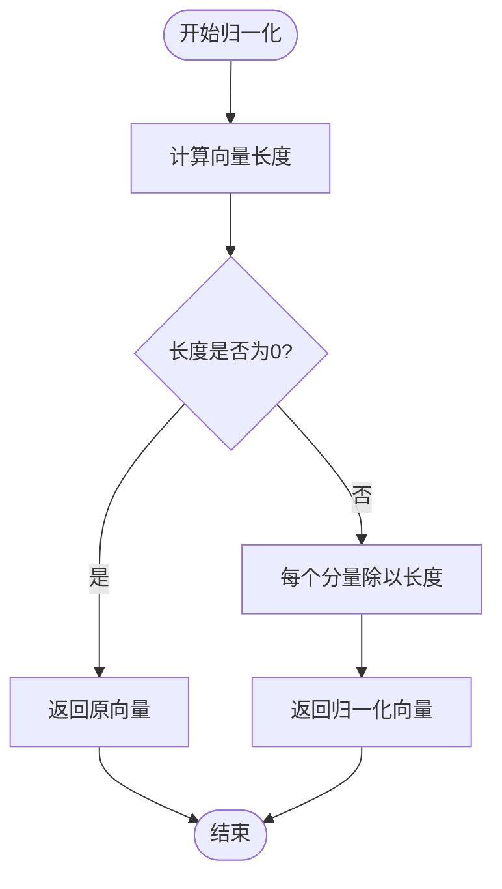
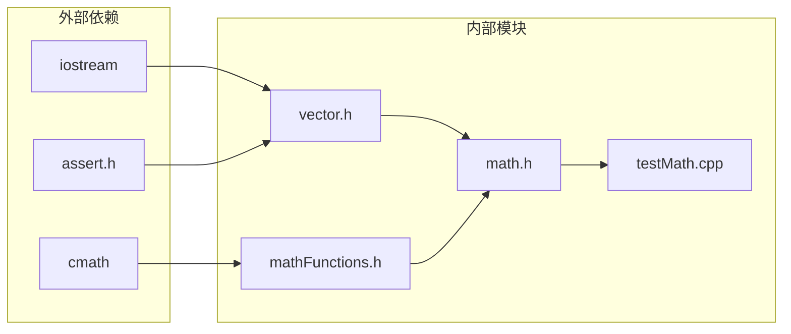

# 数学库模块

<cite>
**本文档引用的文件**
- [math/vector.h](file://math/vector.h)
- [math/math.h](file://math/math.h)
- [math/mathFunctions.h](file://math/mathFunctions.h)
- [testMath.cpp](file://testMath.cpp)
- [global/base.h](file://global/base.h)
</cite>

## 目录
1. [简介](#简介)
2. [项目结构](#项目结构)
3. [核心组件](#核心组件)
4. [架构概览](#架构概览)
5. [详细组件分析](#详细组件分析)
6. [依赖关系分析](#依赖关系分析)
7. [性能考虑](#性能考虑)
8. [故障排除指南](#故障排除指南)
9. [结论](#结论)
10. [附录](#附录)

## 简介

本数学库模块提供了高性能的向量运算功能，采用C++模板编程技术实现了统一的Vector2、Vector3、Vector4模板类。该库专注于2D、3D和4D向量的基本运算，包括算术运算、标量运算、点乘、叉乘、长度计算和归一化等核心数学功能。通过模板特化和重载机制，实现了单一接口支持多种数据类型的向量运算。

## 项目结构

数学库模块采用清晰的分层架构，主要包含以下组件：



**图表来源**
- [math/math.h](file://math/math.h#L1-L4)
- [math/vector.h](file://math/vector.h#L1-L323)
- [math/mathFunctions.h](file://math/mathFunctions.h#L1-L155)
- [testMath.cpp](file://testMath.cpp#L1-L30)
- [global/base.h](file://global/base.h#L1-L42)

**章节来源**
- [math/math.h](file://math/math.h#L1-L4)
- [math/vector.h](file://math/vector.h#L1-L323)
- [math/mathFunctions.h](file://math/mathFunctions.h#L1-L155)
- [testMath.cpp](file://testMath.cpp#L1-L30)
- [global/base.h](file://global/base.h#L1-L42)

## 核心组件

数学库的核心由三个主要组件构成：

### 1. 向量模板类系统
- **Vector2<T>**: 二维向量模板类，支持基本的向量运算
- **Vector3<T>**: 三维向量模板类，提供完整的3D向量运算能力
- **Vector4<T>**: 四维向量模板类，扩展了额外的分量支持

### 2. 数学函数库
- 标量与向量乘法运算
- 向量与向量逐元素乘法
- 绝对值函数
- 点乘(dot)运算
- 叉乘(cross)运算
- 长度计算(length)
- 长度平方计算(lengthSquared)
- 向量归一化(normalize)

### 3. 类型别名系统
- `vec2f` / `vec2i`: float/int类型的二维向量别名
- `vec3f` / `vec3i`: float/int类型的三维向量别名  
- `vec4f` / `vec4i`: float/int类型的四维向量别名

**章节来源**
- [math/vector.h](file://math/vector.h#L13-L323)
- [math/mathFunctions.h](file://math/mathFunctions.h#L1-L155)

## 架构概览

数学库采用了模块化的架构设计，通过头文件包含机制实现松耦合的组件组织：



**图表来源**
- [math/vector.h](file://math/vector.h#L13-L323)
- [math/mathFunctions.h](file://math/mathFunctions.h#L6-L155)

## 详细组件分析

### Vector2<T> 模板类

Vector2是二维向量的基础实现，提供了完整的向量运算能力：

#### 构造函数体系
- 默认构造函数：初始化为零向量
- 参数化构造函数：从坐标值创建向量
- 拷贝构造函数：从其他Vector2实例复制
- 类型转换构造函数：从Vector3或Vector4降维创建

#### 运算符重载机制



**图表来源**
- [math/vector.h](file://math/vector.h#L60-L62)

#### 成员函数特性
- 下标访问运算符：支持数组式访问和修改
- 算术运算：加法、减法、标量乘法、标量除法
- 复合赋值运算：就地修改向量值
- 负号运算：返回向量的相反数

**章节来源**
- [math/vector.h](file://math/vector.h#L13-L127)

### Vector3<T> 模板类

Vector3提供了三维向量的完整功能集：

#### 特殊运算支持
- 与Vector2的类型转换：从二维向量创建三维向量
- 与Vector4的类型转换：从四维向量创建三维向量
- 标量乘法：与数值进行乘法运算
- 标量除法：与非零数值进行除法运算

#### 3D专用运算
Vector3类实现了与3D几何相关的运算，包括：
- 3D叉乘运算（cross）
- 3D向量的负号运算
- 完整的算术运算支持

**章节来源**
- [math/vector.h](file://math/vector.h#L131-L218)

### Vector4<T> 模板类

Vector4是最高维度的向量实现，具有独特的特性：

#### 增强的运算能力
- 支持与Vector3的复合乘法运算
- 四维分量的完整访问接口
- 与Vector2和Vector3的双向类型转换

#### 特殊运算实现
Vector4类包含了Vector3中缺少的某些运算：
- 与Vector3的乘法运算
- 更完整的类型转换支持

**章节来源**
- [math/vector.h](file://math/vector.h#L221-L323)

### 数学函数库

数学函数库提供了独立于具体向量类型的通用数学运算：

#### 点乘运算
点乘函数实现了向量内积计算，支持所有维度的向量：
- 2D点乘：返回两个二维向量的标量内积
- 3D点乘：返回两个三维向量的标量内积
- 4D点乘：返回两个四维向量的标量内积

#### 叉乘运算
叉乘函数根据维度提供不同的实现：
- 2D叉乘：返回标量值（二维平面的垂直分量）
- 3D叉乘：返回三维向量（垂直于两个输入向量的向量）

#### 长度计算系统
- `lengthSquared`：计算向量长度的平方，避免开方运算
- `length`：计算向量的实际长度
- `normalize`：返回单位向量



**图表来源**
- [math/mathFunctions.h](file://math/mathFunctions.h#L140-L153)

**章节来源**
- [math/mathFunctions.h](file://math/mathFunctions.h#L66-L155)

## 依赖关系分析

数学库的依赖关系体现了清晰的模块化设计：



**图表来源**
- [math/vector.h](file://math/vector.h#L1-L4)
- [math/mathFunctions.h](file://math/mathFunctions.h#L1-L4)
- [math/math.h](file://math/math.h#L1-L4)

### 关键依赖特性

1. **最小依赖原则**：每个文件只包含必要的头文件
2. **循环依赖避免**：通过头文件包含顺序避免循环引用
3. **类型安全保证**：使用模板确保编译时类型检查

**章节来源**
- [math/vector.h](file://math/vector.h#L1-L4)
- [math/mathFunctions.h](file://math/mathFunctions.h#L1-L4)
- [math/math.h](file://math/math.h#L1-L4)

## 性能考虑

### 模板编译时优化
- 所有运算在编译时展开，运行时无额外开销
- 内联函数确保调用效率
- 模板特化避免分支判断

### 内存布局优化
- 紧凑的数据结构，无填充字节
- 连续内存布局便于缓存友好访问
- 直接的成员访问避免间接寻址

### 算法复杂度分析
- 基本运算：O(1) 时间复杂度
- 点乘运算：O(n) 时间复杂度，n为向量维度
- 归一化运算：O(n) + O(log n) 复杂度（包含开方运算）

### 性能优化建议
1. **优先使用lengthSquared**：当只需要比较向量长度时，使用长度平方避免开方运算
2. **避免不必要的拷贝**：使用const引用参数传递大型对象
3. **合理使用类型别名**：选择合适的数据类型（float vs double）平衡精度和性能

## 故障排除指南

### 常见错误类型

#### 断言失败
- **索引越界**：使用下标运算符时超出有效范围
- **除零错误**：执行向量除法时除数为零
- **类型不匹配**：尝试进行不兼容的向量运算

#### 编译时错误
- **模板参数不匹配**：使用不支持的数据类型
- **函数重载冲突**：多个同名函数无法区分
- **头文件包含问题**：依赖关系未正确声明

### 调试技巧

#### 编译器诊断
- 启用详细的编译器警告
- 使用静态分析工具检测潜在问题
- 在调试模式下验证断言条件

#### 运行时验证
- 使用assert宏验证关键假设
- 实施边界检查防止越界访问
- 添加日志输出跟踪复杂运算

**章节来源**
- [math/vector.h](file://math/vector.h#L25-L31)
- [math/vector.h](file://math/vector.h#L94-L98)

## 结论

本数学库模块通过精心设计的模板架构，成功实现了统一的多维向量运算系统。Vector2、Vector3、Vector4模板类提供了完整的向量运算能力，配合独立的数学函数库，形成了功能完备的数学计算框架。

### 主要优势
- **类型安全**：编译时类型检查确保运算正确性
- **性能优异**：模板编译时优化提供零开销抽象
- **接口统一**：相似的API设计降低学习成本
- **扩展性强**：模块化设计便于功能扩展

### 应用场景
- 图形渲染中的顶点变换
- 物理模拟中的力和速度计算
- 几何算法中的向量运算
- 机器学习中的特征向量处理

## 附录

### 使用示例

#### 基本向量运算
```cpp
// 创建和操作向量
vec2f v2(1.0f, 2.0f);
vec3f v3(1.0f, 2.0f, 3.0f);
vec4f v4(1.0f, 2.0f, 3.0f, 4.0f);

// 基本运算
auto sum = v2 + v2;
auto product = v2 * 2.0f;
auto normalized = normalize(v4);
```

#### 高级数学运算
```cpp
// 点乘和叉乘
float dotProd = dot(v2, v2);
float crossProd = cross(v2, v2);
Vector3f crossVec = cross(v3, v3);

// 长度计算
float lenSquared = lengthSquared(v3);
float length = length(v4);
```

### 扩展指南

#### 添加新向量维度
1. 定义新的模板类（如Vector5）
2. 实现基本运算符重载
3. 在mathFunctions.h中添加对应函数
4. 更新类型别名定义

#### 自定义数据类型支持
1. 确保自定义类型支持所需运算
2. 提供适当的构造函数
3. 测试边界情况和异常处理

**章节来源**
- [testMath.cpp](file://testMath.cpp#L5-L29)