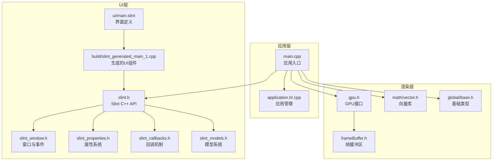
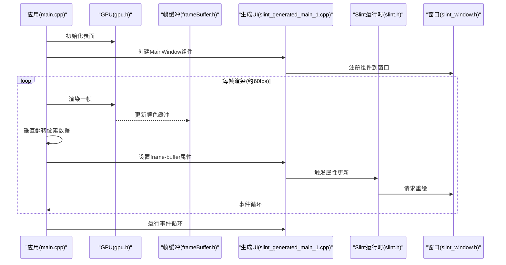
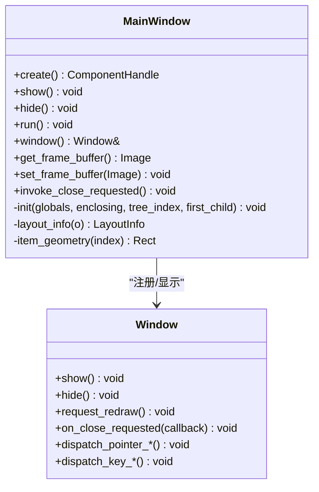
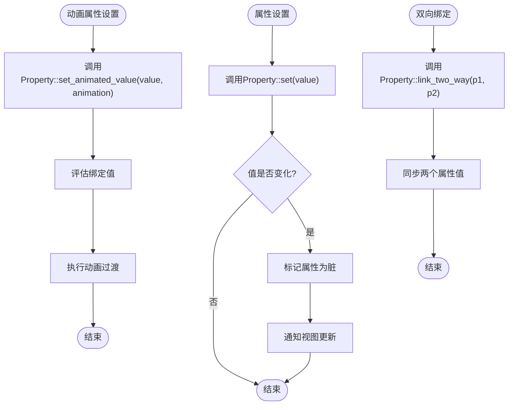
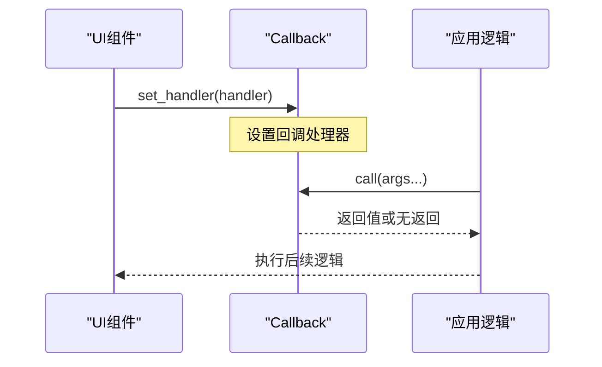
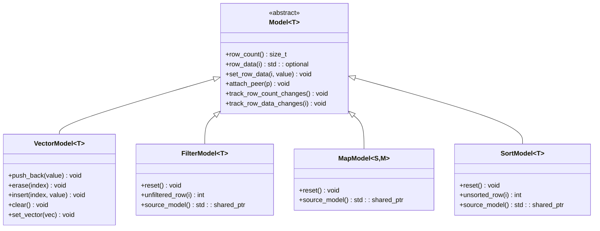
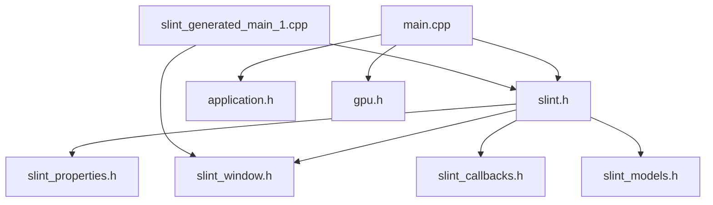

# Slint框架集成

<cite>
**本文档引用的文件**
- [slint.h](file://slint/include/slint/slint.h)
- [slint_window.h](file://slint/include/slint/slint_window.h)
- [slint_properties.h](file://slint/include/slint/slint_properties.h)
- [slint_callbacks.h](file://slint/include/slint/slint_callbacks.h)
- [slint_models.h](file://slint/include/slint/slint_models.h)
- [main.slint](file://ui/main.slint)
- [main.cpp](file://main.cpp)
- [CMakeLists.txt](file://CMakeLists.txt)
- [application.h](file://application/application.h)
- [application.cpp](file://application/application.cpp)
- [slint_generated_main_1.cpp](file://build/slint_generated_main_1.cpp)
- [gpu.h](file://gpu/gpu.h)
- [frameBuffer.h](file://gpu/frameBuffer.h)
- [base.h](file://global/base.h)
- [vector.h](file://math/vector.h)
</cite>

## 目录
1. [简介](#简介)
2. [项目结构](#项目结构)
3. [核心组件](#核心组件)
4. [架构总览](#架构总览)
5. [详细组件分析](#详细组件分析)
6. [依赖关系分析](#依赖关系分析)
7. [性能考虑](#性能考虑)
8. [故障排除指南](#故障排除指南)
9. [结论](#结论)
10. [附录](#附录)

## 简介
本项目展示了如何在C++应用中集成Slint UI框架，实现基于OpenGL的图形渲染与Slint窗口系统的结合。项目通过Slint的界面定义语言(.slint)描述UI布局，使用C++生成的组件类与Slint运行时进行交互，实现从GPU帧缓冲区到Slint图像的转换与显示。

## 项目结构
项目采用分层组织方式，包含Slint集成层、GPU渲染层、数学库与全局类型定义：

- slint/: Slint C++头文件与生成的UI代码
- ui/: Slint界面定义文件
- application/: 应用程序主逻辑与生命周期管理
- gpu/: GPU模拟与帧缓冲区管理
- math/: 向量数学库
- global/: 全局基础类型定义
- build/: CMake构建产物与自动生成的UI组件代码

**图表来源**
- [main.cpp](file://main.cpp#L1-L59)
- [application.h](file://application/application.h#L1-L33)
- [application.cpp](file://application/application.cpp#L1-L46)
- [gpu.h](file://gpu/gpu.h#L1-L37)
- [frameBuffer.h](file://gpu/frameBuffer.h#L1-L19)
- [vector.h](file://math/vector.h#L1-L323)
- [base.h](file://global/base.h#L1-L42)
- [slint.h](file://slint/include/slint/slint.h#L1-L563)
- [slint_window.h](file://slint/include/slint/slint_window.h#L1-L746)
- [slint_properties.h](file://slint/include/slint/slint_properties.h#L1-L418)
- [slint_callbacks.h](file://slint/include/slint/slint_callbacks.h#L1-L113)
- [slint_models.h](file://slint/include/slint/slint_models.h#L1-L800)
- [main.slint](file://ui/main.slint#L1-L18)
- [slint_generated_main_1.cpp](file://build/slint_generated_main_1.cpp#L1-L243)

**章节来源**
- [CMakeLists.txt](file://CMakeLists.txt#L1-L69)
- [main.cpp](file://main.cpp#L1-L59)
- [application.h](file://application/application.h#L1-L33)
- [application.cpp](file://application/application.cpp#L1-L46)
- [gpu.h](file://gpu/gpu.h#L1-L37)
- [frameBuffer.h](file://gpu/frameBuffer.h#L1-L19)
- [vector.h](file://math/vector.h#L1-L323)
- [base.h](file://global/base.h#L1-L42)

## 核心组件
本节深入分析Slint框架的核心概念与架构设计，包括组件系统、属性绑定、回调机制与模型系统。

- 组件系统
  - 生成的组件类提供创建、初始化、布局信息查询与窗口适配功能
  - 组件通过VTable机制与Slint运行时交互，注册到窗口并参与布局计算
  - 示例：MainWindow组件负责窗口显示、事件处理与属性访问

- 属性绑定
  - Property模板类提供双向绑定、动画绑定与常量标记能力
  - 支持数值、颜色、刷子等类型的属性，具备脏值跟踪与变更通知
  - 示例：窗口尺寸、背景色、图像源等属性通过绑定实现动态更新

- 回调机制
  - Callback模板类封装无返回值与有返回值的回调函数
  - 支持处理器设置与调用，用于事件响应与跨语言通信
  - 示例：窗口关闭请求回调、菜单激活回调等

- 模型系统
  - Model抽象类提供数据模型接口，支持行计数、行数据访问与变更通知
  - VectorModel、FilterModel、MapModel、SortModel等具体实现
  - 示例：列表视图、过滤与排序的数据源

**章节来源**
- [slint.h](file://slint/include/slint/slint.h#L31-L563)
- [slint_window.h](file://slint/include/slint/slint_window.h#L318-L746)
- [slint_properties.h](file://slint/include/slint/slint_properties.h#L60-L263)
- [slint_callbacks.h](file://slint/include/slint/slint_callbacks.h#L19-L97)
- [slint_models.h](file://slint/include/slint/slint_models.h#L72-L212)

## 架构总览
Slint框架在本项目中的集成路径如下：C++应用通过Slint C++ API创建组件实例，加载Slint界面定义，将GPU渲染结果转换为Slint图像并绑定到UI属性，最终通过事件循环驱动渲染与交互。

**图表来源**
- [main.cpp](file://main.cpp#L10-L59)
- [gpu.h](file://gpu/gpu.h#L11-L37)
- [frameBuffer.h](file://gpu/frameBuffer.h#L8-L19)
- [slint_generated_main_1.cpp](file://build/slint_generated_main_1.cpp#L190-L243)
- [slint.h](file://slint/include/slint/slint.h#L416-L469)
- [slint_window.h](file://slint/include/slint/slint_window.h#L318-L494)

## 详细组件分析

### 组件系统分析
MainWindow组件是Slint生成的根组件，负责：
- 初始化窗口属性与布局信息
- 提供属性访问器(set/get)与事件回调
- 注册到窗口并参与布局树管理

**图表来源**
- [slint_generated_main_1.cpp](file://build/slint_generated_main_1.cpp#L190-L243)
- [slint_window.h](file://slint/include/slint/slint_window.h#L318-L494)

**章节来源**
- [slint_generated_main_1.cpp](file://build/slint_generated_main_1.cpp#L6-L243)
- [slint_window.h](file://slint/include/slint/slint_window.h#L318-L746)

### 属性绑定与动画流程
属性绑定通过Property模板类实现，支持静态值、动态绑定与动画过渡。以下流程展示属性更新与动画绑定的典型路径。

**图表来源**
- [slint_properties.h](file://slint/include/slint/slint_properties.h#L77-L129)
- [slint_properties.h](file://slint/include/slint/slint_properties.h#L103-L125)
- [slint_properties.h](file://slint/include/slint/slint_properties.h#L130-L146)

**章节来源**
- [slint_properties.h](file://slint/include/slint/slint_properties.h#L60-L263)

### 回调机制与事件处理
回调机制用于处理用户交互与系统事件，支持无返回值与有返回值的回调类型。

**图表来源**
- [slint_callbacks.h](file://slint/include/slint/slint_callbacks.h#L30-L52)
- [slint_callbacks.h](file://slint/include/slint/slint_callbacks.h#L74-L92)

**章节来源**
- [slint_callbacks.h](file://slint/include/slint/slint_callbacks.h#L19-L97)

### 模型系统与数据绑定
模型系统提供数据驱动UI的能力，支持向量模型、过滤、映射与排序。

**图表来源**
- [slint_models.h](file://slint/include/slint/slint_models.h#L72-L212)
- [slint_models.h](file://slint/include/slint/slint_models.h#L273-L333)
- [slint_models.h](file://slint/include/slint/slint_models.h#L471-L524)
- [slint_models.h](file://slint/include/slint/slint_models.h#L571-L609)
- [slint_models.h](file://slint/include/slint/slint_models.h#L757-L799)

**章节来源**
- [slint_models.h](file://slint/include/slint/slint_models.h#L1-L800)

### Slint界面定义语言(.slint)语法与实践
界面定义文件描述了UI结构、属性与回调，支持继承、属性声明与事件处理。

- 组件继承：MainWindow继承Window，复用窗口特性
- 属性声明：title、width、height、background等
- 数据绑定：frame-buffer属性绑定到Image控件
- 事件处理：close-requested回调用于窗口关闭逻辑

**图表来源**
- [main.slint](file://ui/main.slint#L1-L18)
- [slint_generated_main_1.cpp](file://build/slint_generated_main_1.cpp#L6-L52)

**章节来源**
- [main.slint](file://ui/main.slint#L1-L18)

### C++集成与编译配置
项目通过CMake集成Slint框架，包含头文件包含、链接配置与编译设置。

- 使用本地Slint库：通过Slint_DIR指向本地CMake包
- 查找依赖：FreeType、Fontconfig、libinput、xkbcommon等
- 目标链接：链接Slint::Slint与系统库
- UI编译：使用slint_target_sources编译.ui文件

**章节来源**
- [CMakeLists.txt](file://CMakeLists.txt#L12-L69)

### 具体代码示例与实现要点
- 创建自定义组件：通过MainWindow::create()创建实例，设置回调与属性
- 处理用户交互：MainWindow::on_close_requested()绑定关闭逻辑
- 实现数据绑定：将GPU帧缓冲区转换为Slint图像并设置到frame-buffer属性
- 渲染循环：使用slint::Timer定期触发渲染与属性更新

**章节来源**
- [main.cpp](file://main.cpp#L18-L55)
- [slint_generated_main_1.cpp](file://build/slint_generated_main_1.cpp#L208-L224)

## 依赖关系分析
Slint框架的依赖关系主要体现在头文件包含与运行时交互上。

**图表来源**
- [slint.h](file://slint/include/slint/slint.h#L6-L11)
- [slint_window.h](file://slint/include/slint/slint_window.h#L6-L7)
- [slint_properties.h](file://slint/include/slint/slint_properties.h#L16-L17)
- [slint_callbacks.h](file://slint/include/slint/slint_callbacks.h#L6)
- [slint_models.h](file://slint/include/slint/slint_models.h#L6)
- [main.cpp](file://main.cpp#L1-L3)
- [application.h](file://application/application.h#L1-L33)
- [gpu.h](file://gpu/gpu.h#L1-L37)
- [slint_generated_main_1.cpp](file://build/slint_generated_main_1.cpp#L1-L4)

**章节来源**
- [slint.h](file://slint/include/slint/slint.h#L1-L563)
- [slint_window.h](file://slint/include/slint/slint_window.h#L1-L746)
- [slint_properties.h](file://slint/include/slint/slint_properties.h#L1-L418)
- [slint_callbacks.h](file://slint/include/slint/slint_callbacks.h#L1-L113)
- [slint_models.h](file://slint/include/slint/slint_models.h#L1-L800)
- [main.cpp](file://main.cpp#L1-L59)
- [application.h](file://application/application.h#L1-L33)
- [gpu.h](file://gpu/gpu.h#L1-L37)
- [slint_generated_main_1.cpp](file://build/slint_generated_main_1.cpp#L1-L243)

## 性能考虑
- 事件循环与渲染频率：使用约60fps的定时器驱动渲染，避免过度刷新
- 像素数据转换：在CPU侧进行垂直翻转与像素格式转换，注意内存带宽与缓存局部性
- 属性更新：利用Property的脏值检测减少不必要的重绘
- 模型更新：批量更新模型数据并通过通知机制触发UI刷新
- 字体与资源：通过WindowAdapterRc注册字体与位图字体，减少运行时开销

## 故障排除指南
- 线程安全：所有Slint API必须在主线程调用，使用invoke_from_event_loop在其他线程安全地调度
- 内存管理：确保组件与窗口的生命周期匹配，避免悬挂引用
- 事件处理：正确设置on_close_requested回调，防止窗口无法关闭
- 图像绑定：确保像素缓冲区格式与大小正确，避免渲染异常

**章节来源**
- [slint.h](file://slint/include/slint/slint.h#L468-L550)
- [slint_window.h](file://slint/include/slint/slint_window.h#L379-L387)
- [slint_window.h](file://slint/include/slint/slint_window.h#L597-L620)

## 结论
本项目成功展示了Slint框架在C++应用中的集成方式，通过界面定义语言与生成的C++组件实现UI与渲染逻辑的解耦。Slint的属性绑定、回调机制与模型系统为复杂UI提供了强大的数据驱动能力。结合GPU渲染管线，可以构建高性能的图形应用界面。

## 附录
- 数学库：提供向量运算支持，用于图形渲染计算
- 全局类型：RGBA颜色与Point点结构，用于像素与坐标表示
- GPU接口：模拟GPU渲染行为，输出帧缓冲区供UI使用

**章节来源**
- [vector.h](file://math/vector.h#L1-L323)
- [base.h](file://global/base.h#L18-L42)
- [gpu.h](file://gpu/gpu.h#L11-L37)
- [frameBuffer.h](file://gpu/frameBuffer.h#L8-L19)