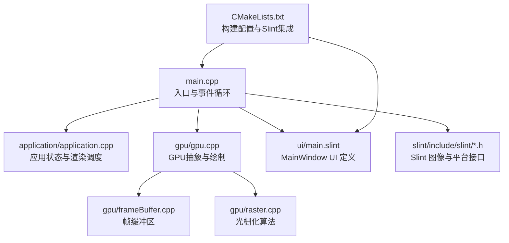
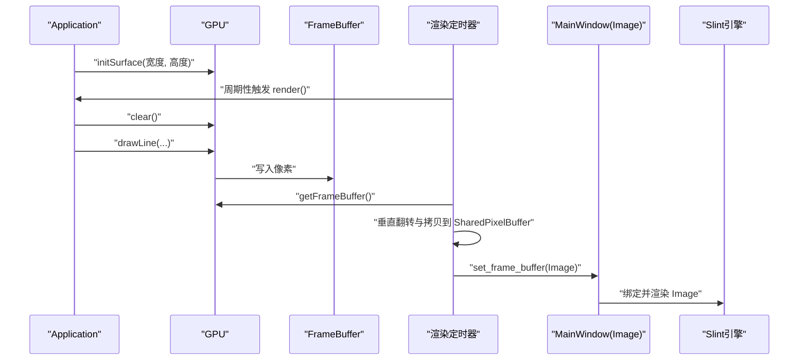
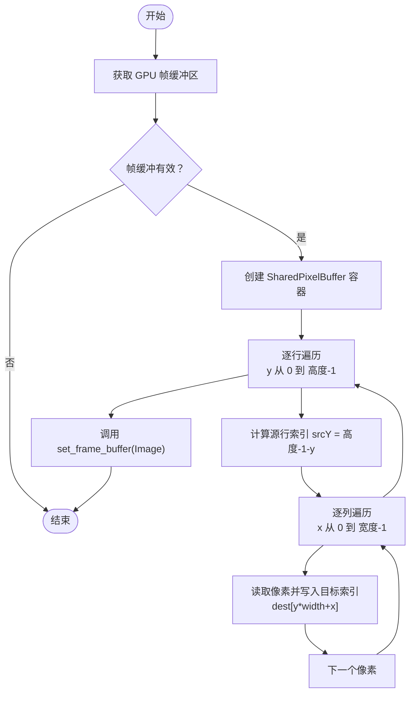
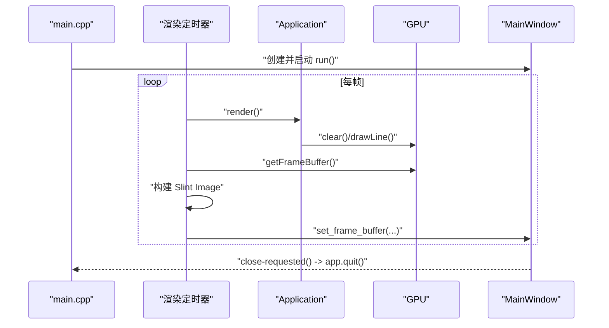
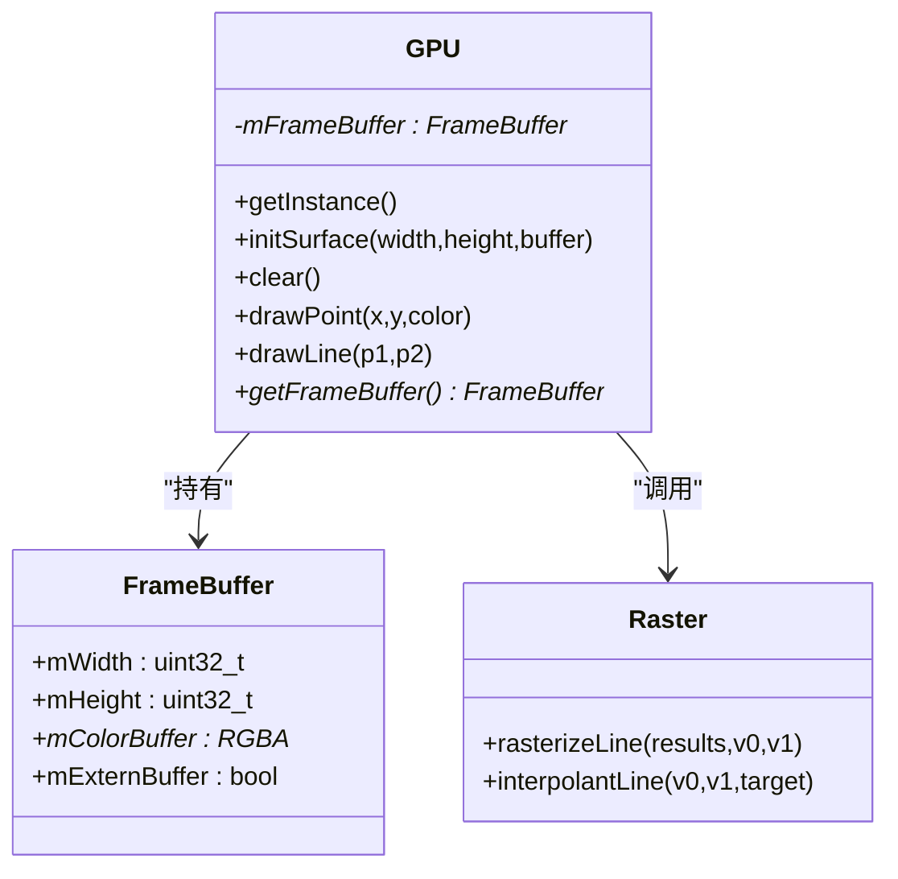
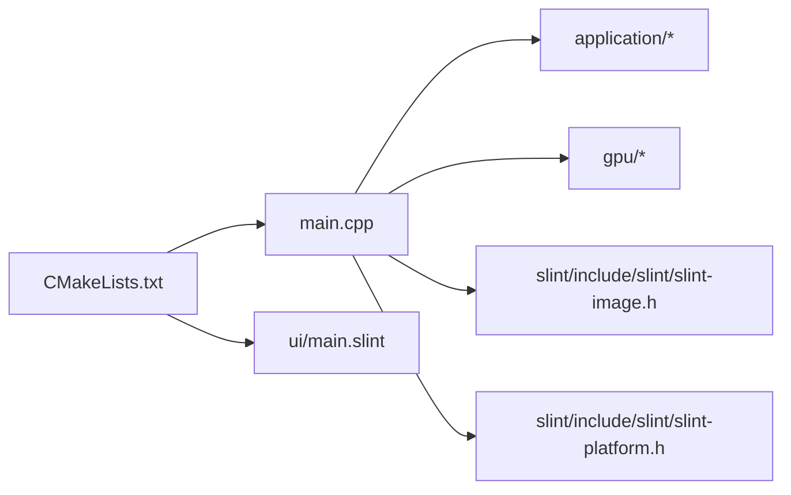

# 应用程序界面

<cite>
**本文引用的文件**
- [main.cpp](file://main.cpp)
- [ui/main.slint](file://ui/main.slint)
- [application/application.h](file://application/application.h)
- [application/application.cpp](file://application/application.cpp)
- [gpu/gpu.h](file://gpu/gpu.h)
- [gpu/gpu.cpp](file://gpu/gpu.cpp)
- [gpu/frameBuffer.h](file://gpu/frameBuffer.h)
- [gpu/frameBuffer.cpp](file://gpu/frameBuffer.cpp)
- [gpu/raster.h](file://gpu/raster.h)
- [gpu/raster.cpp](file://gpu/raster.cpp)
- [global/base.h](file://global/base.h)
- [CMakeLists.txt](file://CMakeLists.txt)
- [slint/include/slint/slint-image.h](file://slint/include/slint/slint-image.h)
- [slint/include/slint/slint-image-internal.h](file://slint/include/slint/slint-image-internal.h)
- [slint/include/slint/slint-platform.h](file://slint/include/slint/slint-platform.h)
- [slint/include/slint/slint-platform-internal.h](file://slint/include/slint/slint-platform-internal.h)
</cite>

## 目录
1. [简介](#简介)
2. [项目结构](#项目结构)
3. [核心组件](#核心组件)
4. [架构总览](#架构总览)
5. [详细组件分析](#详细组件分析)
6. [依赖关系分析](#依赖关系分析)
7. [性能考虑](#性能考虑)
8. [故障排查指南](#故障排查指南)
9. [结论](#结论)
10. [附录](#附录)

## 简介
本文件围绕应用程序界面进行系统性文档化，重点覆盖以下方面：
- 主窗口设计与实现：MainWindow 组件的结构、布局与行为
- 图像显示机制：frame-buffer 属性的使用、图像数据传递与渲染路径
- 事件循环与更新：窗口事件、用户输入响应、渲染更新的时序与触发
- 生命周期管理：从初始化到渲染循环的完整流程
- UI 定制与扩展：新增控件、样式修改、用户输入处理的实践方法
- 性能优化与响应式设计：最佳实践与注意事项

## 项目结构
该项目采用分层组织方式：
- 全局基础类型与常量定义位于 global/base.h
- GPU 抽象与帧缓冲区位于 gpu/ 目录
- 应用层封装 Application 提供渲染调度与状态管理
- UI 使用 Slint DSL 描述，通过 CMake 集成编译
- 主程序入口负责初始化、事件循环与帧构建

图表来源
- [main.cpp](file://main.cpp#L10-L58)
- [application/application.cpp](file://application/application.cpp#L23-L45)
- [gpu/gpu.cpp](file://gpu/gpu.cpp#L18-L47)
- [gpu/frameBuffer.cpp](file://gpu/frameBuffer.cpp#L3-L20)
- [gpu/raster.cpp](file://gpu/raster.cpp#L7-L84)
- [ui/main.slint](file://ui/main.slint#L1-L18)
- [CMakeLists.txt](file://CMakeLists.txt#L67-L69)

章节来源
- [CMakeLists.txt](file://CMakeLists.txt#L1-L69)

## 核心组件
- Application：单例应用对象，负责窗口尺寸、存活状态与每帧渲染调用
- GPU：模拟 GPU 的绘图行为，维护 FrameBuffer 并执行清屏、点绘制与线段光栅化
- FrameBuffer：承载颜色缓冲区的二维像素阵列，支持外部缓冲接管
- Raster：实现线段的 Bresenham 光栅化与颜色插值
- Slint UI：MainWindow 组件通过 in property image frame-buffer 将 GPU 帧数据绑定到 Image 控件

章节来源
- [application/application.h](file://application/application.h#L5-L30)
- [application/application.cpp](file://application/application.cpp#L6-L45)
- [gpu/gpu.h](file://gpu/gpu.h#L11-L36)
- [gpu/gpu.cpp](file://gpu/gpu.cpp#L5-L47)
- [gpu/frameBuffer.h](file://gpu/frameBuffer.h#L8-L18)
- [gpu/frameBuffer.cpp](file://gpu/frameBuffer.cpp#L3-L20)
- [gpu/raster.h](file://gpu/raster.h#L8-L19)
- [gpu/raster.cpp](file://gpu/raster.cpp#L3-L84)
- [ui/main.slint](file://ui/main.slint#L1-L18)

## 架构总览
整体架构由“应用层 → GPU 层 → 帧缓冲区 → Slint 图像层”构成，渲染流程如下：

图表来源
- [main.cpp](file://main.cpp#L15-L53)
- [application/application.cpp](file://application/application.cpp#L23-L45)
- [gpu/gpu.cpp](file://gpu/gpu.cpp#L25-L47)
- [gpu/frameBuffer.h](file://gpu/frameBuffer.h#L14-L16)
- [slint/include/slint/slint-image.h](file://slint/include/slint/slint-image.h#L37-L71)
- [ui/main.slint](file://ui/main.slint#L9-L16)

## 详细组件分析

### MainWindow 组件与布局
- 组件定义：继承 Window，设置标题、尺寸与背景色
- 关键属性：in property image frame-buffer
- 视觉呈现：Image 控件占满窗口，其 source 绑定到 root.frame-buffer
- 交互：提供 close-requested 回调，用于关闭请求处理

章节来源
- [ui/main.slint](file://ui/main.slint#L1-L18)

### 图像显示机制与 frame-buffer
- 数据来源：GPU::getFrameBuffer() 返回当前帧的颜色缓冲区
- 数据转换：遍历帧缓冲区，按行进行垂直翻转，填充到 Slint 的 SharedPixelBuffer<Rgba8Pixel>
- 图像封装：将 SharedPixelBuffer 包装为 Slint Image，并通过 set_frame_buffer 设置到 UI
- 内存模型：FrameBuffer 支持外部缓冲接管，避免重复分配

图表来源
- [main.cpp](file://main.cpp#L31-L53)
- [gpu/gpu.h](file://gpu/gpu.h#L28-L28)
- [gpu/frameBuffer.h](file://gpu/frameBuffer.h#L14-L16)
- [slint/include/slint/slint-image.h](file://slint/include/slint/slint-image.h#L37-L71)
- [slint/include/slint/slint-image-internal.h](file://slint/include/slint/slint-image-internal.h#L338-L354)

章节来源
- [main.cpp](file://main.cpp#L31-L53)
- [gpu/gpu.h](file://gpu/gpu.h#L28-L28)
- [gpu/frameBuffer.h](file://gpu/frameBuffer.h#L14-L16)
- [slint/include/slint/slint-image.h](file://slint/include/slint/slint-image.h#L37-L71)
- [slint/include/slint/slint-image-internal.h](file://slint/include/slint/slint-image-internal.h#L338-L354)

### 事件循环与渲染更新
- 定时器：使用 Slint Timer 按约 16ms（≈60FPS）触发一次渲染
- 生命周期：应用存活标志控制渲染循环；关闭请求触发应用退出
- 更新顺序：先执行应用层渲染，再从 GPU 帧缓冲区构建 Slint 图像并刷新 UI

图表来源
- [main.cpp](file://main.cpp#L18-L55)
- [application/application.cpp](file://application/application.cpp#L23-L45)
- [gpu/gpu.cpp](file://gpu/gpu.cpp#L25-L47)

章节来源
- [main.cpp](file://main.cpp#L18-L55)
- [application/application.cpp](file://application/application.cpp#L23-L45)

### 应用程序生命周期管理
- 初始化阶段：获取 Application 单例，初始化 GPU 表面（宽度/高度）
- 运行阶段：创建 MainWindow，注册关闭回调，启动渲染定时器
- 渲染阶段：每帧清屏、绘制几何，构建图像并提交给 UI
- 结束阶段：收到关闭请求后设置应用非存活，退出事件循环

章节来源
- [main.cpp](file://main.cpp#L10-L58)
- [application/application.h](file://application/application.h#L12-L15)
- [application/application.cpp](file://application/application.cpp#L6-L16)

### GPU 抽象与光栅化
- GPU::initSurface：创建或重置 FrameBuffer
- GPU::clear：全屏清空为不透明黑色
- GPU::drawLine：委托 Raster::rasterizeLine 生成像素序列，再逐点写入
- Raster::rasterizeLine：实现 Bresenham 算法，支持斜率归一化与坐标变换
- Raster::interpolantLine：基于端点颜色进行线性插值

图表来源
- [gpu/gpu.h](file://gpu/gpu.h#L11-L36)
- [gpu/frameBuffer.h](file://gpu/frameBuffer.h#L8-L18)
- [gpu/raster.h](file://gpu/raster.h#L8-L19)

章节来源
- [gpu/gpu.h](file://gpu/gpu.h#L11-L36)
- [gpu/gpu.cpp](file://gpu/gpu.cpp#L18-L47)
- [gpu/frameBuffer.h](file://gpu/frameBuffer.h#L8-L18)
- [gpu/frameBuffer.cpp](file://gpu/frameBuffer.cpp#L3-L20)
- [gpu/raster.h](file://gpu/raster.h#L8-L19)
- [gpu/raster.cpp](file://gpu/raster.cpp#L7-L103)

### Slint 图像与平台接口
- SharedPixelBuffer：Slint 的像素缓冲容器，提供宽高与迭代器访问
- SharedImageBuffer：支持 RGB8/RGBA8/预乘等格式封装
- 平台接口：提供软件渲染器、定时器更新与事件循环钩子

章节来源
- [slint/include/slint/slint-image.h](file://slint/include/slint/slint-image.h#L37-L71)
- [slint/include/slint/slint-image-internal.h](file://slint/include/slint/slint-image-internal.h#L338-L381)
- [slint/include/slint/slint-platform.h](file://slint/include/slint/slint-platform.h#L985-L1021)
- [slint/include/slint/slint-platform-internal.h](file://slint/include/slint/slint-platform-internal.h#L176-L201)

## 依赖关系分析
- 构建系统通过 CMake 集成 Slint，编译 UI 文件并链接相关库
- 主程序依赖应用层、GPU 层与 Slint 图像/平台头文件
- UI 与渲染路径解耦：UI 仅消费图像属性，不直接依赖底层绘制逻辑

图表来源
- [CMakeLists.txt](file://CMakeLists.txt#L67-L69)
- [main.cpp](file://main.cpp#L1-L3)
- [ui/main.slint](file://ui/main.slint#L1-L18)

章节来源
- [CMakeLists.txt](file://CMakeLists.txt#L1-L69)

## 性能考虑
- 帧率控制：定时器周期约为 16ms，确保稳定 60FPS
- 像素拷贝优化：逐像素复制可进一步利用 SIMD 或单次内存块拷贝
- 垂直翻转：GPU 坐标系与 Slint 不同，需在 CPU 上进行翻转，建议减少不必要的中间层
- 光栅化：Bresenham 已为高效整数算法，注意避免重复计算与分支
- 内存管理：FrameBuffer 支持外部缓冲，避免重复分配；注意生命周期与释放策略
- UI 合成：Image 控件占满窗口，避免多余布局开销

## 故障排查指南
- 无画面输出
  - 检查 Application::isAlive 是否为真，渲染循环是否被提前终止
  - 确认 GPU::getFrameBuffer() 返回非空且尺寸有效
  - 核对 SharedPixelBuffer 的宽高与像素数据范围
- 像素颠倒
  - 确认垂直翻转逻辑：源行索引应为“高度-1-y”
- 关闭无响应
  - 检查 MainWindow 的 close-requested 回调是否正确设置并调用 Application::quit()

章节来源
- [main.cpp](file://main.cpp#L20-L22)
- [main.cpp](file://main.cpp#L31-L53)
- [application/application.cpp](file://application/application.cpp#L12-L16)
- [gpu/gpu.h](file://gpu/gpu.h#L28-L28)

## 结论
该界面系统以 Slint 为 UI 框架，结合自研 GPU 抽象与光栅化管线，形成清晰的渲染链路。MainWindow 通过 frame-buffer 属性与 Slint 图像绑定，实现从底层帧缓冲到上层 UI 的平滑过渡。通过定时器驱动的渲染循环，系统具备稳定的帧率与可扩展的绘制能力。

## 附录

### UI 定制与扩展实践
- 添加新控件
  - 在 Slint UI 中新增控件并导出为组件，通过回调与属性与应用层交互
- 修改样式
  - 使用 Slint 的样式语法调整颜色、边框、字体与布局参数
- 处理用户输入
  - 通过 Slint 的输入事件与回调，映射到应用层状态变更，再触发重新渲染
- 扩展渲染内容
  - 在 Application::render 中增加更多几何绘制或纹理合成逻辑

### 响应式设计建议
- 使用相对单位与百分比布局，适配不同分辨率
- 保持 UI 控件最小化，避免过度嵌套导致布局开销
- 将昂贵的绘制操作限制在必要范围内，优先使用高效的光栅化算法