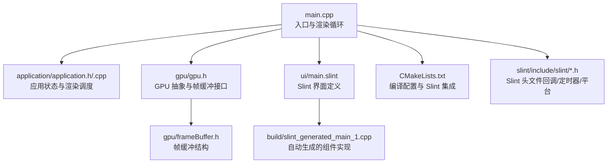
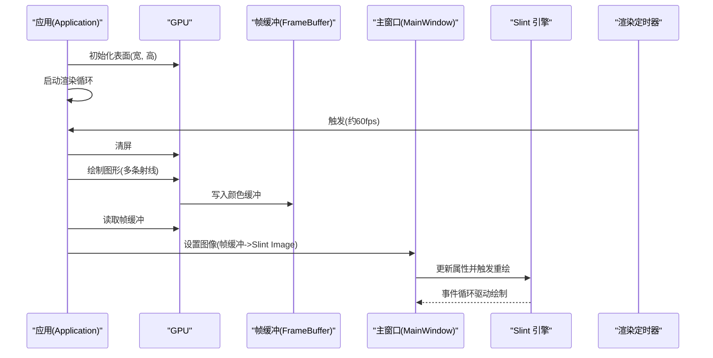
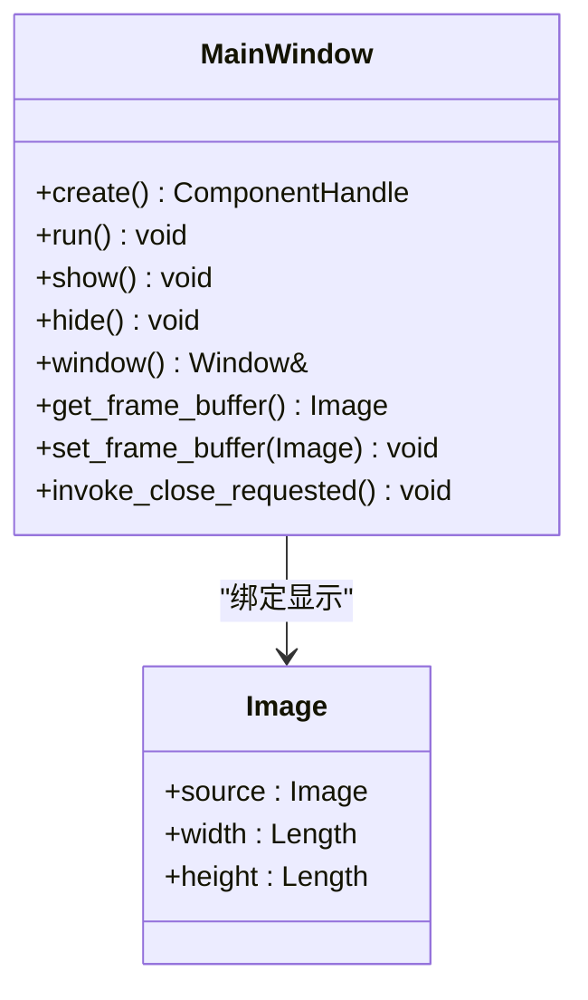
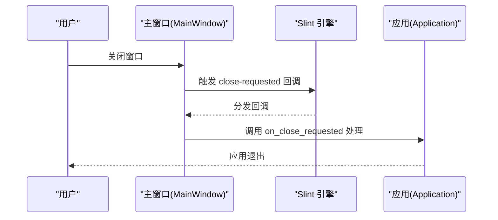
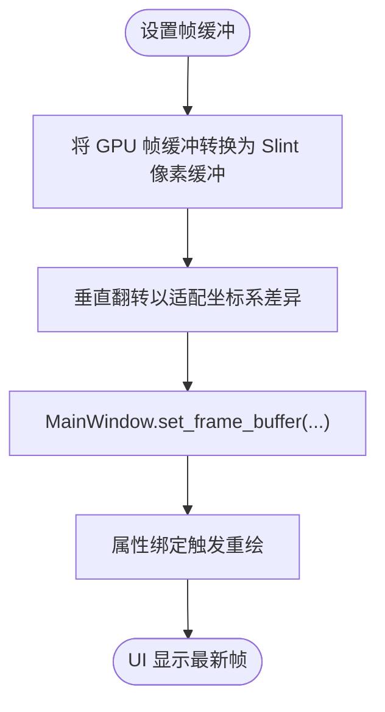
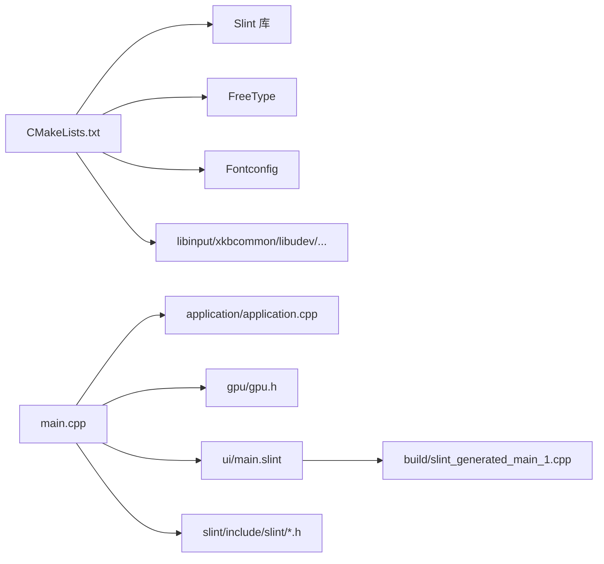

# 用户界面系统

<cite>
**本文引用的文件**
- [ui/main.slint](file://ui/main.slint)
- [main.cpp](file://main.cpp)
- [application/application.h](file://application/application.h)
- [application/application.cpp](file://application/application.cpp)
- [gpu/gpu.h](file://gpu/gpu.h)
- [gpu/frameBuffer.h](file://gpu/frameBuffer.h)
- [global/base.h](file://global/base.h)
- [CMakeLists.txt](file://CMakeLists.txt)
- [build/slint_generated_main_1.cpp](file://build/slint_generated_main_1.cpp)
- [slint/include/slint/slint_callbacks.h](file://slint/include/slint/slint_callbacks.h)
- [slint/include/slint/slint_timer.h](file://slint/include/slint/slint_timer.h)
- [slint/include/slint/slint-interpreter.h](file://slint/include/slint/slint-interpreter.h)
- [slint/include/slint/slint_platform_internal.h](file://slint/include/slint/slint_platform_internal.h)
</cite>

## 目录
1. [简介](#简介)
2. [项目结构](#项目结构)
3. [核心组件](#核心组件)
4. [架构总览](#架构总览)
5. [详细组件分析](#详细组件分析)
6. [依赖关系分析](#依赖关系分析)
7. [性能考虑](#性能考虑)
8. [故障排查指南](#故障排查指南)
9. [结论](#结论)
10. [附录](#附录)

## 简介
本文件面向“用户界面系统”的全面文档，聚焦于 Slint UI 框架在本项目中的集成与使用。内容涵盖：
- Slint 界面定义语法与组件模型
- 事件处理机制与回调系统
- 数据绑定与属性更新
- 主窗口设计与实现（图像显示、事件循环、用户交互）
- 应用程序生命周期管理（从初始化到渲染循环）
- UI 定制与扩展（新增控件、样式修改、输入处理）
- 性能优化与响应式设计最佳实践

## 项目结构
该项目采用分层组织方式：应用逻辑位于顶层，GPU 渲染与帧缓冲在 gpu 目录，数学基础类型与向量库在 global 与 math 目录，UI 使用 Slint 的 .slint 文件定义并在构建时生成 C++ 组件。



图表来源
- [main.cpp](file://main.cpp#L1-L59)
- [application/application.h](file://application/application.h#L1-L33)
- [application/application.cpp](file://application/application.cpp#L1-L46)
- [gpu/gpu.h](file://gpu/gpu.h#L1-L37)
- [gpu/frameBuffer.h](file://gpu/frameBuffer.h#L1-L19)
- [ui/main.slint](file://ui/main.slint#L1-L18)
- [build/slint_generated_main_1.cpp](file://build/slint_generated_main_1.cpp#L1-L243)
- [CMakeLists.txt](file://CMakeLists.txt#L1-L69)

章节来源
- [CMakeLists.txt](file://CMakeLists.txt#L1-L69)

## 核心组件
- 主窗口组件 MainWindow：由 Slint UI 定义，负责展示 GPU 输出的图像，并提供关闭请求回调。
- 应用 Application：单例，管理应用生命周期、尺寸与每帧渲染逻辑。
- GPU 与帧缓冲：抽象 GPU 行为与帧缓冲，提供清屏、画点、画线与帧缓冲访问。
- 全局基础类型：RGBA 颜色与 Point 点结构，用于像素与几何绘制。
- Slint 运行时：回调、定时器、事件循环与平台集成接口。

章节来源
- [ui/main.slint](file://ui/main.slint#L1-L18)
- [application/application.h](file://application/application.h#L1-L33)
- [application/application.cpp](file://application/application.cpp#L1-L46)
- [gpu/gpu.h](file://gpu/gpu.h#L1-L37)
- [gpu/frameBuffer.h](file://gpu/frameBuffer.h#L1-L19)
- [global/base.h](file://global/base.h#L1-L42)

## 架构总览
整体架构围绕“渲染管线 + UI 展示”展开：应用层每帧调用 GPU 渲染，将结果写入帧缓冲；主线程定时器将帧缓冲转换为 Slint Image 并更新 UI；Slint 负责事件循环与窗口管理。



图表来源
- [main.cpp](file://main.cpp#L10-L59)
- [application/application.cpp](file://application/application.cpp#L23-L45)
- [gpu/gpu.h](file://gpu/gpu.h#L17-L28)
- [gpu/frameBuffer.h](file://gpu/frameBuffer.h#L8-L18)
- [build/slint_generated_main_1.cpp](file://build/slint_generated_main_1.cpp#L220-L224)
- [slint/include/slint/slint_timer.h](file://slint/include/slint/slint_timer.h#L48-L102)

## 详细组件分析

### Slint 界面定义与组件模型
- 界面定义文件通过 Slint DSL 描述主窗口，设置标题、尺寸、背景与一个只读属性 frame-buffer。
- 主窗口内包含一个 Image 控件，其 source 绑定到根属性 frame-buffer，实现 GPU 图像的直接显示。
- 自动生成的 MainWindow 类封装了 Slint 组件的生命周期、布局信息、属性访问与事件循环启动。



图表来源
- [ui/main.slint](file://ui/main.slint#L1-L18)
- [build/slint_generated_main_1.cpp](file://build/slint_generated_main_1.cpp#L190-L242)

章节来源
- [ui/main.slint](file://ui/main.slint#L1-L18)
- [build/slint_generated_main_1.cpp](file://build/slint_generated_main_1.cpp#L1-L243)

### 事件处理机制与回调
- Slint 回调系统通过模板化 Callback 实现，支持无返回值与带返回值的回调签名。
- MainWindow 提供 close-requested 回调，应用层可注册处理函数以响应窗口关闭。
- 应用层通过 set_handler 将 C++ lambda 绑定到回调，实现事件处理。



图表来源
- [ui/main.slint](file://ui/main.slint#L7-L7)
- [build/slint_generated_main_1.cpp](file://build/slint_generated_main_1.cpp#L208-L212)
- [slint/include/slint/slint_callbacks.h](file://slint/include/slint/slint_callbacks.h#L62-L97)

章节来源
- [ui/main.slint](file://ui/main.slint#L7-L7)
- [build/slint_generated_main_1.cpp](file://build/slint_generated_main_1.cpp#L208-L212)
- [slint/include/slint/slint_callbacks.h](file://slint/include/slint/slint_callbacks.h#L1-L112)

### 数据绑定与属性更新
- MainWindow 的 frame-buffer 属性通过 set_frame_buffer 更新，触发 Slint 内部绑定链路与重绘。
- 属性绑定与脏标记由 Slint 内部机制维护，开发者仅需设置新值即可驱动 UI 更新。
- 自动生成代码中包含布局信息绑定与几何查询，确保 Image 控件随窗口尺寸变化而自适应。



图表来源
- [main.cpp](file://main.cpp#L32-L53)
- [build/slint_generated_main_1.cpp](file://build/slint_generated_main_1.cpp#L220-L224)
- [build/slint_generated_main_1.cpp](file://build/slint_generated_main_1.cpp#L14-L51)

章节来源
- [main.cpp](file://main.cpp#L32-L53)
- [build/slint_generated_main_1.cpp](file://build/slint_generated_main_1.cpp#L14-L51)

### 主窗口设计与实现
- 主窗口尺寸与标题在 .slint 中声明，Image 控件占满窗口，实现全屏图像显示。
- MainWindow::run 调用 show 与 run_event_loop，进入 Slint 事件循环；hide 在退出时调用。
- 关闭请求通过回调通知应用层，应用层调用 quit 结束事件循环。

章节来源
- [ui/main.slint](file://ui/main.slint#L1-L18)
- [build/slint_generated_main_1.cpp](file://build/slint_generated_main_1.cpp#L226-L242)

### 应用程序生命周期管理
- 入口函数创建 Application 单例，初始化 GPU 表面，创建主窗口并注册关闭回调。
- 启动渲染定时器，每约 16ms 执行一次渲染与图像更新。
- run_event_loop 驱动 UI 事件循环，直到应用退出。

```mermaid
sequenceDiagram
participant Main as "main()"
participant App as "Application"
participant GPU as "GPU"
participant Win as "MainWindow"
participant Loop as "事件循环"
Main->>App : 获取单例
Main->>GPU : initSurface(宽, 高)
Main->>Win : create()
Main->>Win : on_close_requested(...)
Main->>Loop : run()
Loop-->>Main : 事件循环运行
Main->>Loop : quit() 触发退出
```

图表来源
- [main.cpp](file://main.cpp#L10-L59)
- [application/application.h](file://application/application.h#L6-L16)
- [application/application.cpp](file://application/application.cpp#L12-L16)
- [build/slint_generated_main_1.cpp](file://build/slint_generated_main_1.cpp#L238-L242)

章节来源
- [main.cpp](file://main.cpp#L10-L59)
- [application/application.h](file://application/application.h#L6-L16)
- [application/application.cpp](file://application/application.cpp#L12-L16)

### GPU 渲染与帧缓冲
- GPU 提供 initSurface、clear、drawPoint、drawLine 等接口；getFrameBuffer 返回当前帧缓冲。
- 帧缓冲包含宽度、高度与颜色缓冲区指针，供 CPU 读取与转换为 Slint Image。
- 应用层在每帧渲染后从 GPU 获取帧缓冲，进行像素格式转换与垂直翻转，再设置到 UI。

章节来源
- [gpu/gpu.h](file://gpu/gpu.h#L11-L36)
- [gpu/frameBuffer.h](file://gpu/frameBuffer.h#L8-L18)
- [main.cpp](file://main.cpp#L24-L53)

### Slint 定时器与事件循环
- slint::Timer 支持重复模式，构造时指定间隔与回调；内部通过平台接口注册与管理。
- run_event_loop 驱动事件循环，update_timers_and_animations 在每次迭代中推进动画与计时器。
- duration_until_next_timer_update 提供等待下一计时器的时间，便于事件循环节流。

章节来源
- [slint/include/slint/slint_timer.h](file://slint/include/slint/slint_timer.h#L48-L102)
- [slint/include/slint/slint_platform_internal.h](file://slint/include/slint/slint_platform_internal.h#L1001-L1019)
- [slint/include/slint/slint-interpreter.h](file://slint/include/slint/slint-interpreter.h#L592-L592)

## 依赖关系分析
- CMakeLists 将 Slint 作为外部包引入，并通过 slint_target_sources 编译 .slint 文件。
- 可执行程序链接 Slint、FreeType、Fontconfig 以及若干系统库（libinput、xkbcommon、libudev、gbm、libseat）。
- 代码层面，main.cpp 依赖 Application、GPU、MainWindow；MainWindow 由 Slint 自动生成；Slint 头文件提供回调、定时器与平台接口。



图表来源
- [CMakeLists.txt](file://CMakeLists.txt#L13-L68)
- [main.cpp](file://main.cpp#L1-L59)
- [build/slint_generated_main_1.cpp](file://build/slint_generated_main_1.cpp#L1-L243)

章节来源
- [CMakeLists.txt](file://CMakeLists.txt#L13-L68)

## 性能考虑
- 帧率控制：定时器间隔约 16ms（≈60 FPS），平衡流畅度与 CPU/GPU 占用。
- 像素转换与翻转：逐像素复制并进行垂直翻转，注意避免在热路径中进行不必要的内存分配。
- 绑定更新：仅在帧缓冲变化时更新属性，减少不必要的重绘。
- 响应式设计：Image 控件绑定到窗口尺寸，自动适配；合理设置最小/首选/最大尺寸有助于布局稳定。
- 动画与计时器：使用 update_timers_and_animations 推进动画，避免阻塞事件循环。

## 故障排查指南
- 窗口不显示或立即退出
  - 检查 MainWindow::run 是否被调用，确认 show 与 run_event_loop 的顺序。
  - 章节来源
    - [build/slint_generated_main_1.cpp](file://build/slint_generated_main_1.cpp#L238-L242)
- 图像不更新
  - 确认渲染定时器是否运行，set_frame_buffer 是否被调用。
  - 章节来源
    - [main.cpp](file://main.cpp#L25-L53)
    - [build/slint_generated_main_1.cpp](file://build/slint_generated_main_1.cpp#L220-L224)
- 关闭无响应
  - 检查 on_close_requested 是否正确注册，quit 是否被调用。
  - 章节来源
    - [main.cpp](file://main.cpp#L20-L22)
    - [build/slint_generated_main_1.cpp](file://build/slint_generated_main_1.cpp#L208-L212)
- 构建失败
  - 确认 Slint_DIR 指向正确路径，find_package(Slint REQUIRED) 成功。
  - 章节来源
    - [CMakeLists.txt](file://CMakeLists.txt#L12-L14)

## 结论
本项目通过 Slint 将自定义 GPU 渲染输出无缝集成到 UI 系统中，形成“渲染管线 + 事件驱动 UI”的清晰架构。利用 Slint 的回调、定时器与属性绑定机制，实现了稳定的帧更新与用户交互响应。遵循本文的性能与扩展建议，可在保证流畅性的前提下进一步定制 UI 与功能。

## 附录
- UI 定制与扩展建议
  - 新增控件：在 .slint 中定义控件并使用标准属性（如 width、height、source 等），通过属性绑定连接应用数据。
  - 修改样式：通过 Slint 的样式系统调整颜色、字体与布局参数，保持与现有布局一致。
  - 处理用户输入：注册回调处理鼠标/键盘事件，结合应用状态更新 UI。
- 最佳实践
  - 将渲染逻辑与 UI 更新分离，使用定时器驱动渲染，避免阻塞事件循环。
  - 对像素转换进行边界检查与错误处理，确保帧缓冲有效。
  - 利用布局绑定与尺寸约束，提升 UI 在不同分辨率下的适应性。