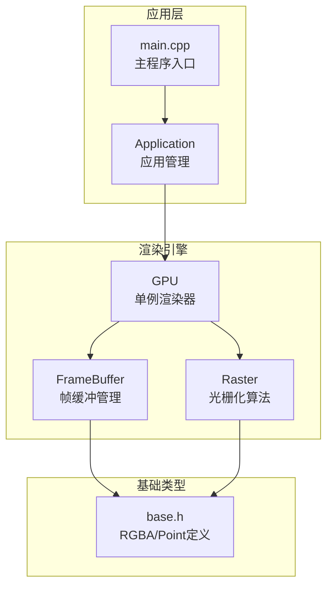
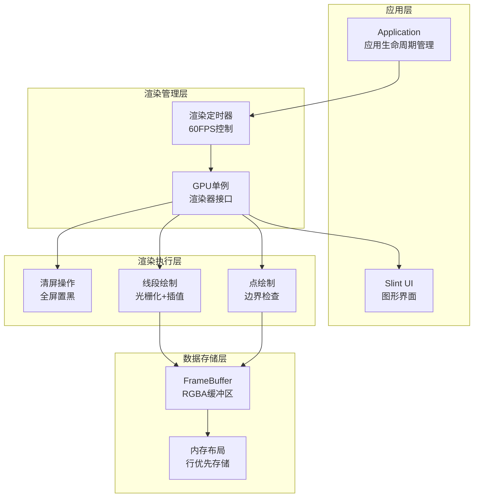
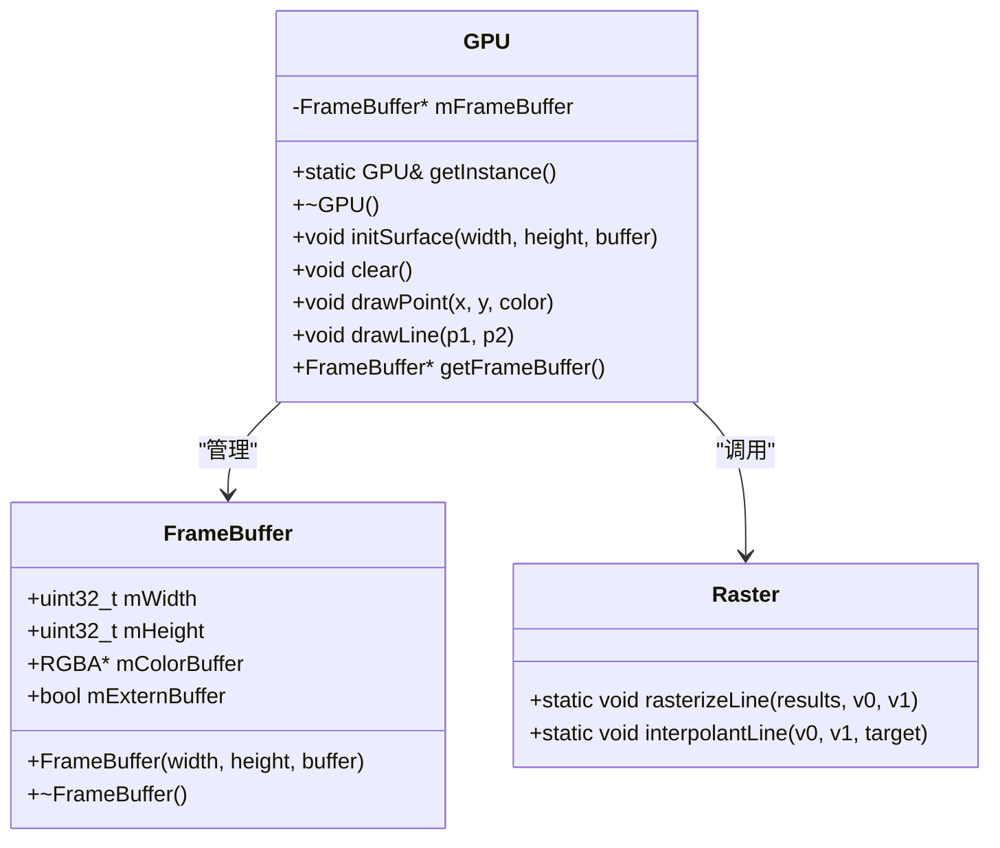
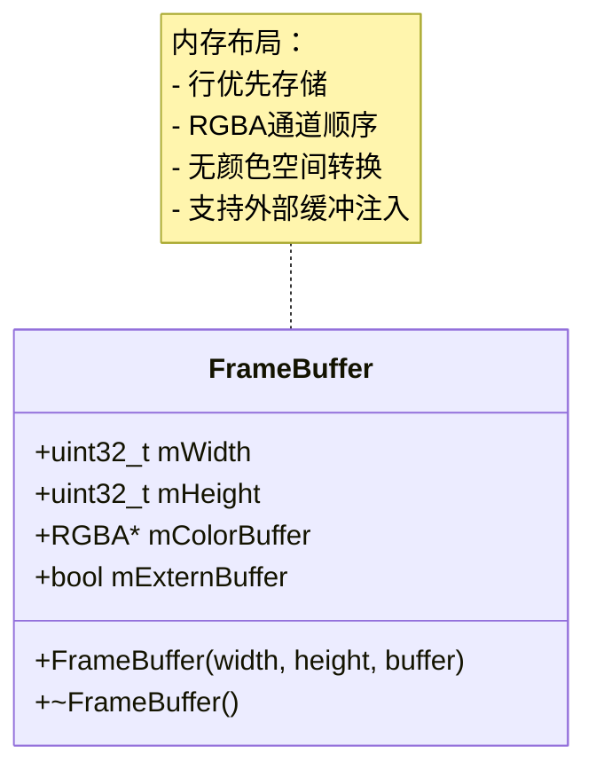
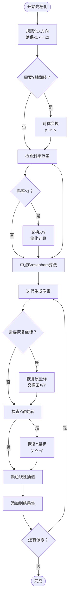
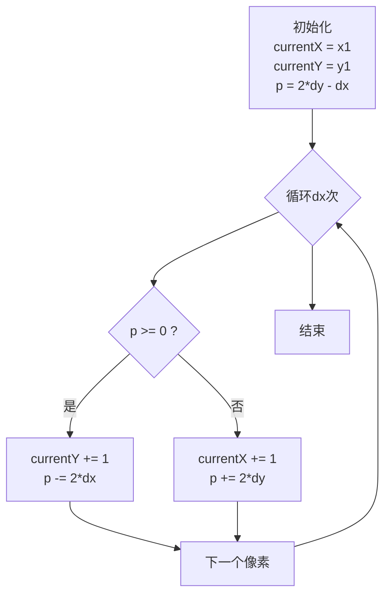
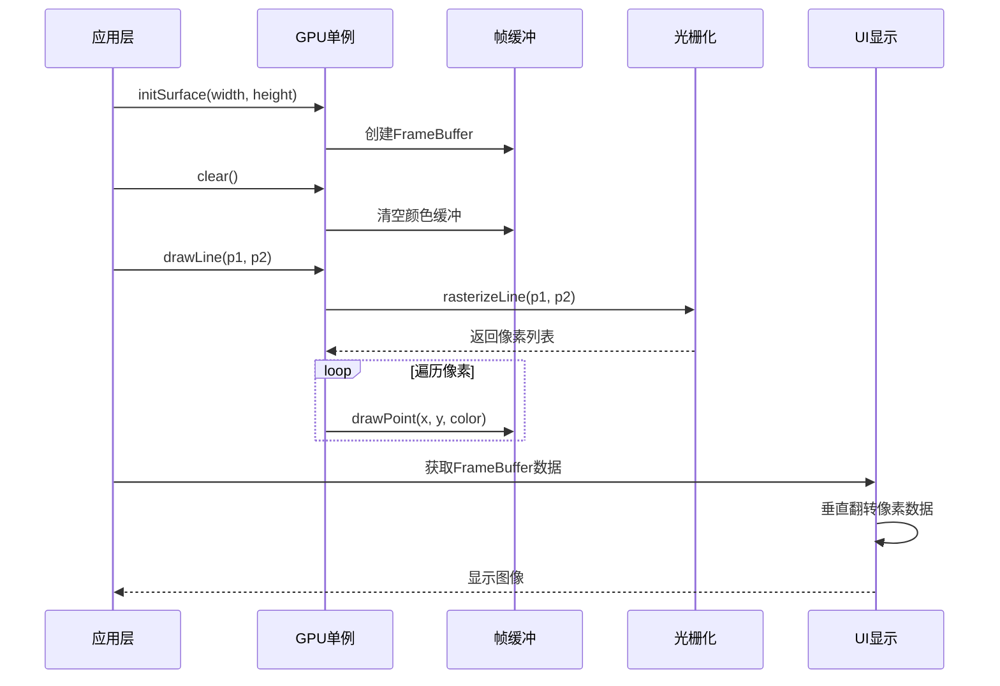
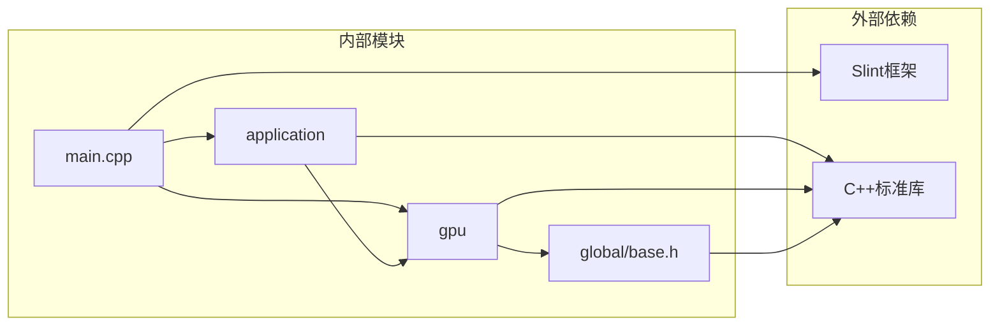

# GPU渲染架构

<cite>
**本文档引用的文件**
- [gpu.h](file://gpu/gpu.h)
- [gpu.cpp](file://gpu/gpu.cpp)
- [frameBuffer.h](file://gpu/frameBuffer.h)
- [frameBuffer.cpp](file://gpu/frameBuffer.cpp)
- [raster.h](file://gpu/raster.h)
- [raster.cpp](file://gpu/raster.cpp)
- [base.h](file://global/base.h)
- [main.cpp](file://main.cpp)
- [application.h](file://application/application.h)
- [application.cpp](file://application/application.cpp)
- [testMath.cpp](file://testMath.cpp)
</cite>

## 目录
1. [简介](#简介)
2. [项目结构](#项目结构)
3. [核心组件](#核心组件)
4. [架构总览](#架构总览)
5. [详细组件分析](#详细组件分析)
6. [依赖关系分析](#依赖关系分析)
7. [性能考虑](#性能考虑)
8. [故障排除指南](#故障排除指南)
9. [结论](#结论)
10. [附录](#附录)

## 简介
本项目是一个基于软件光栅化的GPU渲染系统，采用单例模式设计的GPU类作为渲染引擎的核心，结合帧缓冲管理、中点Bresenham线段光栅化算法和颜色插值策略，实现了从应用程序调用到最终像素输出的完整渲染管线。系统支持外部缓冲区注入与内部缓冲区管理两种模式，提供清晰的内存布局和像素格式抽象，并通过Slint框架进行像素数据的垂直翻转与显示输出。

## 项目结构
项目采用模块化组织方式，核心渲染逻辑集中在gpu目录，基础数据类型定义在global目录，应用层逻辑在application目录，入口程序在根目录。

**图表来源**
- [main.cpp](file://main.cpp#L1-L59)
- [application.h](file://application/application.h#L1-L33)
- [gpu.h](file://gpu/gpu.h#L1-L37)
- [frameBuffer.h](file://gpu/frameBuffer.h#L1-L19)
- [raster.h](file://gpu/raster.h#L1-L20)
- [base.h](file://global/base.h#L1-L42)

**章节来源**
- [main.cpp](file://main.cpp#L1-L59)
- [application.h](file://application/application.h#L1-L33)
- [gpu.h](file://gpu/gpu.h#L1-L37)
- [frameBuffer.h](file://gpu/frameBuffer.h#L1-L19)
- [raster.h](file://gpu/raster.h#L1-L20)
- [base.h](file://global/base.h#L1-L42)

## 核心组件
本节深入分析GPU渲染系统的关键组件及其职责分工。

### GPU类（单例渲染器）
GPU类采用经典的单例模式设计，提供统一的渲染接口：
- 单例实例管理：通过静态方法提供全局唯一实例
- 表面初始化：支持外部缓冲区注入和内部缓冲区分配
- 渲染操作：清屏、点绘制、线段绘制
- 资源管理：自动释放帧缓冲内存

### FrameBuffer类（帧缓冲管理）
帧缓冲类负责管理渲染目标的内存布局：
- 宽高参数：存储画布尺寸信息
- 颜色缓冲：指向RGBA像素数组的指针
- 外部缓冲：支持外部传入的缓冲区指针
- 内存管理：根据是否外部缓冲决定释放策略

### Raster类（光栅化算法）
光栅化类提供静态方法实现线段的像素化：
- 中点Bresenham算法：高效的整数坐标线段绘制
- 方向规范化：统一处理x方向递增和y方向翻转
- 斜率归一化：将任意斜率转换为0-1范围内的递归
- 颜色插值：沿线段进行RGB通道的线性插值

**章节来源**
- [gpu.h](file://gpu/gpu.h#L11-L36)
- [gpu.cpp](file://gpu/gpu.cpp#L5-L47)
- [frameBuffer.h](file://gpu/frameBuffer.h#L8-L18)
- [frameBuffer.cpp](file://gpu/frameBuffer.cpp#L3-L20)
- [raster.h](file://gpu/raster.h#L8-L19)
- [raster.cpp](file://gpu/raster.cpp#L7-L103)

## 架构总览
渲染系统的整体架构遵循分层设计原则，从应用层到硬件抽象层逐级封装。

**图表来源**
- [main.cpp](file://main.cpp#L25-L53)
- [application.cpp](file://application/application.cpp#L23-L44)
- [gpu.cpp](file://gpu/gpu.cpp#L25-L47)
- [frameBuffer.cpp](file://gpu/frameBuffer.cpp#L3-L14)

**章节来源**
- [main.cpp](file://main.cpp#L10-L59)
- [application.cpp](file://application/application.cpp#L23-L44)
- [gpu.cpp](file://gpu/gpu.cpp#L18-L47)

## 详细组件分析

### GPU类单例模式设计
GPU类采用线程安全的静态局部变量实现单例模式，确保全局唯一性。

**图表来源**
- [gpu.h](file://gpu/gpu.h#L11-L36)
- [frameBuffer.h](file://gpu/frameBuffer.h#L8-L18)
- [raster.h](file://gpu/raster.h#L8-L19)

#### 单例实现要点
- 静态局部变量：编译器保证线程安全的延迟初始化
- 移动语义：禁用拷贝构造和赋值，防止意外复制
- 资源清理：析构函数自动释放帧缓冲内存

**章节来源**
- [gpu.h](file://gpu/gpu.h#L11-L36)
- [gpu.cpp](file://gpu/gpu.cpp#L5-L16)

### FrameBuffer帧缓冲管理机制
帧缓冲类提供了灵活的内存管理模式，支持外部缓冲区注入。

**图表来源**
- [frameBuffer.h](file://gpu/frameBuffer.h#L8-L18)
- [frameBuffer.cpp](file://gpu/frameBuffer.cpp#L3-L20)

#### 内存布局与像素格式
- **存储格式**：RGBA四通道，每个通道8位
- **内存布局**：行优先存储，连续内存块
- **像素索引**：`pixelPos = y * width + x`
- **颜色空间**：未进行颜色空间转换，直接使用设备RGB

#### 外部缓冲区管理
- **注入模式**：外部传入缓冲区指针，内部不负责释放
- **内部模式**：内部动态分配内存，析构时自动释放
- **切换机制**：重复初始化时自动释放旧缓冲区

**章节来源**
- [frameBuffer.h](file://gpu/frameBuffer.h#L8-L18)
- [frameBuffer.cpp](file://gpu/frameBuffer.cpp#L3-L20)

### Raster光栅化算法实现
光栅化算法实现了中点Bresenham线段绘制的核心逻辑。

**图表来源**
- [raster.cpp](file://gpu/raster.cpp#L7-L84)
- [raster.cpp](file://gpu/raster.cpp#L86-L103)

#### 中点Bresenham算法详解
算法通过决策参数p控制下一个像素的选择：

**图表来源**
- [raster.cpp](file://gpu/raster.cpp#L44-L82)

#### 像素填充策略
- **坐标变换**：通过标志位记录必要的坐标变换
- **颜色插值**：沿线段使用线性插值计算中间像素颜色
- **边界处理**：确保生成的像素坐标在有效范围内

**章节来源**
- [raster.h](file://gpu/raster.h#L8-L19)
- [raster.cpp](file://gpu/raster.cpp#L7-L103)

### 渲染管线数据流
完整的渲染管线从应用层调用到最终像素输出的流程如下：

**图表来源**
- [main.cpp](file://main.cpp#L25-L53)
- [application.cpp](file://application/application.cpp#L23-L44)
- [gpu.cpp](file://gpu/gpu.cpp#L25-L47)

**章节来源**
- [main.cpp](file://main.cpp#L25-L53)
- [application.cpp](file://application/application.cpp#L23-L44)
- [gpu.cpp](file://gpu/gpu.cpp#L18-L47)

## 依赖关系分析

**图表来源**
- [main.cpp](file://main.cpp#L1-L59)
- [application.cpp](file://application/application.cpp#L1-L46)
- [gpu.cpp](file://gpu/gpu.cpp#L1-L48)
- [base.h](file://global/base.h#L1-L42)

### 组件耦合度分析
- **低耦合设计**：各模块职责明确，接口清晰
- **依赖方向**：自上而下的单向依赖，避免循环引用
- **抽象层次**：基础类型定义独立，便于复用

**章节来源**
- [main.cpp](file://main.cpp#L1-L59)
- [application.h](file://application/application.h#L1-L33)
- [gpu.h](file://gpu/gpu.h#L1-L37)
- [base.h](file://global/base.h#L1-L42)

## 性能考虑

### 内存访问模式优化
1. **行优先存储**：符合CPU缓存行特性，提升局部性
2. **连续内存分配**：减少内存碎片，提高缓存命中率
3. **批量操作**：清屏使用fill_n进行连续内存写入

### 缓存友好设计
- **像素索引计算**：简单的乘法加法运算，编译器可优化
- **循环展开**：光栅化算法使用简单循环，利于CPU分支预测
- **数据局部性**：同一线段的像素按顺序存储，提升访问效率

### 算法复杂度分析
- **清屏操作**：O(W×H)，单次批量写入
- **点绘制**：O(1)，包含边界检查
- **线段光栅化**：O(Δx)，其中Δx为水平距离
- **内存分配**：O(W×H)，一次性分配

**章节来源**
- [gpu.cpp](file://gpu/gpu.cpp#L25-L38)
- [raster.cpp](file://gpu/raster.cpp#L44-L82)

## 故障排除指南

### 常见问题及解决方案

#### 帧缓冲未初始化
**症状**：调用drawPoint或drawLine时报错
**原因**：未调用initSurface初始化帧缓冲
**解决**：在渲染前调用initSurface设置画布尺寸

#### 坐标越界访问
**症状**：绘制异常或程序崩溃
**原因**：像素坐标超出帧缓冲边界
**解决**：在drawPoint中进行边界检查，或确保输入坐标有效

#### 颜色空间不匹配
**症状**：显示颜色异常
**原因**：RGBA通道顺序与显示系统不一致
**解决**：在UI层进行颜色通道重排或修改RGBA定义

#### 内存泄漏
**症状**：程序运行时间越长内存占用越大
**原因**：重复初始化导致旧帧缓冲未释放
**解决**：使用智能指针或确保正确管理生命周期

**章节来源**
- [gpu.cpp](file://gpu/gpu.cpp#L30-L38)
- [frameBuffer.cpp](file://gpu/frameBuffer.cpp#L16-L20)

## 结论
本GPU渲染系统通过精心设计的单例模式、灵活的帧缓冲管理和高效的中点Bresenham光栅化算法，构建了一个简洁而强大的软件渲染引擎。系统具有以下特点：

1. **架构清晰**：模块职责明确，接口设计合理
2. **性能优秀**：缓存友好的内存布局和高效的光栅化算法
3. **扩展性强**：支持外部缓冲区注入，易于集成其他显示系统
4. **资源管理**：自动内存管理，减少资源泄漏风险

该系统为理解GPU渲染的基本原理提供了良好的学习平台，其设计理念可以推广到更复杂的硬件渲染系统中。

## 附录

### 使用示例与最佳实践

#### 基础使用流程
1. 获取GPU单例实例
2. 初始化帧缓冲表面
3. 执行渲染操作
4. 将帧缓冲数据传递给显示系统

#### 错误处理策略
- 输入验证：始终检查坐标和尺寸参数
- 边界检查：在像素访问前进行范围验证
- 资源检查：确保帧缓冲已正确初始化
- 异常处理：捕获并处理内存分配失败等异常情况

#### 资源管理最佳实践
- 单例生命周期：随程序启动和退出自动管理
- 帧缓冲重用：避免频繁创建销毁，支持动态尺寸调整
- 内存对齐：确保RGBA结构体的内存对齐要求
- 并发安全：在多线程环境中注意线程安全问题

**章节来源**
- [main.cpp](file://main.cpp#L15-L33)
- [application.cpp](file://application/application.cpp#L23-L44)
- [gpu.h](file://gpu/gpu.h#L18-L28)