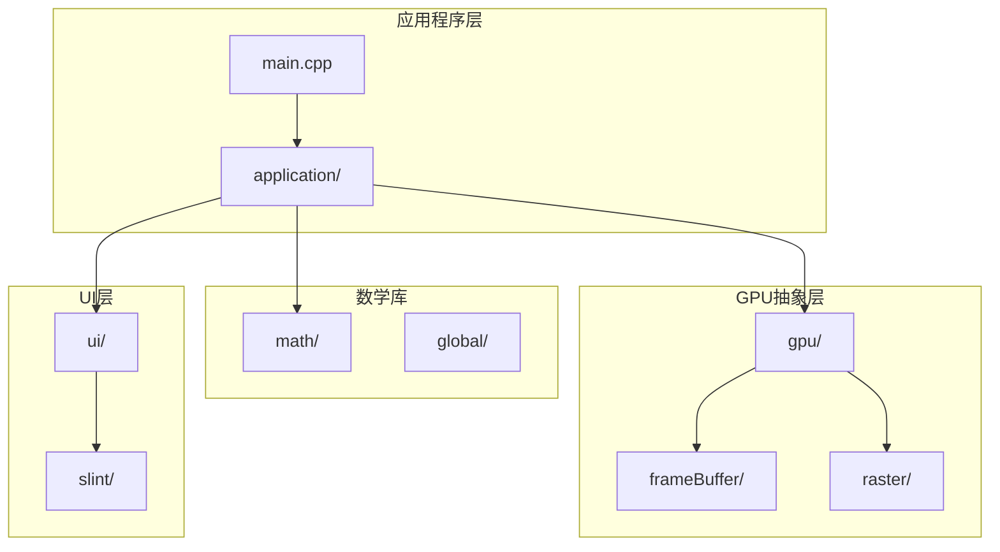
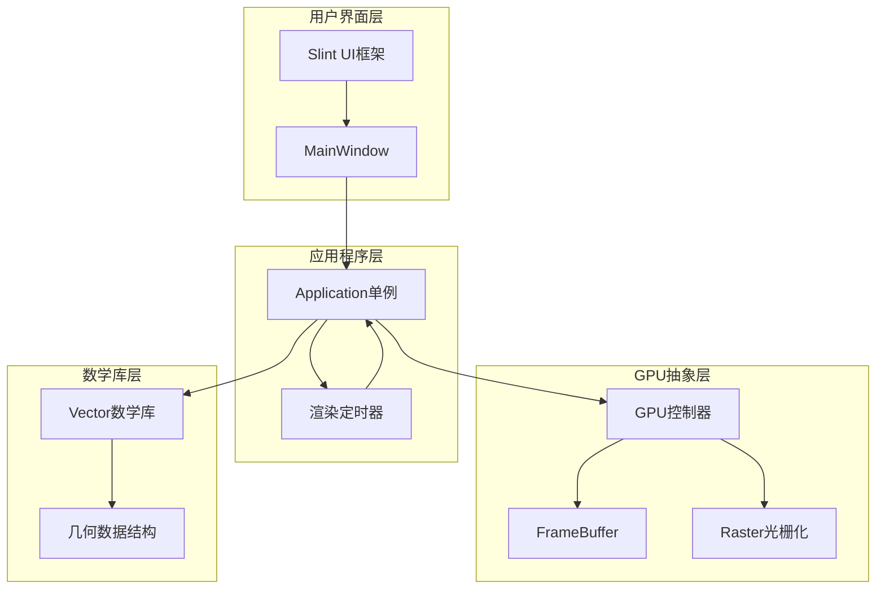
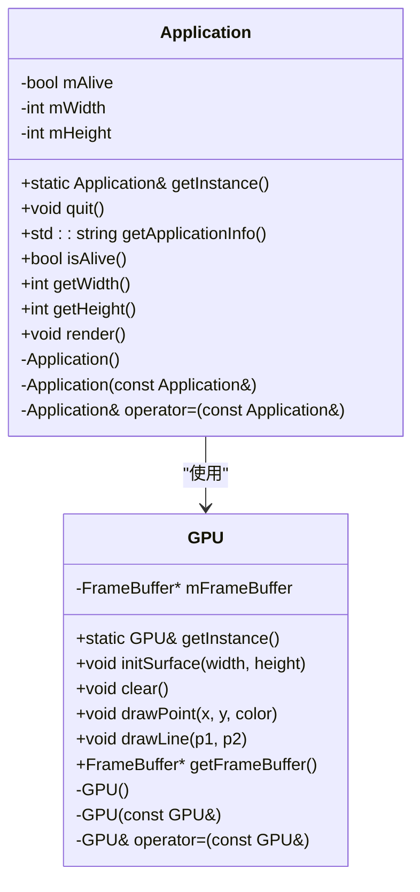
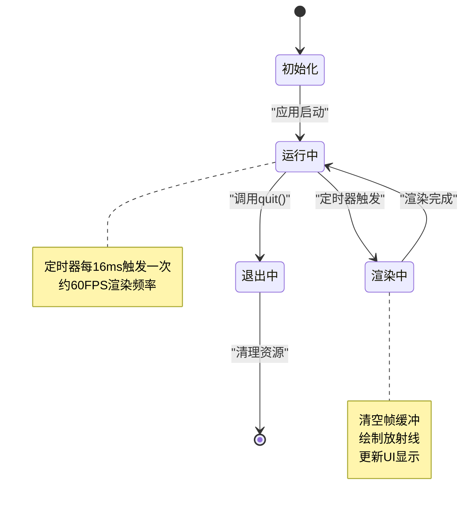
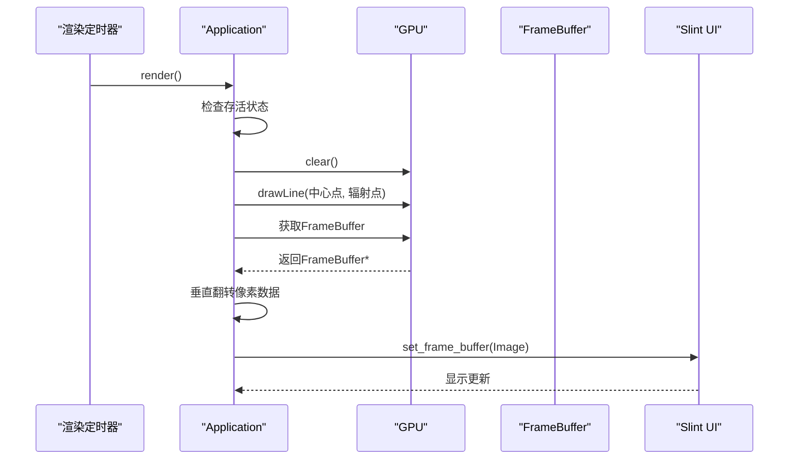
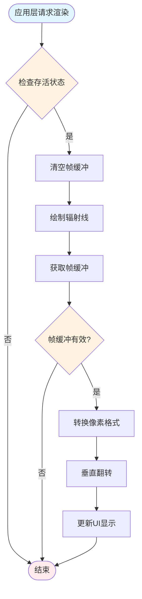
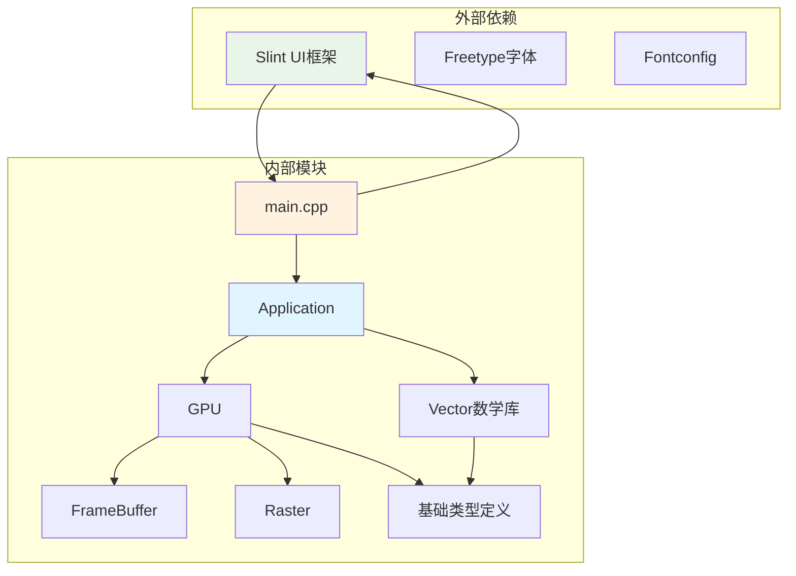

# 应用程序层架构

<cite>
**本文档引用的文件**
- [application.h](file://application/application.h)
- [application.cpp](file://application/application.cpp)
- [main.cpp](file://main.cpp)
- [gpu.h](file://gpu/gpu.h)
- [gpu.cpp](file://gpu/gpu.cpp)
- [frameBuffer.h](file://gpu/frameBuffer.h)
- [frameBuffer.cpp](file://gpu/frameBuffer.cpp)
- [raster.h](file://gpu/raster.h)
- [raster.cpp](file://gpu/raster.cpp)
- [base.h](file://global/base.h)
- [vector.h](file://math/vector.h)
- [main.slint](file://ui/main.slint)
- [CMakeLists.txt](file://CMakeLists.txt)
</cite>

## 目录
1. [引言](#引言)
2. [项目结构](#项目结构)
3. [核心组件](#核心组件)
4. [架构概览](#架构概览)
5. [详细组件分析](#详细组件分析)
6. [依赖关系分析](#依赖关系分析)
7. [性能考虑](#性能考虑)
8. [故障排除指南](#故障排除指南)
9. [结论](#结论)

## 引言

本文件为Learn OpenGL系列第4课《向量》项目的应用程序层架构文档。该项目是一个基于纯软件渲染的图形应用程序，展示了向量数学库的实现和应用。应用程序层采用单例模式设计，负责管理应用程序生命周期、渲染调度和与GPU层的交互。

该系统的核心目标是演示向量数学在图形渲染中的应用，通过软渲染器实现基本的图形绘制功能，包括线条绘制、颜色插值和帧缓冲管理。

## 项目结构

该项目采用模块化的目录结构，主要分为以下几个层次：

**图表来源**
- [application.h](file://application/application.h#L1-L33)
- [gpu.h](file://gpu/gpu.h#L1-L37)
- [main.cpp](file://main.cpp#L1-L59)

**章节来源**
- [CMakeLists.txt](file://CMakeLists.txt#L21-L31)
- [main.cpp](file://main.cpp#L1-L59)

## 核心组件

### Application类（应用程序核心）

Application类是整个系统的核心控制器，实现了单例模式来确保全局唯一的应用程序实例。该类提供了完整的应用程序生命周期管理功能。

**关键特性：**
- 单例模式实现（线程安全）
- 应用程序状态管理（存活状态）
- 渲染调度控制
- 配置参数管理（宽度、高度）

### GPU类（图形处理单元）

GPU类作为图形渲染的抽象层，模拟了真实GPU的功能，包括：
- 帧缓冲管理
- 图形绘制操作
- 光栅化算法实现

### FrameBuffer类（帧缓冲）

帧缓冲类负责管理渲染输出的目标缓冲区，存储最终的像素数据供UI层显示。

### Raster类（光栅化器）

光栅化器实现Bresenham直线算法，将数学上的连续线条转换为离散的像素点。

**章节来源**
- [application.h](file://application/application.h#L5-L30)
- [gpu.h](file://gpu/gpu.h#L11-L36)
- [frameBuffer.h](file://gpu/frameBuffer.h#L8-L18)
- [raster.h](file://gpu/raster.h#L8-L19)

## 架构概览

应用程序采用分层架构设计，各层职责清晰分离：

**图表来源**
- [main.cpp](file://main.cpp#L10-L59)
- [application.cpp](file://application/application.cpp#L23-L45)
- [gpu.cpp](file://gpu/gpu.cpp#L40-L47)

### 单例模式实现分析

Application类采用了经典的C++单例模式实现：

**图表来源**
- [application.h](file://application/application.h#L5-L30)
- [gpu.h](file://gpu/gpu.h#L11-L36)

**章节来源**
- [application.cpp](file://application/application.cpp#L6-L10)
- [gpu.cpp](file://gpu/gpu.cpp#L5-L8)

## 详细组件分析

### Application类深度解析

#### 单例模式设计原理

Application类的单例实现采用了C++11标准的静态局部变量技术，确保了线程安全性：

**线程安全考虑：**
- 静态局部变量的初始化在多线程环境下是原子操作
- 编译器保证第一次访问时的初始化完成
- 避免了传统双重检查锁定模式的复杂性

#### 生命周期管理机制

应用程序的生命周期通过以下机制管理：

**图表来源**
- [main.cpp](file://main.cpp#L24-L53)
- [application.cpp](file://application/application.cpp#L12-L16)

#### 渲染调度逻辑

Application::render()方法实现了完整的渲染流程：

**图表来源**
- [main.cpp](file://main.cpp#L24-L53)
- [application.cpp](file://application/application.cpp#L23-L45)

#### 配置参数管理

应用程序支持以下配置参数：

| 参数名称 | 类型 | 默认值 | 作用说明 |
|---------|------|--------|----------|
| mWidth | int | 800 | 应用程序窗口宽度（像素） |
| mHeight | int | 600 | 应用程序窗口高度（像素） |
| mAlive | bool | true | 应用程序存活状态标志 |

这些参数通过getter方法提供只读访问，确保了数据的一致性和线程安全。

**章节来源**
- [application.h](file://application/application.h#L27-L29)
- [application.cpp](file://application/application.cpp#L23-L45)

### GPU层交互接口

#### 渲染管线流程

GPU层提供了完整的渲染接口，与应用程序层的交互遵循以下流程：

**图表来源**
- [main.cpp](file://main.cpp#L31-L52)
- [gpu.cpp](file://gpu/gpu.cpp#L25-L28)

#### 光栅化算法实现

Raster类实现了高效的Bresenham直线光栅化算法：

**算法特点：**
- 仅使用整数运算，避免浮点计算开销
- 支持任意方向的直线绘制
- 实现颜色插值，生成平滑的视觉效果

**章节来源**
- [raster.cpp](file://gpu/raster.cpp#L7-L84)
- [gpu.cpp](file://gpu/gpu.cpp#L40-L47)

### 数学库集成

#### 向量数学库应用

项目中的向量数学库为图形渲染提供了基础的数学运算能力：

**Vector2/Vector3/Vector4类特性：**
- 完整的向量运算操作符重载
- 支持标量乘法、除法和加减运算
- 提供索引访问和类型转换功能

**在渲染中的应用：**
- 点坐标计算和变换
- 颜色插值计算
- 几何变换矩阵运算

**章节来源**
- [vector.h](file://math/vector.h#L6-L322)
- [raster.cpp](file://gpu/raster.cpp#L86-L103)

## 依赖关系分析

### 模块间依赖关系

**图表来源**
- [CMakeLists.txt](file://CMakeLists.txt#L12-L65)
- [main.cpp](file://main.cpp#L1-L59)

### 关键依赖链路

1. **主程序依赖链**：main.cpp → Application → GPU → FrameBuffer/Raster
2. **UI集成链**：Slint UI → MainWindow → Application
3. **数学库依赖**：Vector数学库 → GPU渲染 → UI显示

**章节来源**
- [CMakeLists.txt](file://CMakeLists.txt#L56-L65)
- [main.cpp](file://main.cpp#L1-L59)

## 性能考虑

### 渲染性能优化

1. **帧率控制**：使用16ms定时器确保约60FPS的稳定帧率
2. **内存管理**：静态单例减少动态分配开销
3. **算法效率**：Bresenham算法避免浮点运算
4. **数据结构优化**：连续内存布局提高缓存命中率

### 内存使用分析

- **帧缓冲内存**：宽度 × 高度 × sizeof(RGBA) 字节
- **像素转换缓冲**：每次渲染时临时分配
- **对象生命周期**：单例对象随进程生命周期存在

## 故障排除指南

### 常见问题及解决方案

**问题1：应用程序无法启动**
- 检查Slint UI框架是否正确安装
- 验证GPU初始化是否成功
- 确认帧缓冲创建正常

**问题2：渲染异常或显示错误**
- 检查帧缓冲尺寸设置
- 验证像素坐标转换逻辑
- 确认颜色通道顺序正确

**问题3：性能问题**
- 检查渲染循环频率
- 优化像素转换算法
- 减少不必要的对象创建

**章节来源**
- [main.cpp](file://main.cpp#L15-L16)
- [gpu.cpp](file://gpu/gpu.cpp#L18-L23)

## 结论

本应用程序层架构文档详细分析了Learn OpenGL项目第4课的实现。系统采用清晰的分层架构，通过单例模式确保应用程序的统一管理和线程安全。GPU抽象层提供了完整的渲染功能，而数学库则为图形计算提供了坚实的基础。

该架构的主要优势包括：
- **模块化设计**：各层职责明确，便于维护和扩展
- **性能优化**：采用高效的算法和数据结构
- **可移植性**：抽象层设计便于替换底层实现
- **学习价值**：完整展示了从数学到渲染的完整流程

对于开发者而言，这个项目提供了理解图形渲染管道、数学库应用和UI集成的绝佳示例。通过分析其实现细节，可以深入掌握软件渲染的基本原理和最佳实践。