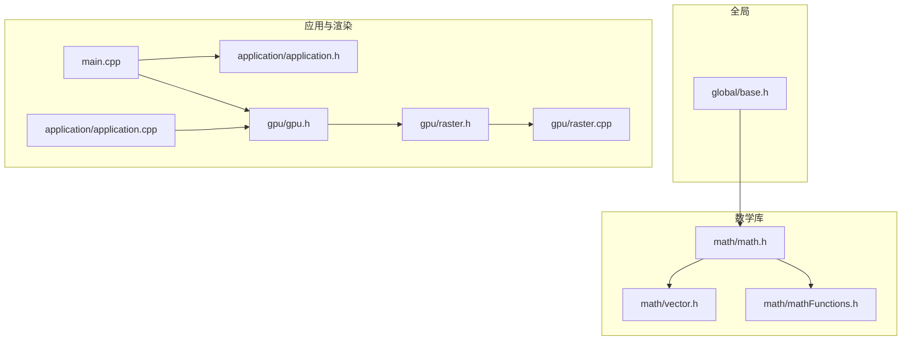
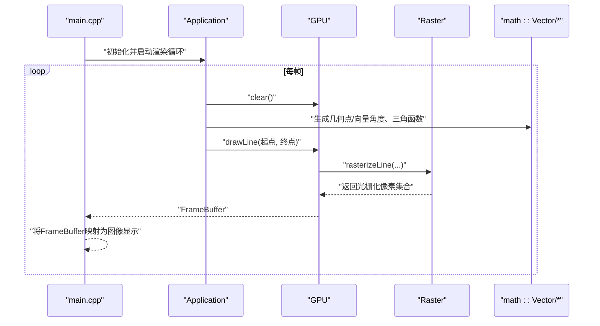
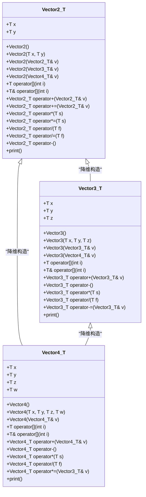
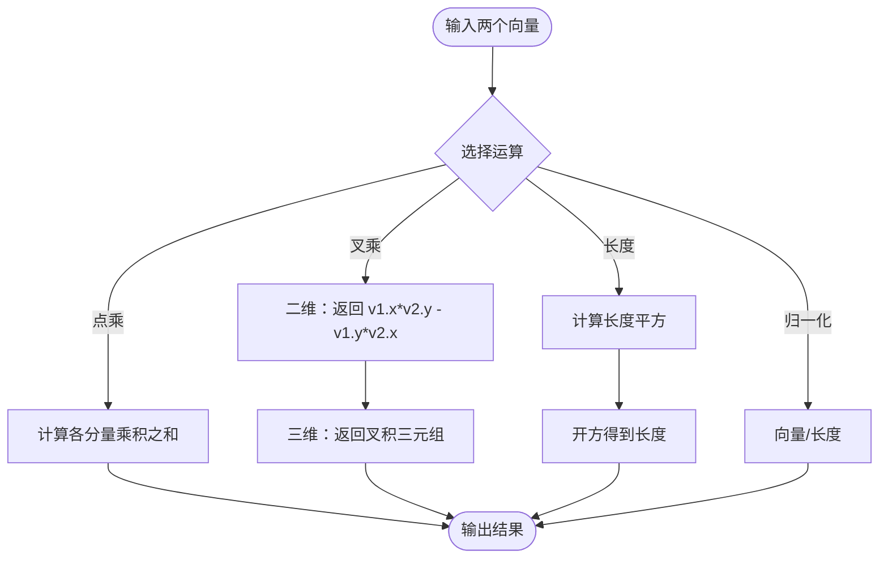
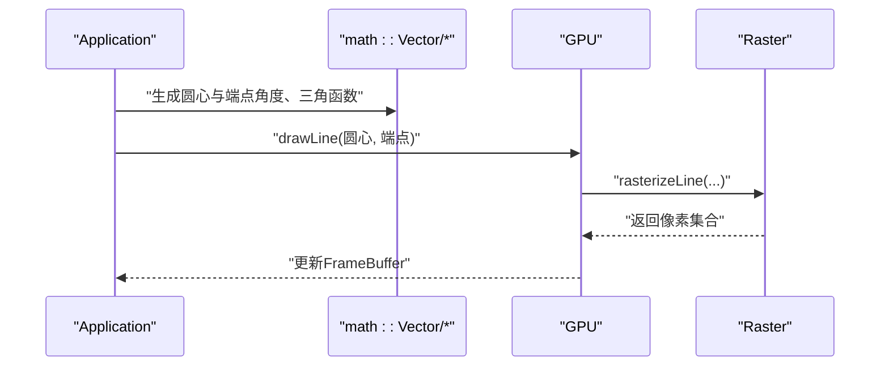
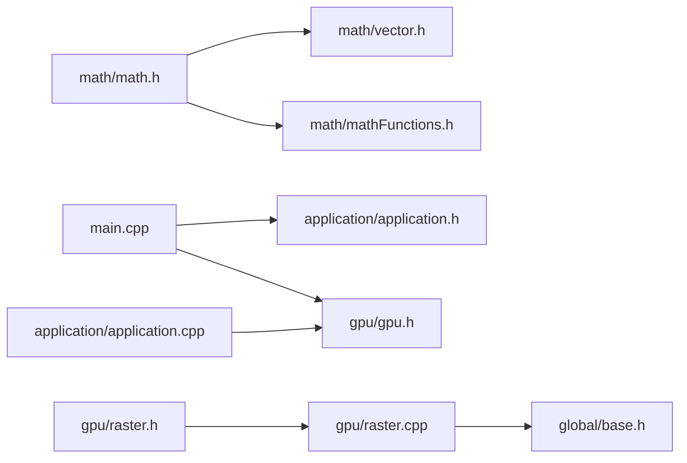

# 数学库架构

<cite>
**本文引用的文件**
- [math/vector.h](file://math/vector.h)
- [math/math.h](file://math/math.h)
- [math/mathFunctions.h](file://math/mathFunctions.h)
- [testMath.cpp](file://testMath.cpp)
- [main.cpp](file://main.cpp)
- [global/base.h](file://global/base.h)
- [gpu/gpu.h](file://gpu/gpu.h)
- [gpu/raster.h](file://gpu/raster.h)
- [gpu/raster.cpp](file://gpu/raster.cpp)
- [application/application.h](file://application/application.h)
- [application/application.cpp](file://application/application.cpp)
</cite>

## 目录
1. [简介](#简介)
2. [项目结构](#项目结构)
3. [核心组件](#核心组件)
4. [架构总览](#架构总览)
5. [详细组件分析](#详细组件分析)
6. [依赖关系分析](#依赖关系分析)
7. [性能考量](#性能考量)
8. [故障排查指南](#故障排查指南)
9. [结论](#结论)
10. [附录](#附录)

## 简介
本文件面向“数学库模块”的架构文档，重点解析Vector模板类的设计模式（Vector2、Vector3、Vector4的通用接口与特化实现）、模板编程在数学库中的应用（编译时优化与类型安全）、数学函数库的组织结构（点乘、叉乘、归一化、长度计算等核心算法）、运算符重载的设计理念与性能考量，并说明数学库与渲染系统的集成方式及向量运算在图形学中的应用场景。同时提供使用示例与性能优化建议（含SIMD指令集的潜在应用）。

## 项目结构
该项目采用分层与功能模块化组织：
- 全局基础类型与常量定义位于 global/base.h
- 数学库位于 math/，包含向量模板与数学函数
- 应用入口与渲染流程位于 application/ 与 gpu/，通过数学库进行几何计算与图形绘制
- 主程序入口 main.cpp 驱动应用生命周期与渲染循环

图表来源
- [math/math.h](file://math/math.h#L1-L4)
- [math/vector.h](file://math/vector.h#L1-L323)
- [math/mathFunctions.h](file://math/mathFunctions.h#L1-L155)
- [main.cpp](file://main.cpp#L1-L59)
- [application/application.h](file://application/application.h#L1-L33)
- [application/application.cpp](file://application/application.cpp#L1-L46)
- [gpu/gpu.h](file://gpu/gpu.h#L1-L37)
- [gpu/raster.h](file://gpu/raster.h#L1-L20)
- [gpu/raster.cpp](file://gpu/raster.cpp#L1-L104)

章节来源
- [math/math.h](file://math/math.h#L1-L4)
- [main.cpp](file://main.cpp#L1-L59)

## 核心组件
- Vector模板类族：Vector2<T>、Vector3<T>、Vector4<T>，提供统一的成员访问、构造、拷贝、运算符重载与打印方法
- 数学函数库：标量与向量乘法、向量与向量逐分量乘法、绝对值、点乘、叉乘、长度平方、长度、归一化等
- 类型别名：vec2f、vec2i、vec3f、vec3i、vec4f、vec4i，便于直接使用
- 测试入口：testMath.cpp 展示基本加减乘除、逐分量乘法、标量乘法与归一化

章节来源
- [math/vector.h](file://math/vector.h#L12-L323)
- [math/mathFunctions.h](file://math/mathFunctions.h#L1-L155)
- [testMath.cpp](file://testMath.cpp#L1-L30)

## 架构总览
数学库作为渲染管线的几何基础，被应用层调用以生成几何数据（如旋转扇形的端点），随后由GPU驱动的光栅化模块将几何转换为像素。

图表来源
- [main.cpp](file://main.cpp#L10-L59)
- [application/application.cpp](file://application/application.cpp#L23-L45)
- [gpu/gpu.h](file://gpu/gpu.h#L11-L37)
- [gpu/raster.cpp](file://gpu/raster.cpp#L7-L84)
- [math/mathFunctions.h](file://math/mathFunctions.h#L66-L79)

## 详细组件分析

### Vector模板类设计模式
Vector2<T>、Vector3<T>、Vector4<T>共享统一的接口与语义，通过模板参数T实现类型安全与复用。每个类均提供：
- 构造函数族：默认构造、带参构造、拷贝构造、从更高维向量降维构造
- 成员访问：[] 运算符重载，支持断言边界检查
- 算术运算：+、-、+=、-=、*（标量）、/（标量）、*=、/=、负号取反
- 打印方法：用于调试输出

图表来源
- [math/vector.h](file://math/vector.h#L13-L127)
- [math/vector.h](file://math/vector.h#L131-L218)
- [math/vector.h](file://math/vector.h#L221-L314)

章节来源
- [math/vector.h](file://math/vector.h#L12-L323)

### 运算符重载与设计理念
- 下标访问：提供断言保护，避免越界；返回值区分const与非const，确保安全性
- 算术运算：支持标量乘除、向量加减、逐分量乘法（标量与向量、向量与向量）
- 负号取反：返回对应维度的负向量
- 设计权衡：在保证类型安全的同时，尽量保持简单直观的表达式语法，便于图形学中频繁的向量运算

章节来源
- [math/vector.h](file://math/vector.h#L25-L109)
- [math/vector.h](file://math/vector.h#L138-L204)
- [math/vector.h](file://math/vector.h#L227-L304)

### 数学函数库组织结构
数学函数库集中于mathFunctions.h，提供以下核心算法：
- 标量与向量乘法：支持交换律（s * v）
- 向量与向量逐分量乘法：用于纹理采样或分量级混合
- 绝对值：逐分量取绝对值
- 点乘：内积，用于夹角计算与投影
- 叉乘：二维返回标量（面积有向性），三维返回向量（垂直于两向量）
- 长度平方与长度：长度平方优先用于比较，避免开方
- 归一化：除以长度，得到单位向量

图表来源
- [math/mathFunctions.h](file://math/mathFunctions.h#L66-L153)

章节来源
- [math/mathFunctions.h](file://math/mathFunctions.h#L1-L155)

### 类型别名与编译时优化
- 类型别名：vec2f、vec2i、vec3f、vec3i、vec4f、vec4i，减少显式模板参数书写
- 编译时优化：模板在编译期展开，运算符重载与内联函数（inline）减少调用开销；长度平方避免重复开方

章节来源
- [math/vector.h](file://math/vector.h#L316-L321)
- [math/mathFunctions.h](file://math/mathFunctions.h#L11-L24)

### 与渲染系统的集成
- 应用层通过三角函数与角度换算生成几何点，使用Vector进行坐标变换与插值
- GPU负责清屏、绘制线段、管理FrameBuffer
- 光栅化模块将线段离散化为像素并进行插值着色
- 主程序将FrameBuffer映射为图像显示

图表来源
- [application/application.cpp](file://application/application.cpp#L30-L44)
- [gpu/gpu.h](file://gpu/gpu.h#L26-L28)
- [gpu/raster.cpp](file://gpu/raster.cpp#L7-L84)

章节来源
- [application/application.cpp](file://application/application.cpp#L23-L45)
- [gpu/gpu.h](file://gpu/gpu.h#L11-L37)
- [gpu/raster.cpp](file://gpu/raster.cpp#L1-L104)

### 使用示例与最佳实践
- 基本运算：加法、标量乘法、逐分量乘法、除法、取反
- 几何应用：归一化用于光线/法向量，点乘用于投影与夹角，叉乘用于法向量与面积有向性
- 性能建议：优先使用长度平方进行距离比较；避免在热路径中频繁分配临时对象；合理使用内联与编译器优化

章节来源
- [testMath.cpp](file://testMath.cpp#L1-L30)
- [math/mathFunctions.h](file://math/mathFunctions.h#L104-L153)

## 依赖关系分析
- math/math.h 作为聚合头，包含 vector.h 与 mathFunctions.h
- 应用层 main.cpp 依赖 application/application.h 与 gpu/gpu.h
- 光栅化模块 raster.h/.cpp 依赖 global/base.h 中的基础类型与常量

图表来源
- [math/math.h](file://math/math.h#L1-L4)
- [main.cpp](file://main.cpp#L1-L59)
- [application/application.cpp](file://application/application.cpp#L1-L46)
- [gpu/raster.cpp](file://gpu/raster.cpp#L1-L104)

章节来源
- [math/math.h](file://math/math.h#L1-L4)
- [main.cpp](file://main.cpp#L1-L59)

## 性能考量
- 模板与内联：模板在编译期展开，配合inline减少函数调用开销
- 避免不必要的开方：优先使用长度平方进行比较与判断
- 运算符重载的短路与无副作用：尽量保持纯函数式风格，便于编译器优化
- SIMD指令集潜力：可将同类型向量的四元组（Vector4）作为SIMD单元，利用SSE/AVX进行并行计算（需引入平台特定头与编译选项）

[本节为通用性能指导，不直接分析具体文件]

## 故障排查指南
- 断言失败：下标访问越界会触发断言，检查索引范围
- 除零错误：除法运算前应确保除数非零
- 类型不匹配：注意标量与向量乘法的类型一致性
- 归一化风险：长度接近零时归一化可能导致数值不稳定，应在调用前检查长度

章节来源
- [math/vector.h](file://math/vector.h#L25-L43)
- [math/vector.h](file://math/vector.h#L94-L109)
- [math/mathFunctions.h](file://math/mathFunctions.h#L140-L153)

## 结论
该数学库以模板为核心，提供了类型安全且高效的向量运算能力，覆盖了图形学中最常用的几何操作。通过清晰的接口与合理的运算符重载，既保证了易用性，又为编译时优化与运行时性能提供了基础。结合渲染系统，数学库在几何生成、变换与光栅化阶段发挥关键作用。未来可在保持现有接口稳定性的前提下，探索SIMD加速与更丰富的数学工具集。

[本节为总结性内容，不直接分析具体文件]

## 附录
- 关键API速查
  - 点乘：dot(v1, v2)
  - 叉乘：cross(v1, v2)（二维返回标量，三维返回向量）
  - 长度：length(v)、lengthSquared(v)
  - 归一化：normalize(v)
  - 逐分量乘法：v0 * v1（向量与向量）
  - 标量乘法：s * v 或 v * s

[本节为概览性内容，不直接分析具体文件]