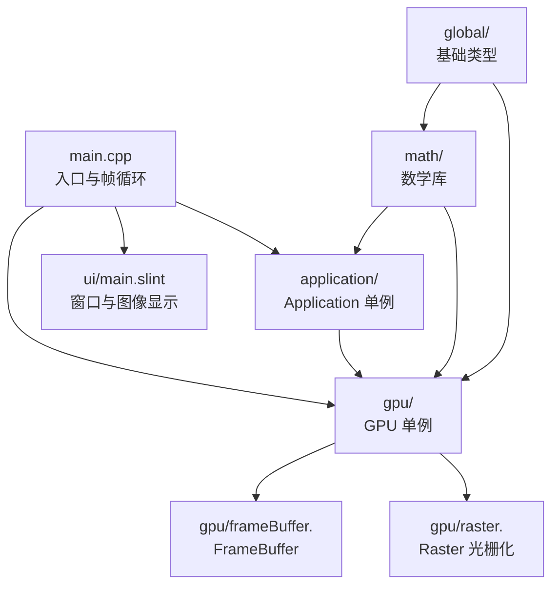
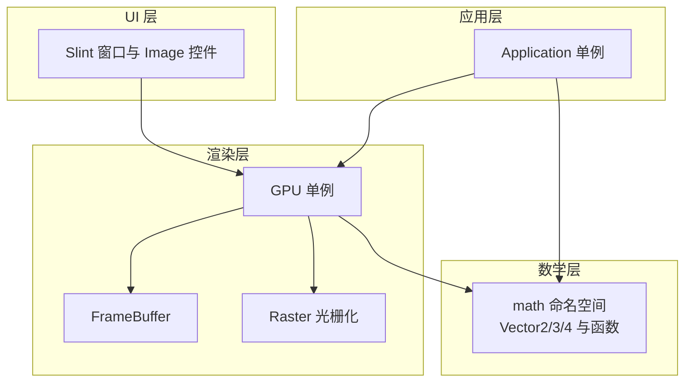
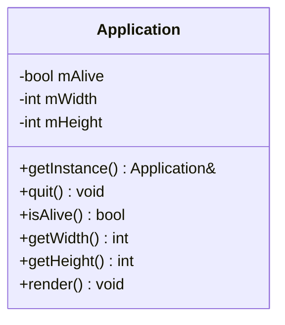
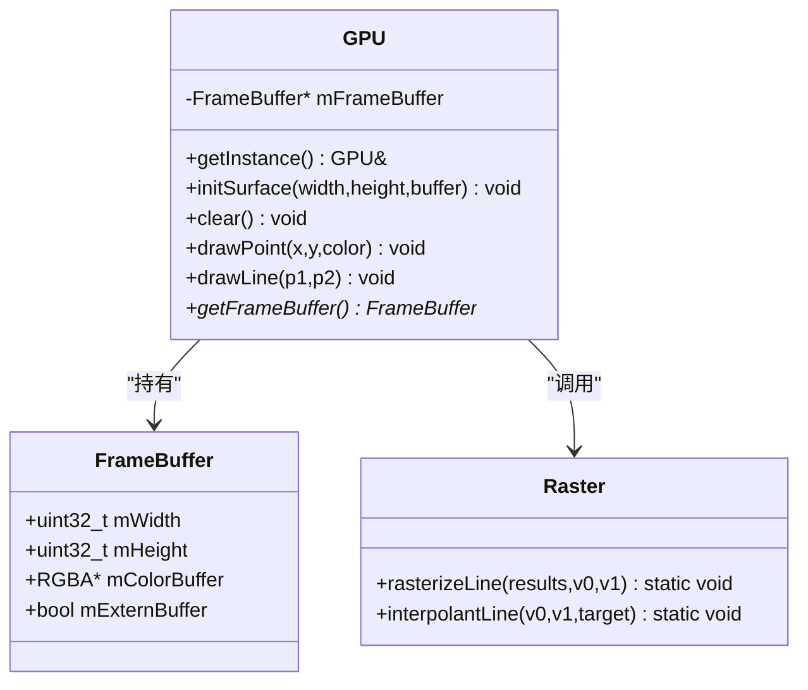
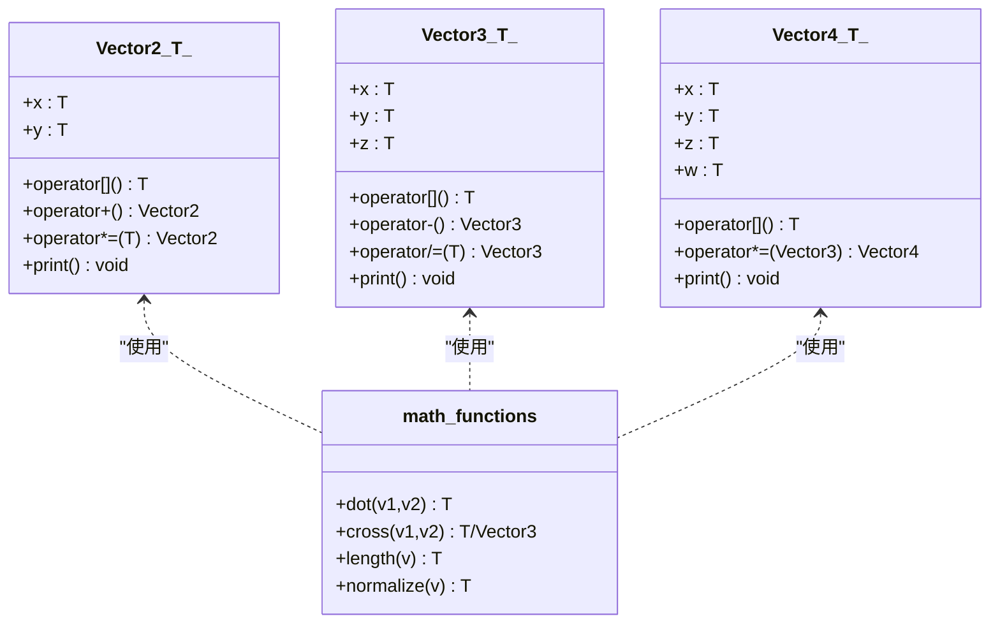
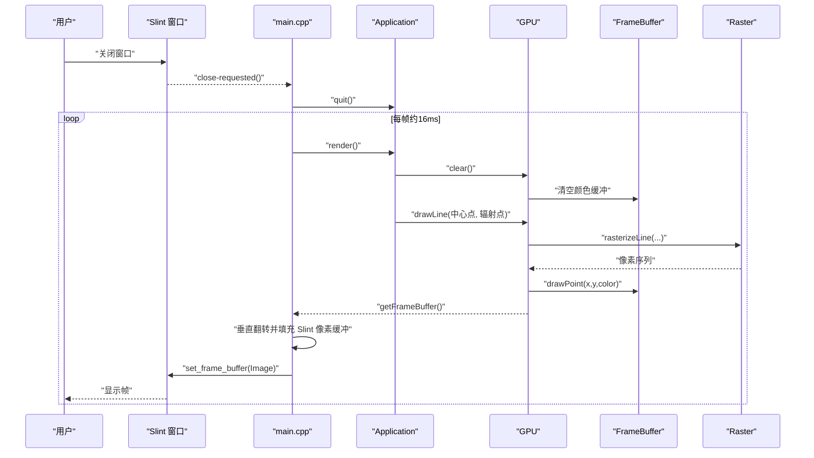
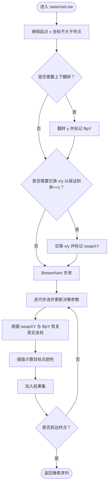
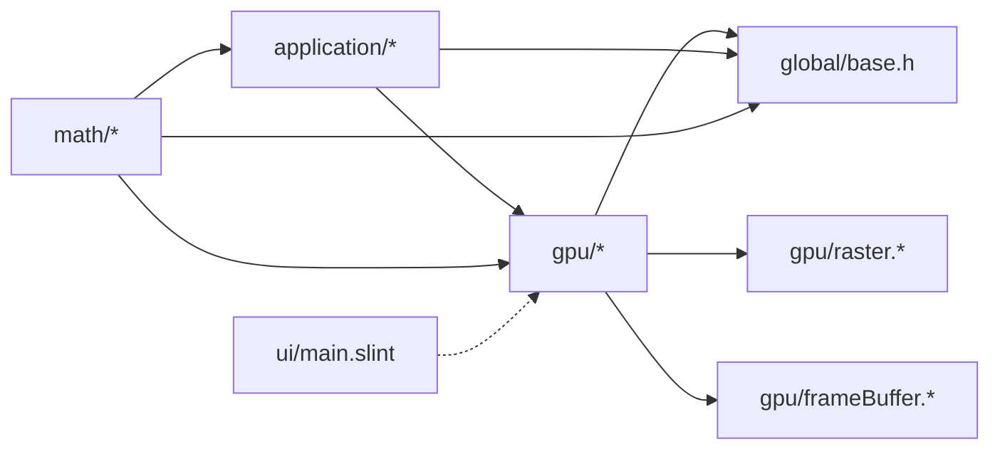

# 系统架构设计

<cite>
**本文引用的文件**
- [main.cpp](file://main.cpp)
- [application.h](file://application/application.h)
- [application.cpp](file://application/application.cpp)
- [gpu.h](file://gpu/gpu.h)
- [gpu.cpp](file://gpu/gpu.cpp)
- [frameBuffer.h](file://gpu/frameBuffer.h)
- [frameBuffer.cpp](file://gpu/frameBuffer.cpp)
- [raster.h](file://gpu/raster.h)
- [raster.cpp](file://gpu/raster.cpp)
- [base.h](file://global/base.h)
- [math.h](file://math/math.h)
- [vector.h](file://math/vector.h)
- [mathFunctions.h](file://math/mathFunctions.h)
- [testMath.cpp](file://testMath.cpp)
- [CMakeLists.txt](file://CMakeLists.txt)
- [main.slint](file://ui/main.slint)
</cite>

## 目录
1. [引言](#引言)
2. [项目结构](#项目结构)
3. [核心组件](#核心组件)
4. [架构总览](#架构总览)
5. [详细组件分析](#详细组件分析)
6. [依赖分析](#依赖分析)
7. [性能考虑](#性能考虑)
8. [故障排查指南](#故障排查指南)
9. [结论](#结论)
10. [附录](#附录)

## 引言
本项目围绕“04-Vectors”主题，构建了一个软光栅渲染管线的简化示例，重点演示向量数学库的模板实现与软渲染流水线的协作。系统采用分层架构与模块化设计，将应用控制、渲染与数学计算清晰分离，便于教学与扩展。

- 应用层负责生命周期管理、帧调度与业务逻辑（如绘制辐射线）。
- 渲染层负责图形绘制、光栅化与帧缓冲管理。
- 数学层提供通用向量类型与运算函数，支持模板化复用。
- UI 层通过 Slint 提供窗口与图像显示。

## 项目结构
项目采用按功能域划分的目录组织方式：
- application：应用控制与帧循环
- gpu：GPU 抽象、帧缓冲与光栅化
- math：数学库（向量与运算）
- global：基础类型与常量定义
- ui：Slint UI 定义
- 根目录：入口程序、构建配置与测试

图表来源
- [main.cpp](file://main.cpp#L10-L58)
- [application.h](file://application/application.h#L5-L33)
- [gpu.h](file://gpu/gpu.h#L11-L37)
- [frameBuffer.h](file://gpu/frameBuffer.h#L8-L19)
- [raster.h](file://gpu/raster.h#L8-L20)
- [base.h](file://global/base.h#L18-L42)
- [math.h](file://math/math.h#L1-L4)
- [vector.h](file://math/vector.h#L5-L323)
- [main.slint](file://ui/main.slint#L1-L18)

章节来源
- [CMakeLists.txt](file://CMakeLists.txt#L21-L31)
- [main.cpp](file://main.cpp#L1-L59)

## 核心组件
- Application 单例：管理应用状态、尺寸与渲染调度；对外暴露渲染接口。
- GPU 单例：抽象 GPU 行为，持有 FrameBuffer；提供清屏、点绘制与线段绘制。
- FrameBuffer：封装颜色缓冲区与宽高信息，支持外部缓冲接管。
- Raster：提供线段光栅化与插值能力，生成离散像素序列。
- 数学库：模板化的 Vector2/3/4 类型与标量/向量运算、点乘、叉乘、归一化等函数。
- UI（Slint）：窗口与图像控件，接收帧缓冲数据进行显示。

章节来源
- [application.h](file://application/application.h#L5-L33)
- [application.cpp](file://application/application.cpp#L6-L46)
- [gpu.h](file://gpu/gpu.h#L11-L37)
- [gpu.cpp](file://gpu/gpu.cpp#L5-L48)
- [frameBuffer.h](file://gpu/frameBuffer.h#L8-L19)
- [frameBuffer.cpp](file://gpu/frameBuffer.cpp#L3-L21)
- [raster.h](file://gpu/raster.h#L8-L20)
- [raster.cpp](file://gpu/raster.cpp#L7-L104)
- [vector.h](file://math/vector.h#L6-L323)
- [mathFunctions.h](file://math/mathFunctions.h#L11-L155)
- [base.h](file://global/base.h#L18-L42)

## 架构总览
系统采用三层架构与模块化设计：
- 分层架构
  - 应用层：Application 单例负责帧循环与业务绘制。
  - 渲染层：GPU 单例协调 FrameBuffer 与 Raster 完成绘制。
  - 数学层：math 命名空间下的模板向量与函数，被应用与渲染共同使用。
- 模块化设计
  - global 提供基础类型与常量，被多模块共享。
  - math 与 gpu 通过 global 的基础类型耦合，避免跨层直接依赖。
  - UI 通过 Slint 与 GPU 帧缓冲解耦，仅消费最终图像。

图表来源
- [application.h](file://application/application.h#L5-L33)
- [gpu.h](file://gpu/gpu.h#L11-L37)
- [frameBuffer.h](file://gpu/frameBuffer.h#L8-L19)
- [raster.h](file://gpu/raster.h#L8-L20)
- [vector.h](file://math/vector.h#L6-L323)
- [mathFunctions.h](file://math/mathFunctions.h#L11-L155)
- [main.slint](file://ui/main.slint#L1-L18)

## 详细组件分析

### 应用层（Application）
职责
- 单例模式提供全局访问点，统一管理应用生命周期与渲染状态。
- 提供渲染接口，委托 GPU 执行绘制。
- 与 Slint 窗口交互，响应关闭事件并退出。

关键点
- 单例构造私有，禁止拷贝，确保唯一实例。
- 渲染方法中调用 GPU::clear 与 GPU::drawLine，形成业务绘制流。
- 通过 sglApp 宏便捷获取单例引用。

图表来源
- [application.h](file://application/application.h#L5-L33)

章节来源
- [application.h](file://application/application.h#L5-L33)
- [application.cpp](file://application/application.cpp#L6-L46)

### 渲染层（GPU、FrameBuffer、Raster）
职责
- GPU 单例：初始化表面、清屏、绘制点与线段，并持有 FrameBuffer。
- FrameBuffer：管理颜色缓冲区与宽高，支持外部缓冲接管。
- Raster：实现线段光栅化与颜色插值，输出像素集合。

关键点
- GPU::drawLine 将线段转换为像素序列后逐点绘制，体现“矢量→栅格”的典型流程。
- Raster 内部处理斜率、象限与坐标变换，保证算法健壮性。
- FrameBuffer 支持外部缓冲，便于与 UI 或其他系统集成。

图表来源
- [gpu.h](file://gpu/gpu.h#L11-L37)
- [frameBuffer.h](file://gpu/frameBuffer.h#L8-L19)
- [raster.h](file://gpu/raster.h#L8-L20)

章节来源
- [gpu.h](file://gpu/gpu.h#L11-L37)
- [gpu.cpp](file://gpu/gpu.cpp#L5-L48)
- [frameBuffer.h](file://gpu/frameBuffer.h#L8-L19)
- [frameBuffer.cpp](file://gpu/frameBuffer.cpp#L3-L21)
- [raster.h](file://gpu/raster.h#L8-L20)
- [raster.cpp](file://gpu/raster.cpp#L7-L104)

### 数学层（Vector 模板与函数）
职责
- 提供模板化向量类型 Vector2/3/4，覆盖常见运算符重载与构造。
- 提供标量与向量、向量与向量的乘法，以及点乘、叉乘、长度、归一化等函数。
- 通过别名（vec2f、vec3f、vec4f 等）降低使用复杂度。

关键点
- 模板设计使同一套 API 支持整数与浮点类型，提升复用性。
- 运算符重载与辅助函数配合应用层与渲染层的数据需求。
- 与 global 的基础类型（RGBA、Point）协同工作。

图表来源
- [vector.h](file://math/vector.h#L13-L323)
- [mathFunctions.h](file://math/mathFunctions.h#L11-L155)

章节来源
- [vector.h](file://math/vector.h#L6-L323)
- [mathFunctions.h](file://math/mathFunctions.h#L11-L155)
- [math.h](file://math/math.h#L1-L4)

### 数据流与控制流（从输入到渲染输出）
- 用户输入：Slint 窗口事件（如关闭）由回调触发，通知 Application 退出。
- 帧循环：主程序创建定时器，周期性调用 Application::render。
- 渲染过程：Application 清空 GPU 帧缓冲，生成多条从中心辐射的线段，GPU 光栅化并写入颜色缓冲。
- 图像合成：主程序将 GPU FrameBuffer 中的颜色数据复制到 Slint 的像素缓冲，并进行垂直翻转以匹配坐标系差异。
- 输出显示：Slint Image 控件展示最终图像。

图表来源
- [main.cpp](file://main.cpp#L20-L53)
- [application.cpp](file://application/application.cpp#L23-L45)
- [gpu.cpp](file://gpu/gpu.cpp#L40-L47)
- [raster.cpp](file://gpu/raster.cpp#L7-L84)
- [frameBuffer.cpp](file://gpu/frameBuffer.cpp#L3-L21)
- [main.slint](file://ui/main.slint#L9-L16)

章节来源
- [main.cpp](file://main.cpp#L10-L58)
- [application.cpp](file://application/application.cpp#L23-L45)
- [gpu.cpp](file://gpu/gpu.cpp#L25-L47)
- [raster.cpp](file://gpu/raster.cpp#L7-L104)
- [frameBuffer.cpp](file://gpu/frameBuffer.cpp#L3-L21)
- [main.slint](file://ui/main.slint#L1-L18)

### 单例模式与模板编程的应用
- 单例模式
  - Application：通过静态 getInstance 返回唯一实例，构造与析构私有，禁止拷贝，确保全局一致的状态与资源管理。
  - GPU：同样采用单例，集中管理帧缓冲与绘制状态，避免重复初始化。
- 模板编程
  - math::Vector2/3/4：模板参数 T 支持多种数值类型，运算符重载与辅助函数统一实现，减少代码重复。
  - mathFunctions：针对不同维度的向量提供统一的 dot、cross、length、normalize 等函数，提升可读性与一致性。

章节来源
- [application.h](file://application/application.h#L5-L33)
- [application.cpp](file://application/application.cpp#L6-L16)
- [gpu.h](file://gpu/gpu.h#L11-L37)
- [gpu.cpp](file://gpu/gpu.cpp#L5-L16)
- [vector.h](file://math/vector.h#L6-L323)
- [mathFunctions.h](file://math/mathFunctions.h#L11-L155)

### 关键算法流程（线段光栅化）

图表来源
- [raster.cpp](file://gpu/raster.cpp#L7-L84)
- [raster.cpp](file://gpu/raster.cpp#L86-L104)

章节来源
- [raster.cpp](file://gpu/raster.cpp#L7-L104)

## 依赖分析
- 模块内聚与耦合
  - application 依赖 gpu 与 global；gpu 依赖 global 与 raster；raster 依赖 global；math 与 global 耦合。
  - UI 仅依赖 GPU 的 FrameBuffer 指针，保持低耦合。
- 外部依赖
  - CMake 链接 Slint、FreeType、Fontconfig 与若干系统库，用于 UI 与字体渲染。
- 可能的循环依赖
  - 当前结构未见直接循环依赖；若未来扩展，需避免 math 与 gpu 直接互相 include。

图表来源
- [CMakeLists.txt](file://CMakeLists.txt#L21-L31)
- [application.h](file://application/application.h#L1-L33)
- [gpu.h](file://gpu/gpu.h#L1-L37)
- [frameBuffer.h](file://gpu/frameBuffer.h#L1-L19)
- [raster.h](file://gpu/raster.h#L1-L20)
- [base.h](file://global/base.h#L1-L42)
- [math.h](file://math/math.h#L1-L4)

章节来源
- [CMakeLists.txt](file://CMakeLists.txt#L56-L65)

## 性能考虑
- 帧循环频率：定时器设置约 60fps（16ms），平衡流畅度与 CPU 占用。
- 光栅化复杂度：Bresenham 算法时间复杂度 O(dx)，适合线段快速绘制；注意在高频帧循环中避免过度绘制。
- 内存访问：FrameBuffer 为连续内存布局，有利于缓存命中；像素复制时注意避免不必要的数据拷贝。
- 颜色插值：插值计算在每一步执行，建议在批量绘制时合并处理或使用更高效的插值策略。
- 模板开销：模板函数在编译期展开，运行时无额外开销；但可能导致二进制体积增大，需权衡。

## 故障排查指南
- 应用无法启动或立即退出
  - 检查 Application::isAlive 与 quit 调用链路，确认关闭回调正确传递。
- 渲染无输出
  - 确认 GPU::initSurface 已在 main 中调用且尺寸正确。
  - 检查 FrameBuffer 是否成功分配颜色缓冲。
- 显示倒置或错位
  - 核对主程序中垂直翻转逻辑与 Slint 坐标系差异。
- 性能抖动
  - 检查帧循环频率与绘制复杂度；减少每帧绘制对象数量或优化光栅化参数。

章节来源
- [main.cpp](file://main.cpp#L10-L58)
- [application.cpp](file://application/application.cpp#L12-L16)
- [gpu.cpp](file://gpu/gpu.cpp#L18-L28)
- [frameBuffer.cpp](file://gpu/frameBuffer.cpp#L3-L21)

## 结论
本项目通过清晰的分层与模块化设计，将应用控制、渲染与数学计算有效解耦。单例模式确保了 GPU 与 Application 的全局一致性，模板编程提升了数学库的复用性与类型安全。数据流从用户输入到最终图像输出路径明确，便于扩展更多图元与 UI 功能。后续可在不破坏现有结构的前提下，引入更多几何图元、纹理与着色器模拟，逐步逼近现代图形管线。

## 附录
- 测试程序：testMath.cpp 展示了数学库的基本使用方式，可作为学习与验证的参考。
- UI 定义：main.slint 提供窗口与图像控件，便于观察渲染结果。

章节来源
- [testMath.cpp](file://testMath.cpp#L1-L30)
- [main.slint](file://ui/main.slint#L1-L18)