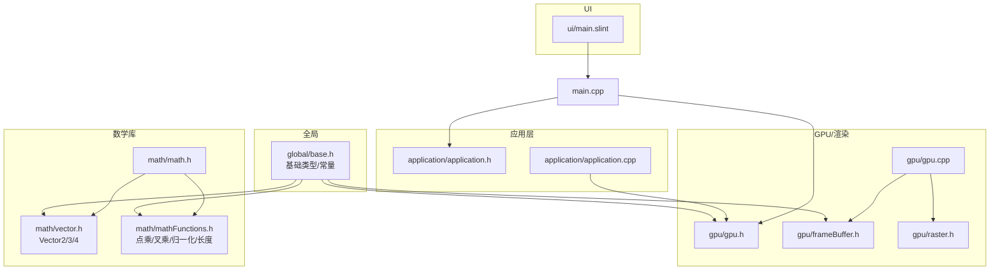
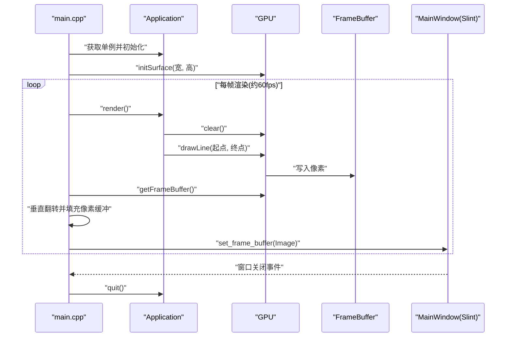
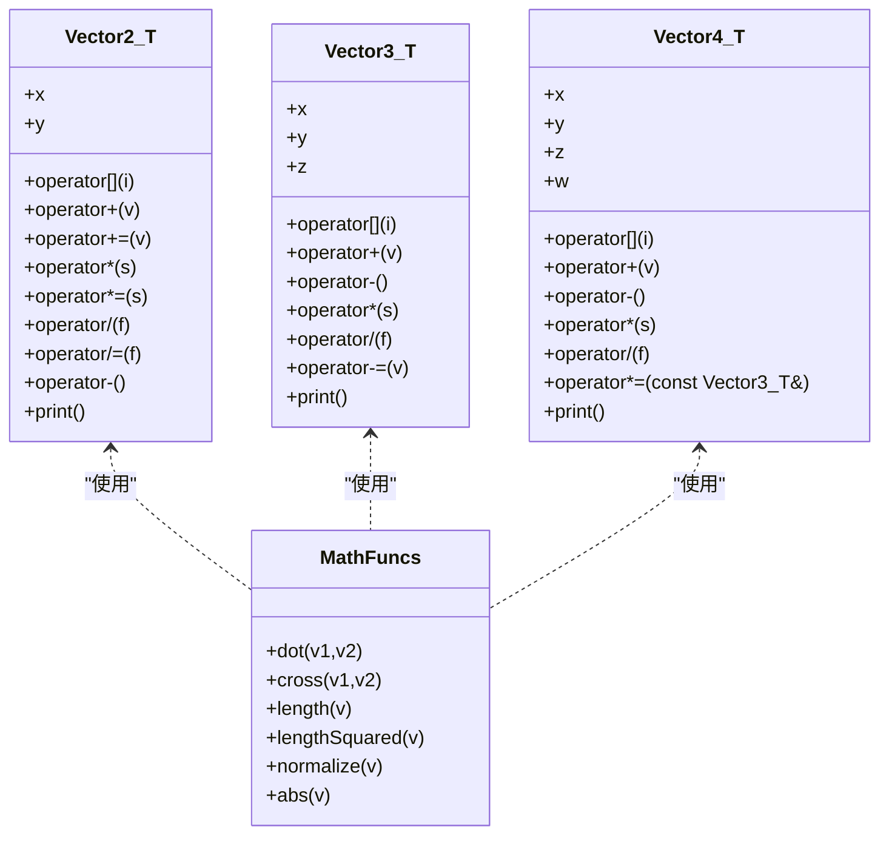
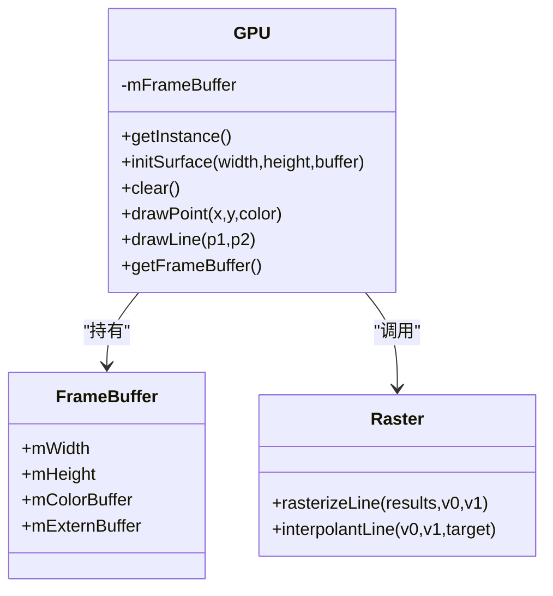
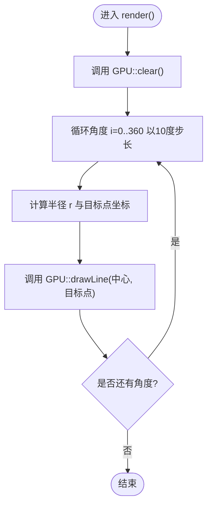
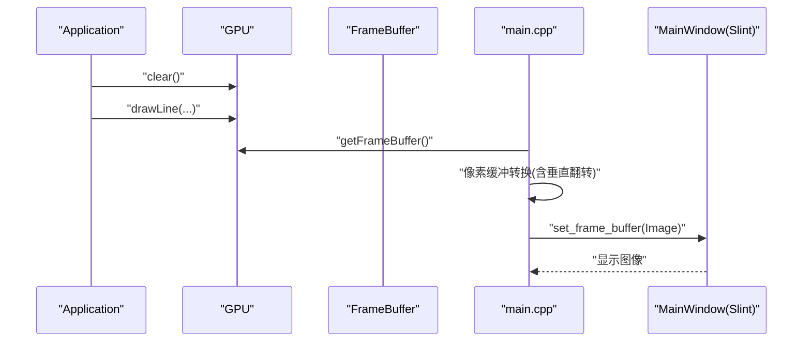
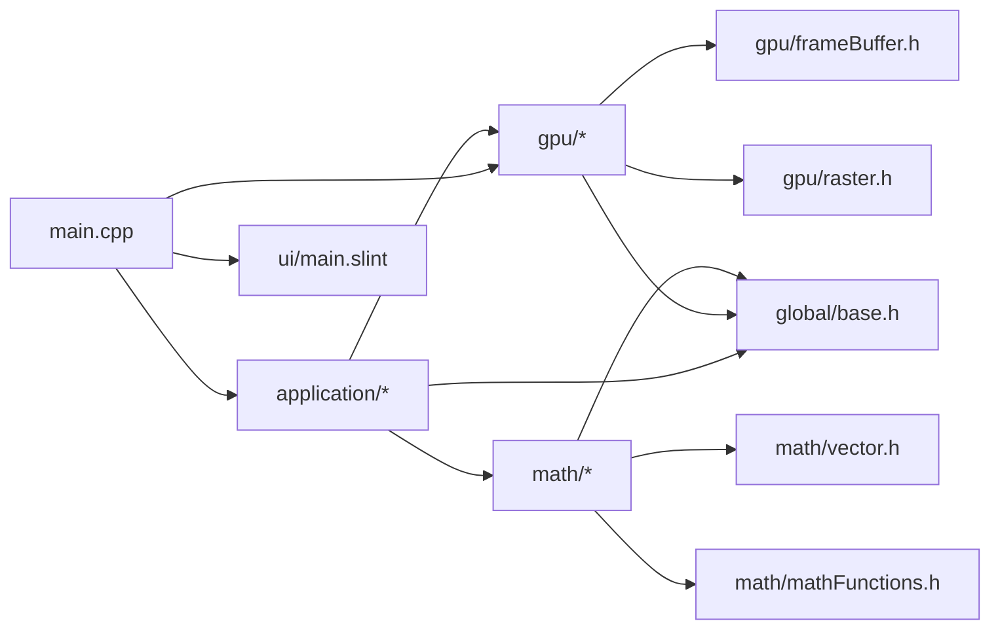

# 项目概述

<cite>
**本文引用的文件**
- [CMakeLists.txt](file://CMakeLists.txt)
- [main.cpp](file://main.cpp)
- [application/application.h](file://application/application.h)
- [application/application.cpp](file://application/application.cpp)
- [gpu/gpu.h](file://gpu/gpu.h)
- [gpu/gpu.cpp](file://gpu/gpu.cpp)
- [gpu/frameBuffer.h](file://gpu/frameBuffer.h)
- [gpu/raster.h](file://gpu/raster.h)
- [math/vector.h](file://math/vector.h)
- [math/mathFunctions.h](file://math/mathFunctions.h)
- [math/math.h](file://math/math.h)
- [global/base.h](file://global/base.h)
- [ui/main.slint](file://ui/main.slint)
- [testMath.cpp](file://testMath.cpp)
</cite>

## 目录
1. [引言](#引言)
2. [项目结构](#项目结构)
3. [核心组件](#核心组件)
4. [架构总览](#架构总览)
5. [详细组件分析](#详细组件分析)
6. [依赖关系分析](#依赖关系分析)
7. [性能考量](#性能考量)
8. [故障排查指南](#故障排查指南)
9. [结论](#结论)
10. [附录](#附录)

## 引言
04-Vectors 是一个基于 C++20 的图形学教学项目，旨在通过“从零实现”的方式，帮助学习者系统掌握向量数学与软光栅渲染的基本原理与实践方法。该项目同时演示了如何在纯 C++ 环境中集成 Slint UI 框架进行交互式可视化输出，并通过 CMake 构建系统完成跨平台编译与依赖管理。项目适合初学者循序渐进地理解：
- 向量数学库（二维/三维/四维向量）的定义、运算与常用函数（点乘、叉乘、归一化、长度等）
- 软光栅渲染管线中的基础图元绘制（点、线段）与光栅化流程
- 应用层与 GPU 层的职责划分与数据流
- 交互式 UI 与渲染缓冲区的桥接机制

本项目强调“可读性优先”，所有核心逻辑均以清晰的类与函数组织，便于教学与自学。

## 项目结构
项目采用按功能域分层的目录组织方式：
- 全局基础类型与常量：global/base.h
- 数学库：math/vector.h、math/mathFunctions.h、math/math.h
- GPU/渲染子系统：gpu/gpu.h、gpu/gpu.cpp、gpu/frameBuffer.h、gpu/raster.h
- 应用层：application/application.h、application/application.cpp
- UI 定义：ui/main.slint
- 入口与构建：main.cpp、CMakeLists.txt
- 数学库单元测试：testMath.cpp

图表来源
- [CMakeLists.txt](file://CMakeLists.txt#L21-L31)
- [main.cpp](file://main.cpp#L1-L59)
- [application/application.h](file://application/application.h#L1-L33)
- [application/application.cpp](file://application/application.cpp#L1-L46)
- [gpu/gpu.h](file://gpu/gpu.h#L1-L37)
- [gpu/gpu.cpp](file://gpu/gpu.cpp#L1-L48)
- [gpu/frameBuffer.h](file://gpu/frameBuffer.h#L1-L19)
- [gpu/raster.h](file://gpu/raster.h#L1-L20)
- [math/math.h](file://math/math.h#L1-L4)
- [math/vector.h](file://math/vector.h#L1-L323)
- [math/mathFunctions.h](file://math/mathFunctions.h#L1-L155)
- [global/base.h](file://global/base.h#L1-L42)
- [ui/main.slint](file://ui/main.slint#L1-L18)

章节来源
- [CMakeLists.txt](file://CMakeLists.txt#L1-L69)
- [main.cpp](file://main.cpp#L1-L59)

## 核心组件
- 向量数学库：提供通用的二维/三维/四维向量模板类及其运算符重载，以及点乘、叉乘、长度、归一化等常用函数，覆盖教学所需的向量代数基础。
- GPU/渲染子系统：封装帧缓冲区、点/线段绘制与光栅化接口，负责将几何图元转换为像素并写入帧缓冲。
- 应用层：管理应用生命周期、渲染循环与场景绘制逻辑，调用 GPU 接口完成每帧渲染。
- UI 层：使用 Slint 定义窗口与图像显示控件，将 GPU 帧缓冲区映射为 UI 图像进行实时展示。
- 构建系统：CMake 配置 C++20 标准、本地 Slint 库、字体与输入设备依赖，并生成可执行程序与测试程序。

章节来源
- [math/vector.h](file://math/vector.h#L1-L323)
- [math/mathFunctions.h](file://math/mathFunctions.h#L1-L155)
- [gpu/gpu.h](file://gpu/gpu.h#L1-L37)
- [gpu/gpu.cpp](file://gpu/gpu.cpp#L1-L48)
- [gpu/frameBuffer.h](file://gpu/frameBuffer.h#L1-L19)
- [gpu/raster.h](file://gpu/raster.h#L1-L20)
- [application/application.h](file://application/application.h#L1-L33)
- [application/application.cpp](file://application/application.cpp#L1-L46)
- [ui/main.slint](file://ui/main.slint#L1-L18)
- [CMakeLists.txt](file://CMakeLists.txt#L1-L69)

## 架构总览
系统采用“应用层 -> GPU 层 -> 帧缓冲区 -> UI 层”的数据流设计。应用层在渲染循环中调用 GPU 接口绘制几何图元；GPU 将图元光栅化后写入帧缓冲；主程序将帧缓冲区转换为 Slint 支持的像素格式并更新 UI 显示。

图表来源
- [main.cpp](file://main.cpp#L10-L59)
- [application/application.cpp](file://application/application.cpp#L23-L45)
- [gpu/gpu.cpp](file://gpu/gpu.cpp#L25-L47)
- [gpu/frameBuffer.h](file://gpu/frameBuffer.h#L8-L18)
- [ui/main.slint](file://ui/main.slint#L1-L18)

## 详细组件分析

### 数学库（向量与常用函数）
- 设计要点
  - 以模板类 Vector2/3/4 提供统一的向量抽象，支持索引访问、算术运算与赋值运算符重载。
  - 提供标量与向量、向量与向量的乘法，以及点乘、叉乘、长度、长度平方、归一化等常用函数。
  - 使用全局常量与类型别名（如 vec2f、vec3f、vec4f）提升易用性。
- 复杂度与性能
  - 向量运算均为 O(1)，函数调用开销低，适合高频渲染场景。
- 错误处理
  - 除法运算包含除零断言保护，确保数值稳定性。
- 教学价值
  - 通过模板与运算符重载，直观展示现代 C++ 在图形学中的应用。
  - 通过点/叉乘与归一化，为后续矩阵变换与光照模型打下基础。

图表来源
- [math/vector.h](file://math/vector.h#L13-L127)
- [math/vector.h](file://math/vector.h#L131-L218)
- [math/vector.h](file://math/vector.h#L221-L321)
- [math/mathFunctions.h](file://math/mathFunctions.h#L6-L155)

章节来源
- [math/vector.h](file://math/vector.h#L1-L323)
- [math/mathFunctions.h](file://math/mathFunctions.h#L1-L155)
- [math/math.h](file://math/math.h#L1-L4)

### GPU/渲染子系统
- 设计要点
  - GPU 单例负责初始化帧缓冲、清屏、点/线段绘制；内部委托 Raster 进行光栅化。
  - FrameBuffer 封装宽高与颜色缓冲指针，支持外部缓冲标记。
  - Raster 提供线段光栅化与插值辅助函数。
- 数据流
  - 应用层调用 GPU::drawLine，内部收集像素点集合，逐点写入 FrameBuffer。
- 性能与优化
  - 清屏使用批量填充，复杂度 O(W×H)；线段绘制依赖 Raster 的高效采样策略。
- 错误处理
  - 绘制前检查坐标边界，避免越界写入。

图表来源
- [gpu/gpu.h](file://gpu/gpu.h#L11-L36)
- [gpu/gpu.cpp](file://gpu/gpu.cpp#L1-L48)
- [gpu/frameBuffer.h](file://gpu/frameBuffer.h#L8-L18)
- [gpu/raster.h](file://gpu/raster.h#L8-L19)

章节来源
- [gpu/gpu.h](file://gpu/gpu.h#L1-L37)
- [gpu/gpu.cpp](file://gpu/gpu.cpp#L1-L48)
- [gpu/frameBuffer.h](file://gpu/frameBuffer.h#L1-L19)
- [gpu/raster.h](file://gpu/raster.h#L1-L20)

### 应用层
- 设计要点
  - Application 单例管理窗口尺寸、存活状态与渲染循环。
  - render() 中先清屏，再绘制一组从中心辐射出的线段，形成简易的“光栅化演示”。
- 控制流
  - 主循环以定时器触发，每帧调用 Application::render 并刷新 UI。

图表来源
- [application/application.cpp](file://application/application.cpp#L23-L45)

章节来源
- [application/application.h](file://application/application.h#L1-L33)
- [application/application.cpp](file://application/application.cpp#L1-L46)

### UI 层（Slint）
- 设计要点
  - 使用 Slint 定义 MainWindow，包含标题、背景色与图像控件。
  - 通过回调 close-requested 触发应用退出。
  - 主程序将 GPU 帧缓冲转换为 Slint Image 并设置到 UI 上。
- 数据桥接
  - 主程序负责像素缓冲的垂直翻转与格式转换，保证与 Slint 的坐标系一致。

图表来源
- [main.cpp](file://main.cpp#L31-L53)
- [ui/main.slint](file://ui/main.slint#L1-L18)

章节来源
- [ui/main.slint](file://ui/main.slint#L1-L18)
- [main.cpp](file://main.cpp#L1-L59)

### 构建系统（CMake）
- 设计要点
  - 设置 C++20 标准与 Clang 编译器，启用编译命令导出。
  - 本地引入 Slint 库，链接 FreeType、Fontconfig、libinput、xkbcommon、libudev、gbm、libseat 等依赖。
  - 添加可执行程序 softRenderer 与测试程序 testMath，并编译 Slint UI 文件。
- 依赖管理
  - 通过 pkg_check_modules 与 find_package 自动发现并链接系统依赖。
- 教学价值
  - 展示现代 CMake 的最佳实践：目标分离、头文件路径管理、第三方库集成。

章节来源
- [CMakeLists.txt](file://CMakeLists.txt#L1-L69)

## 依赖关系分析
- 内部依赖
  - application 依赖 gpu；gpu 依赖 frameBuffer 与 raster；math 为独立模块，被应用层间接使用。
  - global/base.h 为全局基础类型与常量，被 math、gpu、application 等广泛使用。
- 外部依赖
  - Slint UI 框架、FreeType 字体库、Fontconfig、libinput、xkbcommon、libudev、gbm、libseat。
- 构建产物
  - 可执行程序：softRenderer（主程序）、testMath（数学库测试）。

图表来源
- [CMakeLists.txt](file://CMakeLists.txt#L21-L31)
- [main.cpp](file://main.cpp#L1-L59)
- [application/application.h](file://application/application.h#L1-L33)
- [gpu/gpu.h](file://gpu/gpu.h#L1-L37)
- [gpu/frameBuffer.h](file://gpu/frameBuffer.h#L1-L19)
- [gpu/raster.h](file://gpu/raster.h#L1-L20)
- [math/math.h](file://math/math.h#L1-L4)
- [math/vector.h](file://math/vector.h#L1-L323)
- [math/mathFunctions.h](file://math/mathFunctions.h#L1-L155)
- [global/base.h](file://global/base.h#L1-L42)
- [ui/main.slint](file://ui/main.slint#L1-L18)

章节来源
- [CMakeLists.txt](file://CMakeLists.txt#L1-L69)

## 性能考量
- 渲染循环
  - 每帧约 60fps 的定时器驱动，适合演示与教学场景。
- 清屏与绘制
  - 清屏使用批量填充，复杂度 O(W×H)；线段绘制依赖高效的光栅化算法。
- 像素缓冲转换
  - 主程序对帧缓冲进行垂直翻转与像素格式转换，注意内存拷贝成本；可考虑复用缓冲或减少拷贝次数。
- 建议
  - 在更高分辨率或更复杂场景下，可引入双缓冲、延迟绘制与更精细的光栅化策略。

## 故障排查指南
- 编译失败（找不到 Slint 或依赖）
  - 确认本地 Slint 路径配置正确，且已安装 FreeType、Fontconfig、libinput、xkbcommon、libudev、gbm、libseat。
- 运行时黑屏或画面异常
  - 检查 GPU::initSurface 是否成功创建 FrameBuffer，确认像素坐标未越界。
  - 确认主程序像素缓冲转换逻辑（垂直翻转与格式匹配）无误。
- 数学库使用报错
  - 确保使用正确的类型别名（vec2f/vec3f/vec4f），并避免除零操作。
- UI 不响应关闭
  - 检查 MainWindow 的 close-requested 回调是否正确绑定到 Application::quit。

章节来源
- [CMakeLists.txt](file://CMakeLists.txt#L12-L20)
- [gpu/gpu.cpp](file://gpu/gpu.cpp#L18-L38)
- [main.cpp](file://main.cpp#L20-L53)
- [math/mathFunctions.h](file://math/mathFunctions.h#L94-L98)

## 结论
04-Vectors 以简洁清晰的模块划分与扎实的图形学基础，为学习者提供了从向量数学到软光栅渲染再到交互式 UI 的完整教学闭环。通过 C++20、Slint 与 CMake 的组合，项目既具备良好的可读性，又展示了现代 C++ 在图形学领域的工程实践价值。建议初学者先从数学库与基础渲染流程入手，逐步扩展到更复杂的图元与管线阶段。

## 附录
- 实际使用场景示例
  - 向量运算：在 testMath 中演示加法、乘法、除法与归一化等基本操作。
  - 软光栅渲染：在每帧中绘制一组从中心向外辐射的线段，观察光栅化效果。
  - 交互式 UI：通过 Slint 窗口实时显示 GPU 帧缓冲，实现所见即所得的可视化反馈。
- 初学者理解路径
  - 第一步：阅读 global/base.h 了解基础类型与常量。
  - 第二步：学习 math/vector.h 与 math/mathFunctions.h 的向量运算与常用函数。
  - 第三步：理解 gpu/gpu.h/gpu.cpp 的渲染流程与帧缓冲管理。
  - 第四步：阅读 application/application.cpp 的渲染循环与场景绘制。
  - 第五步：查看 main.cpp 的 UI 集成与像素缓冲桥接。
- 进阶学习建议
  - 扩展图元：添加三角形光栅化、扫描线填充与深度/纹理插值。
  - 优化与扩展：引入双缓冲、延迟绘制、更丰富的 UI 控件与用户交互。
  - 工程化：完善日志系统、错误处理与单元测试，提升可维护性。

章节来源
- [testMath.cpp](file://testMath.cpp#L1-L30)
- [application/application.cpp](file://application/application.cpp#L23-L45)
- [main.cpp](file://main.cpp#L10-L59)
- [ui/main.slint](file://ui/main.slint#L1-L18)